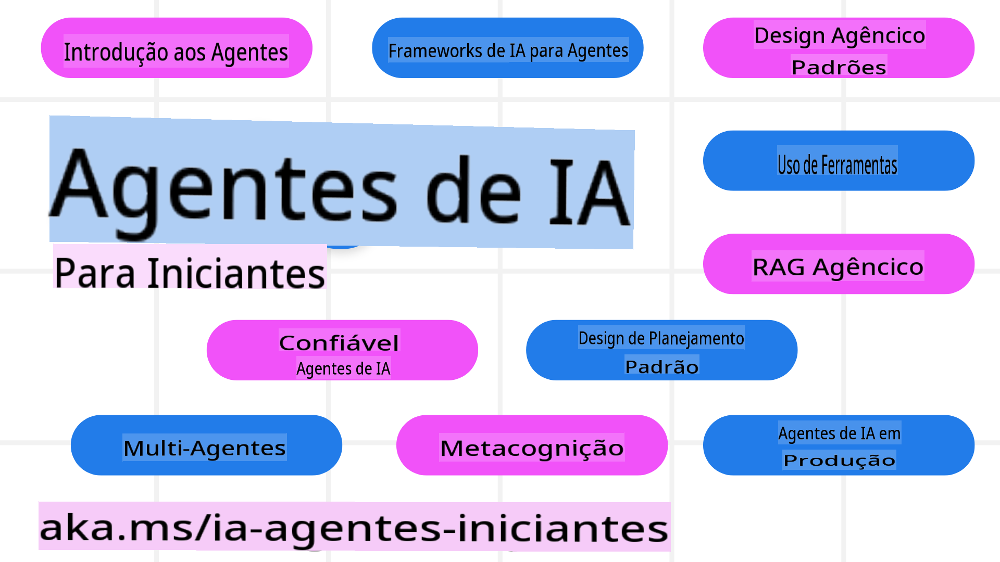

<!--
CO_OP_TRANSLATOR_METADATA:
{
  "original_hash": "09e975d95b470ee45ab546c22ee35d33",
  "translation_date": "2025-03-28T11:26:45+00:00",
  "source_file": "README.md",
  "language_code": "pt"
}
-->
# Agentes de IA para Iniciantes - Um Curso

## 10 Lições ensinando tudo o que você precisa saber para começar a criar Agentes de IA

  
  
  
  

### Suporte de Idiomas
  
  
  
  
  
  
  
  
  
  
  
  

  
  

## 🌱 Começando

Este curso contém 10 lições cobrindo os fundamentos para criar Agentes de IA. Cada lição aborda um tema específico, então você pode começar por onde preferir!

Há suporte para vários idiomas neste curso. Confira os [idiomas disponíveis aqui](../..).

Se esta é sua primeira vez trabalhando com modelos de IA Generativa, dê uma olhada no nosso curso [IA Generativa para Iniciantes](https://aka.ms/genai-beginners), que inclui 21 lições sobre como trabalhar com GenAI.

Não se esqueça de [dar uma estrela (🌟) neste repositório](https://docs.github.com/en/get-started/exploring-projects-on-github/saving-repositories-with-stars?WT.mc_id=academic-105485-koreyst) e [fazer um fork deste repositório](https://github.com/microsoft/ai-agents-for-beginners/fork) para executar o código.

### O que Você Precisa

Cada lição deste curso inclui exemplos de código, que podem ser encontrados na pasta code_samples. Você pode [fazer um fork deste repositório](https://github.com/microsoft/ai-agents-for-beginners/fork) para criar sua própria cópia.

Os exemplos de código nestes exercícios utilizam o Azure AI Foundry e os Catálogos de Modelos do GitHub para interagir com Modelos de Linguagem:

- [Modelos do GitHub](https://aka.ms/ai-agents-beginners/github-models) - Gratuito / Limitado  
- [Azure AI Foundry](https://aka.ms/ai-agents-beginners/ai-foundry) - Requer conta Azure  

Este curso também utiliza os seguintes frameworks e serviços de Agentes de IA da Microsoft:

- [Azure AI Agent Service](https://aka.ms/ai-agents-beginners/ai-agent-service)  
- [Semantic Kernel](https://aka.ms/ai-agents-beginners/semantic-kernel)  
- [AutoGen](https://aka.ms/ai-agents/autogen)  

Para mais informações sobre como executar o código deste curso, acesse [Configuração do Curso](./00-course-setup/README.md).  

## 🙏 Quer ajudar?

Você tem sugestões ou encontrou erros de ortografia ou no código? [Abra uma issue](https://github.com/microsoft/ai-agents-for-beginners/issues?WT.mc_id=academic-105485-koreyst) ou [Crie um pull request](https://github.com/microsoft/ai-agents-for-beginners/pulls?WT.mc_id=academic-105485-koreyst).  

Se você ficar preso ou tiver dúvidas sobre como construir Agentes de IA, participe do nosso [Discord da Comunidade Azure AI](https://discord.gg/kzRShWzttr).  

## 📂 Cada lição inclui

- Uma lição escrita localizada no README e um vídeo curto  
- Exemplos de código Python com suporte ao Azure AI Foundry e aos modelos do Github (Gratuitos)  
- Links para recursos extras para continuar seu aprendizado  

## 🗃️ Lições  

| **Lição**                                | **Texto & Código**                                 | **Vídeo**                                                   | **Aprendizado Extra**                                                                  |  
|------------------------------------------|----------------------------------------------------|------------------------------------------------------------|----------------------------------------------------------------------------------------|  
| Introdução a Agentes de IA e Casos de Uso| [Link](./01-intro-to-ai-agents/README.md)          | [Vídeo](https://youtu.be/3zgm60bXmQk?si=z8QygFvYQv-9WtO1)  | [Link](https://aka.ms/ai-agents-beginners/collection?WT.mc_id=academic-105485-koreyst) |  
| Explorando Frameworks Agentes de IA      | [Link](./02-explore-agentic-frameworks/README.md)  | [Vídeo](https://youtu.be/ODwF-EZo_O8?si=Vawth4hzVaHv-u0H)  | [Link](https://aka.ms/ai-agents-beginners/collection?WT.mc_id=academic-105485-koreyst) |  
| Entendendo Padrões de Design Agentes de IA | [Link](./03-agentic-design-patterns/README.md)    | [Vídeo](https://youtu.be/m9lM8qqoOEA?si=BIzHwzstTPL8o9GF)  | [Link](https://aka.ms/ai-agents-beginners/collection?WT.mc_id=academic-105485-koreyst) |  
| Padrão de Design de Uso de Ferramentas   | [Link](./04-tool-use/README.md)                    | [Vídeo](https://youtu.be/vieRiPRx-gI?si=2z6O2Xu2cu_Jz46N)  | [Link](https://aka.ms/ai-agents-beginners/collection?WT.mc_id=academic-105485-koreyst) |  
| RAG Agente                               | [Link](./05-agentic-rag/README.md)                 | [Vídeo](https://youtu.be/WcjAARvdL7I?si=gKPWsQpKiIlDH9A3)  | [Link](https://aka.ms/ai-agents-beginners/collection?WT.mc_id=academic-105485-koreyst) |  
| Construindo Agentes de IA Confiáveis     | [Link](./06-building-trustworthy-agents/README.md) | [Vídeo](https://youtu.be/iZKkMEGBCUQ?si=jZjpiMnGFOE9L8OK)  | [Link](https://aka.ms/ai-agents-beginners/collection?WT.mc_id=academic-105485-koreyst) |  
| Padrão de Design de Planejamento         | [Link](./07-planning-design/README.md)             | [Vídeo](https://youtu.be/kPfJ2BrBCMY?si=6SC_iv_E5-mzucnC)  | [Link](https://aka.ms/ai-agents-beginners/collection?WT.mc_id=academic-105485-koreyst) |  
| Padrão de Design Multi-Agentes           | [Link](./08-multi-agent/README.md)                 | [Vídeo](https://youtu.be/V6HpE9hZEx0?si=rMgDhEu7wXo2uo6g)  | [Link](https://aka.ms/ai-agents-beginners/collection?WT.mc_id=academic-105485-koreyst) |  
| Padrão de Design de Metacognição          | [Link](./09-metacognition/README.md)               | [Vídeo](https://youtu.be/His9R6gw6Ec?si=8gck6vvdSNCt6OcF)  | [Link](https://aka.ms/ai-agents-beginners/collection?WT.mc_id=academic-105485-koreyst) |
| Agentes de IA em Produção                 | [Link](./10-ai-agents-production/README.md)        | [Vídeo](https://youtu.be/l4TP6IyJxmQ?si=31dnhexRo6yLRJDl)  | [Link](https://aka.ms/ai-agents-beginners/collection?WT.mc_id=academic-105485-koreyst) |

## 🌐 Suporte a Múltiplos Idiomas

| Idioma               | Código | Link para o README Traduzido                          | Última Atualização |
|----------------------|--------|------------------------------------------------------|--------------------|
| Chinês (Simplificado)| zh     | [Tradução para Chinês](../zh/README.md)  | 2025-03-24         |
| Chinês (Tradicional) | tw     | [Tradução para Chinês](../tw/README.md)  | 2025-02-13         |
| Chinês (Hong Kong)   | hk     | [Tradução para Chinês (Hong Kong)](../hk/README.md) | 2025-02-13         |
| Francês              | fr     | [Tradução para Francês](../fr/README.md) | 2025-02-13         |
| Japonês              | ja     | [Tradução para Japonês](../ja/README.md) | 2025-02-13         |
| Coreano              | ko     | [Tradução para Coreano](../ko/README.md) | 2025-02-13         |
| Português            | pt     | [Tradução para Português](./README.md) | 2025-02-13         |
| Espanhol             | es     | [Tradução para Espanhol](../es/README.md) | 2025-02-13         |
| Alemão               | de     | [Tradução para Alemão](../de/README.md) | 2025-02-13         |
| Persa                | fa     | [Tradução para Persa](../fa/README.md)   | 2025-03-26         |
| Polonês              | pl     | [Tradução para Polonês](../pl/README.md) | 2025-03-26         |

## 🎒 Outros Cursos

Nossa equipe produz outros cursos! Confira:

- [**NOVO** IA Generativa para Iniciantes usando .NET](https://github.com/microsoft/Generative-AI-for-beginners-dotnet?WT.mc_id=academic-105485-koreyst)
- [IA Generativa para Iniciantes](https://github.com/microsoft/generative-ai-for-beginners?WT.mc_id=academic-105485-koreyst)
- [ML para Iniciantes](https://aka.ms/ml-beginners?WT.mc_id=academic-105485-koreyst)
- [Ciência de Dados para Iniciantes](https://aka.ms/datascience-beginners?WT.mc_id=academic-105485-koreyst)
- [IA para Iniciantes](https://aka.ms/ai-beginners?WT.mc_id=academic-105485-koreyst)
- [Cibersegurança para Iniciantes](https://github.com/microsoft/Security-101??WT.mc_id=academic-96948-sayoung)
- [Desenvolvimento Web para Iniciantes](https://aka.ms/webdev-beginners?WT.mc_id=academic-105485-koreyst)
- [IoT para Iniciantes](https://aka.ms/iot-beginners?WT.mc_id=academic-105485-koreyst)
- [Desenvolvimento de XR para Iniciantes](https://github.com/microsoft/xr-development-for-beginners?WT.mc_id=academic-105485-koreyst)
- [Dominando o GitHub Copilot para Programação em Par com IA](https://aka.ms/GitHubCopilotAI?WT.mc_id=academic-105485-koreyst)
- [Dominando o GitHub Copilot para Desenvolvedores C#/.NET](https://github.com/microsoft/mastering-github-copilot-for-dotnet-csharp-developers?WT.mc_id=academic-105485-koreyst)
- [Escolha Sua Própria Aventura com Copilot](https://github.com/microsoft/CopilotAdventures?WT.mc_id=academic-105485-koreyst)

## 🌟 Agradecimentos à Comunidade

Obrigado a [Shivam Goyal](https://www.linkedin.com/in/shivam2003/) por contribuir com exemplos de código importantes que demonstram o Agentic RAG. 

## Contribuindo

Este projeto está aberto a contribuições e sugestões. A maioria das contribuições exige que você concorde com um
Contrato de Licença de Contribuidor (CLA) declarando que você tem o direito de, e de fato concede a nós,
os direitos de usar sua contribuição. Para mais detalhes, visite <https://cla.opensource.microsoft.com>.

Ao enviar um pull request, um bot de CLA determinará automaticamente se você precisa fornecer
um CLA e irá decorar o PR de forma apropriada (por exemplo, verificação de status, comentário). Basta seguir as instruções
fornecidas pelo bot. Você só precisará fazer isso uma vez em todos os repositórios que utilizam nosso CLA.
Este projeto adotou o [Código de Conduta de Código Aberto da Microsoft](https://opensource.microsoft.com/codeofconduct/).  
Para mais informações, veja as [Perguntas Frequentes sobre o Código de Conduta](https://opensource.microsoft.com/codeofconduct/faq/) ou  
entre em contato pelo e-mail [opencode@microsoft.com](mailto:opencode@microsoft.com) para quaisquer dúvidas ou comentários adicionais.  

## Marcas Registradas  

Este projeto pode conter marcas registradas ou logotipos de projetos, produtos ou serviços. O uso autorizado de marcas registradas ou logotipos da Microsoft  
deve seguir as [Diretrizes de Marcas e Branding da Microsoft](https://www.microsoft.com/legal/intellectualproperty/trademarks/usage/general).  
O uso de marcas registradas ou logotipos da Microsoft em versões modificadas deste projeto não deve causar confusão ou implicar patrocínio da Microsoft.  
Qualquer uso de marcas registradas ou logotipos de terceiros está sujeito às políticas desses terceiros.  

**Aviso Legal**:  
Este documento foi traduzido usando o serviço de tradução por IA [Co-op Translator](https://github.com/Azure/co-op-translator). Embora nos esforcemos para garantir a precisão, é importante estar ciente de que traduções automáticas podem conter erros ou imprecisões. O documento original em seu idioma nativo deve ser considerado a fonte autoritativa. Para informações críticas, recomenda-se a tradução profissional feita por humanos. Não nos responsabilizamos por quaisquer mal-entendidos ou interpretações equivocadas decorrentes do uso desta tradução.