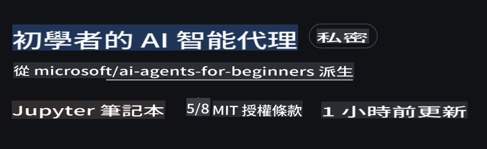
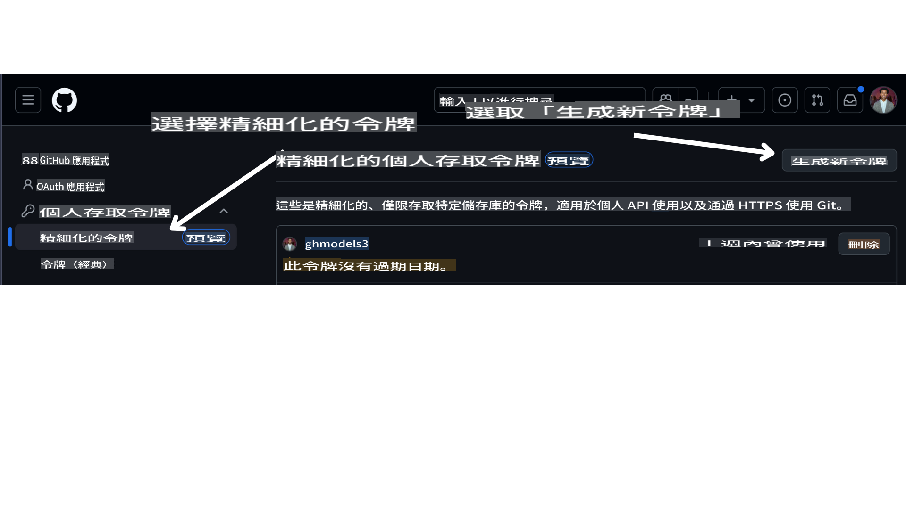

<!--
CO_OP_TRANSLATOR_METADATA:
{
  "original_hash": "366bc6709dd95b8a32ec7c705b0f179c",
  "translation_date": "2025-03-28T14:06:54+00:00",
  "source_file": "00-course-setup\\README.md",
  "language_code": "tw"
}
-->
# 課程設置

## 簡介

這節課將介紹如何運行本課程的程式範例。

## 需求

- 一個 GitHub 帳號  
- Python 3.12+  
- Azure 訂閱  
- Azure AI Foundry 帳號  

## 複製或分支此倉庫

首先，請複製或分支此 GitHub 倉庫。這樣您就可以擁有課程內容的自己的版本，方便您運行、測試和調整程式碼！

這可以通過點擊以下連結完成：



## 獲取您的 GitHub 個人訪問令牌（PAT）

目前，本課程使用 GitHub 模型市場提供對大型語言模型（LLMs）的免費訪問，這些模型將用於創建 AI Agent。

要訪問此服務，您需要創建一個 GitHub 個人訪問令牌。

這可以通過進入您的 GitHub 帳號完成。

選擇螢幕左側的 `Fine-grained tokens` 選項。

然後選擇 `Generate new token`。



複製您剛剛創建的新令牌。現在，您需要將其添加到本課程包含的 `.env` 文件中。

## 添加到環境變數

要創建 `.env` 文件，請在終端中運行以下命令：

```bash
cp .env.example .env
```

這將複製示例文件並在您的目錄中創建一個 `.env` 文件，填寫環境變數的值。您可以在 [Azure AI Foundry](https://ai.azure.com?WT.mc_id=academic-105485-koreyst) 入口網站的以下位置找到每個環境變數的值：

打開該文件，將您創建的令牌粘貼到 `GITHUB_TOKEN=` field of the .env file. 
- `AZURE_SUBSCRIPTION_ID` - On the **Overview** page of your project within **Project details**.
- `AZURE_AI_PROJECT_NAME` - At the top of the **Overview** page for your project.
- `AZURE_OPENAI_RESOURCE_GROUP` - On the **Overview** page of the **Management Center** within **Project properties**.
- `AZURE_OPENAI_SERVICE` - On the **Overview** page of your project in the **Included capabilities** tab for **Azure OpenAI Service**.
- `AZURE_OPENAI_API_VERSION` - On the [API version lifecycle](https://learn.microsoft.com/azure/ai-services/openai/api-version-deprecation#latest-ga-api-release?WT.mc_id=academic-105485-koreyst) webpage within the **Latest GA API release** section.
- `AZURE_OPENAI_ENDPOINT` - 在模型部署的 **Endpoint** 中的 **Details** 標籤下（即 **Target URI**）。

## 安裝所需的套件

為確保您擁有運行程式碼所需的所有 Python 套件，請在終端中運行以下命令。

我們建議創建一個 Python 虛擬環境以避免任何衝突和問題。

```bash
pip install -r requirements.txt
```

這應該會安裝所需的 Python 套件。

# 登錄到 Azure

作為安全的最佳實踐，我們將使用 [無密鑰身份驗證](https://learn.microsoft.com/azure/developer/ai/keyless-connections?tabs=csharp%2Cazure-cli?WT.mc_id=academic-105485-koreyst) 通過 Microsoft Entra ID 驗證到 Azure OpenAI。在此之前，您需要根據您的操作系統按照 [安裝指導](https://learn.microsoft.com/cli/azure/install-azure-cli?WT.mc_id=academic-105485-koreyst) 安裝 **Azure CLI**。

接下來，打開終端並運行 `az login` to sign in to your Azure account.

## Sign in to Azure

Login with your Azure AI account used to provision the Azure resources.

Open a new terminal and enter the following command and follow the instructions in the terminal:

`az login --use-device-code`

Once you've logged in, select your subscription in the terminal.

## Access the environment variables.

We'll import `os` and `load_dotenv`，以便您可以訪問環境變數。

```python
import os
from dotenv import load_dotenv

load_dotenv()
```

## 設置無密鑰身份驗證

我們將使用無密鑰連接到 Azure OpenAI，而不是硬編碼您的憑據。為此，我們將導入 `DefaultAzureCredential` and later call the `DefaultAzureCredential` 函數來獲取憑據。

```python
from azure.identity import DefaultAzureCredential, InteractiveBrowserCredential
```

現在，您已準備好運行本課程的程式碼，祝您在 AI Agent 的世界中學習愉快！

如果您在設置過程中遇到任何問題，請加入我們的討論。

## 下一節課

[AI Agent 簡介及其應用案例](../01-intro-to-ai-agents/README.md)

**免責聲明**：  
本文檔使用 AI 翻譯服務 [Co-op Translator](https://github.com/Azure/co-op-translator) 進行翻譯。我們致力於提供準確的翻譯，但請注意，自動翻譯可能會包含錯誤或不準確之處。應以原文檔的母語版本作為權威來源。對於重要信息，建議使用專業人工翻譯。我們對因使用此翻譯而產生的任何誤解或錯誤解釋不承擔責任。