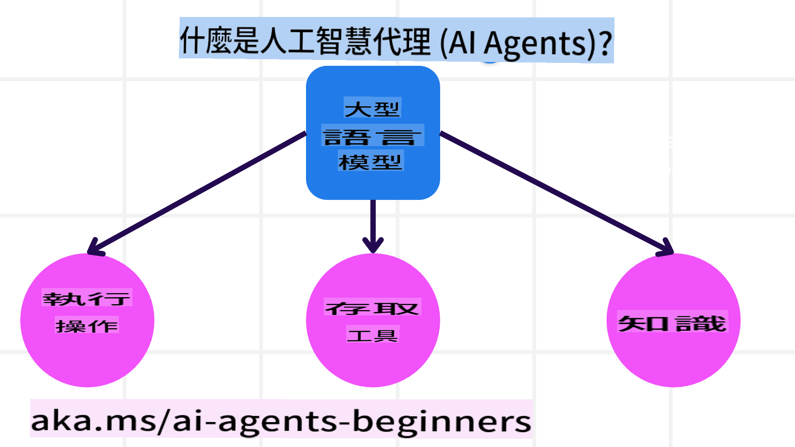
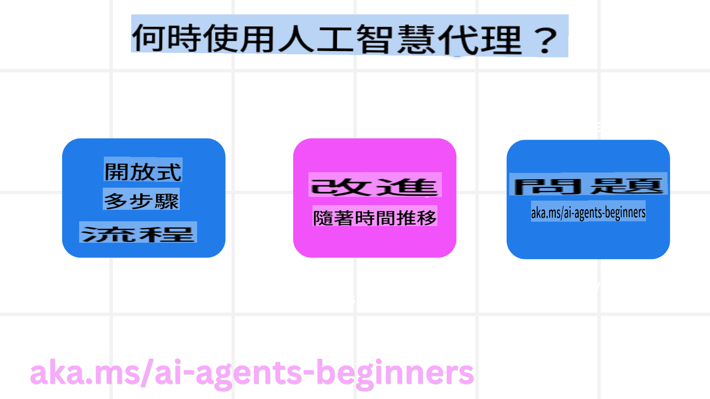

<!--
CO_OP_TRANSLATOR_METADATA:
{
  "original_hash": "233e7a18025a27eae95b653e9b5b5aa5",
  "translation_date": "2025-03-28T14:07:25+00:00",
  "source_file": "01-intro-to-ai-agents\\README.md",
  "language_code": "tw"
}
-->

> _(點擊上方圖片觀看本課程影片)_

# AI代理與使用案例介紹

歡迎來到「AI代理初學者課程」！這門課程提供建立AI代理的基本知識及應用範例。

加入我們以結識其他學習者和AI代理開發者，並提出你對本課程的任何問題。

在課程的開始，我們會先了解什麼是AI代理，以及如何在我們開發的應用程序和工作流程中使用它們。

## 課程介紹

本課程涵蓋：

- 什麼是AI代理？有哪些不同類型的代理？
- 哪些使用案例最適合AI代理？它們如何幫助我們？
- 設計代理解決方案時的一些基本構建要素。

## 學習目標
完成本課程後，你應該能夠：

- 了解AI代理的概念以及它們與其他AI解決方案的區別。
- 高效地應用AI代理。
- 為使用者和客戶生產性地設計代理解決方案。

## AI代理的定義及類型

### 什麼是AI代理？

AI代理是**系統**，它透過給予**大型語言模型(LLMs)** **工具**和**知識**的訪問權限，來擴展其能力並使其能夠**執行動作**。

讓我們把這個定義拆解成更小的部分：

- **系統** - 代理不僅僅是一個單一組件，而是由多個組件組成的系統。在基本層面，AI代理的組件包括：
  - **環境** - 定義AI代理運作的空間。例如，如果我們有一個旅遊預訂AI代理，環境可能是代理用來完成任務的旅遊預訂系統。
  - **感應器** - 環境提供信息並回饋狀態。AI代理使用感應器收集並解釋環境的當前狀態信息。在旅遊預訂代理的例子中，旅遊預訂系統可以提供酒店空房或航班價格的信息。
  - **執行器** - 當AI代理接收到環境的當前狀態後，代理會為當前任務決定採取的行動以改變環境。對於旅遊預訂代理來說，可能是幫使用者預訂一間可用的房間。

**大型語言模型** - 代理的概念早在LLMs出現之前就已存在。使用LLMs建立AI代理的優勢在於其解讀人類語言和數據的能力。這種能力使LLMs能夠解釋環境信息並制定改變環境的計劃。

**執行動作** - 在AI代理系統之外，LLMs的功能僅限於根據使用者的提示生成內容或信息。在AI代理系統內，LLMs能夠透過解讀使用者的需求並使用環境中的工具來完成任務。

**工具訪問** - LLM可使用的工具由以下兩點決定：1) 它運作的環境，2) AI代理的開發者。例如在旅遊代理的例子中，代理的工具可能受到預訂系統操作的限制，或開發者限制代理只能訪問航班相關工具。

**知識** - 除了環境提供的信息外，AI代理還能從其他系統、服務、工具，甚至其他代理中檢索知識。在旅遊代理的例子中，這些知識可能是存儲在客戶數據庫中的使用者旅行偏好信息。

### 不同類型的代理

現在我們有了AI代理的一般定義，讓我們看看一些特定的代理類型，以及它們如何應用於旅遊預訂AI代理。

| **代理類型**                | **描述**                                                                                                                       | **例子**                                                                                                                                                                                                                   |
| ----------------------------- | ------------------------------------------------------------------------------------------------------------------------------------- | ----------------------------------------------------------------------------------------------------------------------------------------------------------------------------------------------------------------------------- |
| **簡單反射代理**      | 根據預定義的規則執行即時動作。                                                                                  | 旅遊代理解讀電子郵件的內容並將旅遊投訴轉發給客戶服務部門。                                                                                                                          |
| **基於模型的反射代理** | 根據世界模型及其變化執行動作。                                                              | 旅遊代理根據歷史定價數據優先考慮價格顯著變動的路線。                                                                                                             |
| **目標導向代理**         | 通過解讀目標並制定計劃來達成特定目標。                                  | 旅遊代理通過制定必要的旅行安排（例如汽車、公共交通、航班），從目前位置到目的地完成旅程預訂。                                                                                |
| **效用導向代理**      | 考慮偏好並以數值權衡取捨來決定如何達成目標。                                               | 旅遊代理在預訂旅行時權衡便利性與成本以最大化效用。                                                                                                                                          |
| **學習代理**           | 根據回饋逐步改進，並相應地調整行動。                                                        | 旅遊代理透過使用客戶在旅行後調查中的回饋，改進未來的預訂安排。                                                                                                               |
| **分層代理**       | 包含多個代理的分層系統，高層代理將任務分解為子任務，讓低層代理完成。 | 旅遊代理取消行程，透過將任務分解為子任務（例如取消特定預訂），讓低層代理完成並向高層代理回報。                                     |
| **多代理系統 (MAS)** | 代理獨立完成任務，可能是合作或競爭的方式。                                                           | 合作：多個代理分別預訂特定的旅遊服務，例如酒店、航班和娛樂活動。競爭：多個代理管理並競爭共享的酒店預訂日曆，以為客戶完成酒店預訂。 |

## 何時使用AI代理

在之前的部分，我們用旅遊代理的使用案例解釋了不同類型的代理如何在旅遊預訂的不同場景中使用。我們將在整個課程中繼續使用這個應用案例。

讓我們看看AI代理最適合的使用案例類型：

- **開放式問題** - 允許LLM決定完成任務所需的步驟，因為流程不一定能硬編碼到工作流中。
- **多步驟過程** - 任務需要一定的複雜性，AI代理需要在多輪交互中使用工具或信息，而非單次檢索。
- **逐步改進** - 任務允許代理透過接收環境或使用者的回饋來逐步改進，以提供更高的效用。

我們會在「建立可信任的AI代理」課程中深入討論使用AI代理的更多考量。

## 代理解決方案的基礎

### 代理開發

設計AI代理系統的第一步是定義工具、行動和行為。在本課程中，我們重點使用 **Azure AI Agent Service** 來定義我們的代理。它提供以下功能：

- 選擇開放模型，例如OpenAI、Mistral和Llama
- 使用來自Tripadvisor等提供商的授權數據
- 使用標準化的OpenAPI 3.0工具

### 代理模式

與LLM的溝通是透過提示完成的。由於AI代理的半自動特性，並非總是可能或需要在環境改變後手動重新提示LLM。我們使用 **代理模式**，以更具規模化的方式在多步驟中提示LLM。

本課程分為一些當前流行的代理模式。

### 代理框架

代理框架允許開發者透過代碼實現代理模式。這些框架提供模板、插件和工具，以促進更好的AI代理協作。這些好處能提高AI代理系統的可觀察性和故障排除能力。

在本課程中，我們將探索研究驅動的AutoGen框架以及Semantic Kernel中面向生產的Agent框架。

## 上一課

[課程設定](../00-course-setup/README.md)

## 下一課

[探索代理框架](../02-explore-agentic-frameworks/README.md)

**免責聲明**:  
本文件使用AI翻譯服務[Co-op Translator](https://github.com/Azure/co-op-translator)進行翻譯。儘管我們致力於提供準確的翻譯，請注意自動翻譯可能包含錯誤或不準確之處。原始文件的母語版本應被視為權威來源。對於重要信息，建議尋求專業人工翻譯。我們對使用此翻譯所產生的任何誤解或誤讀不承擔責任。