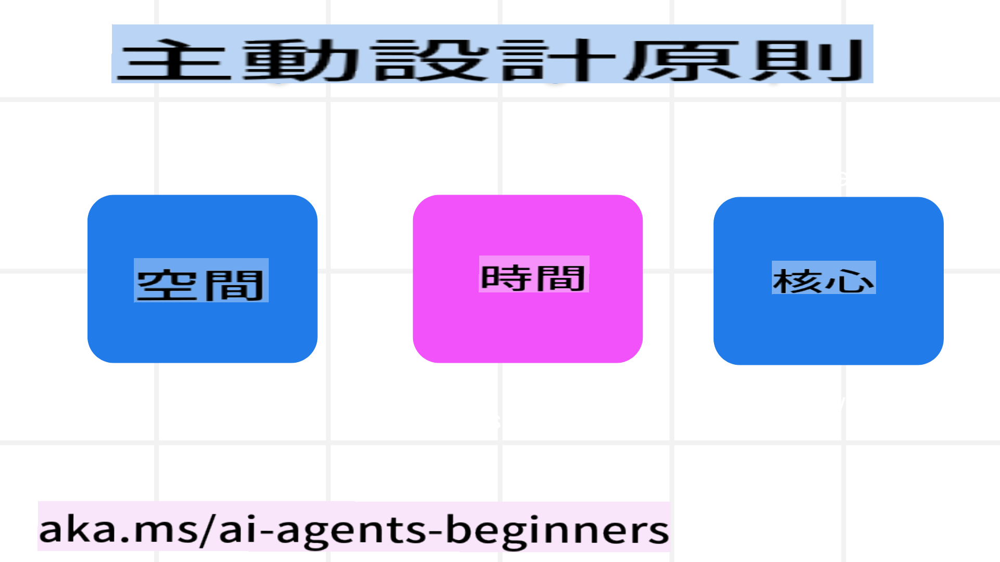

<!--
CO_OP_TRANSLATOR_METADATA:
{
  "original_hash": "969885aab5f923f67f134ce115fbbcaf",
  "translation_date": "2025-03-28T14:10:58+00:00",
  "source_file": "03-agentic-design-patterns\\README.md",
  "language_code": "tw"
}
-->

> _(點擊上方圖片觀看本課視頻)_
# AI 代理設計原則

## 介紹

設計 AI 代理系統有很多種方式。由於生成式 AI 設計中的模糊性是一種特性而非缺陷，工程師有時很難知道從何開始。我們制定了一套以人為本的用戶體驗設計原則，幫助開發者構建以客戶為中心的代理系統來解決業務需求。這些設計原則並非規範性的架構，而是為定義和構建代理體驗的團隊提供的起點。

一般來說，代理應該：

- 擴展並放大人類的能力（如頭腦風暴、解決問題、自動化等）
- 填補知識空白（如幫助我快速掌握某個知識領域、翻譯等）
- 促進並支持我們與他人合作的方式，符合我們個人的偏好
- 幫助我們成為更好的自己（如生活教練/任務管理者，幫助我們學習情緒調節和正念技巧，建立韌性等）

## 本課將涵蓋

- 什麼是代理設計原則
- 在實施這些設計原則時需要遵循的指導方針
- 使用設計原則的一些示例

## 學習目標

完成本課後，你將能夠：

1. 解釋什麼是代理設計原則
2. 解釋使用代理設計原則的指導方針
3. 理解如何利用代理設計原則構建代理

## 代理設計原則

### 代理（空間）

這是代理運行的環境。這些原則指導我們如何設計代理以在物理和數字世界中運作。

- **連接而非取代** – 幫助人們與其他人、事件以及可操作的知識建立聯繫，以促進合作和連結。
  - 代理幫助連接事件、知識和人。
  - 代理拉近人與人之間的距離，而不是取代或貶低人。
- **易於訪問但偶爾隱身** – 代理主要在背景中運行，僅在相關和適當的情況下提示我們。
  - 代理可以在任何設備或平台上為授權用戶輕鬆發現和訪問。
  - 代理支持多模態輸入和輸出（如聲音、語音、文本等）。
  - 代理可以根據用戶需求的感知，在前台與背景間無縫切換；在主動與被動模式間轉換。
  - 代理可能以隱形形式運作，但其背景處理過程路徑以及與其他代理的協作對用戶是透明且可控的。

### 代理（時間）

這是代理隨時間運作的方式。這些原則指導我們如何設計代理以跨越過去、現在和未來進行互動。

- **過去**：反映歷史，包括狀態和上下文。
  - 代理基於對更豐富歷史數據的分析（不僅限於事件、人或狀態）提供更相關的結果。
  - 代理從過去事件中建立聯繫，並積極反思記憶以應對當前情境。
- **現在**：更多提示而非通知。
  - 代理體現了與人互動的全面方法。當事件發生時，代理不僅僅是靜態通知或其他形式的靜態提示。代理可以簡化流程或動態生成提示，以在適當的時刻吸引用戶注意力。
  - 代理基於上下文環境、社會和文化變化，並根據用戶意圖提供信息。
  - 代理的互動可以是漸進的，隨著時間的推移變得更加複雜，以增強用戶的能力。
- **未來**：適應與演變。
  - 代理適應各種設備、平台和模態。
  - 代理適應用戶行為、可訪問性需求，並支持自由定制。
  - 代理通過持續的用戶互動進行塑造和演變。

### 代理（核心）

這是代理設計中的核心要素。

- **擁抱不確定性但建立信任**。
  - 代理的某種程度的不確定性是可以預期的。不確定性是代理設計的一個關鍵元素。
  - 信任與透明性是代理設計的基礎層。
  - 用戶掌控代理的開關，代理狀態在任何時候都清晰可見。

## 實施這些原則的指導方針

在使用上述設計原則時，請遵循以下指導方針：

1. **透明性**：告知用戶 AI 的參與方式及其運作原理（包括過去的行為），並說明如何提供反饋和修改系統。
2. **控制**：讓用戶能夠自定義、指定偏好和個性化，並控制系統及其屬性（包括忘記的能力）。
3. **一致性**：在各設備和端點之間實現一致的多模態體驗。盡可能使用熟悉的 UI/UX 元素（如用於語音互動的麥克風圖標），並盡量減少用戶的認知負擔（如簡潔的回應、視覺輔助和“了解更多”內容）。

## 如何利用這些原則和指導方針設計旅行代理

假設你正在設計一個旅行代理，可以這樣考慮使用設計原則和指導方針：

1. **透明性** – 讓用戶知道旅行代理是一個 AI 驅動的代理。提供一些基本說明，幫助用戶入門（例如，“你好”消息、示例提示）。在產品頁面上清楚記錄這些信息。顯示用戶過去提出的提示列表。明確說明如何提供反饋（如點贊或點踩、“發送反饋”按鈕等）。清楚說明代理是否有使用或主題限制。
2. **控制** – 確保用戶清楚如何修改代理，例如系統提示。允許用戶選擇代理的詳細程度、寫作風格，以及代理應避免的話題。允許用戶查看和刪除任何相關文件或數據、提示和過去的對話。
3. **一致性** – 確保分享提示、添加文件或照片以及標記某人或某物的圖標是標準且易於識別的。使用回形針圖標來表示文件上傳/共享給代理，使用圖片圖標來表示圖形上傳。

## 其他資源

## 上一課

[探索代理框架](../02-explore-agentic-frameworks/README.md)

## 下一課

[工具使用設計模式](../04-tool-use/README.md)

**免責聲明**：  
本文件使用 AI 翻譯服務 [Co-op Translator](https://github.com/Azure/co-op-translator) 進行翻譯。雖然我們致力於確保翻譯的準確性，但請注意，自動翻譯可能會包含錯誤或不準確之處。原始語言的文件應被視為具有權威性的來源。對於關鍵信息，建議尋求專業的人工翻譯。我們對因使用本翻譯而產生的任何誤解或誤釋不承擔責任。