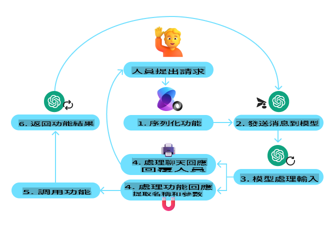
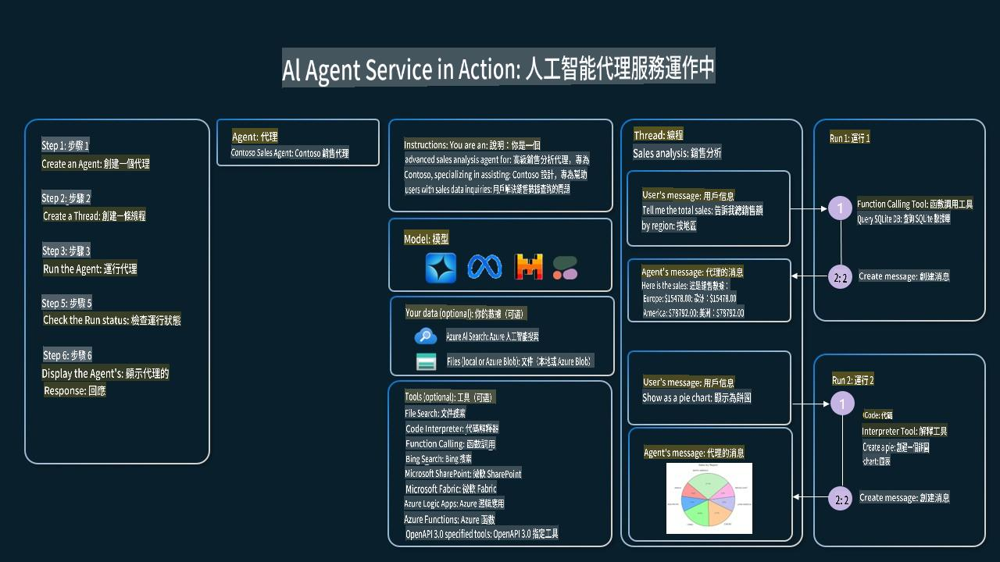

<!--
CO_OP_TRANSLATOR_METADATA:
{
  "original_hash": "b8ea2abd1a674f736d5fc08982e6ec06",
  "translation_date": "2025-03-28T14:11:55+00:00",
  "source_file": "04-tool-use\\README.md",
  "language_code": "tw"
}
-->
[](https://youtu.be/vieRiPRx-gI?si=cEZ8ApnT6Sus9rhn)

> _(點擊上方圖片觀看本課程影片)_

# 工具使用設計模式

工具之所以有趣，是因為它們讓 AI 代理擁有更廣泛的能力。透過加入工具，代理不再只局限於一組有限的動作，而是可以執行多種多樣的操作。在本章中，我們將探討工具使用設計模式，描述 AI 代理如何使用特定工具來達成目標。

## 簡介

在本課程中，我們將回答以下問題：

- 什麼是工具使用設計模式？
- 它可以應用於哪些使用場景？
- 實現這種設計模式需要哪些元素/組成部分？
- 使用工具使用設計模式來構建值得信賴的 AI 代理有哪些特殊考量？

## 學習目標

完成本課程後，您將能夠：

- 定義工具使用設計模式及其目的。
- 識別適用於工具使用設計模式的使用場景。
- 理解實現此設計模式所需的關鍵元素。
- 認識確保使用此設計模式的 AI 代理值得信賴的考量事項。

## 什麼是工具使用設計模式？

**工具使用設計模式**專注於賦予大型語言模型 (LLMs) 與外部工具交互的能力，以達成特定目標。工具是代理可以執行的程式碼，可能是簡單的函數（如計算器），也可能是第三方服務的 API 呼叫（如股票價格查詢或天氣預報）。在 AI 代理的上下文中，工具被設計為可以由代理根據**模型生成的函數呼叫**來執行。

## 它可以應用於哪些使用場景？

AI 代理可以利用工具完成複雜任務、檢索資訊或做出決策。工具使用設計模式通常用於需要與外部系統動態交互的場景，例如數據庫、網路服務或程式碼解釋器。以下是一些典型的使用場景：

- **動態資訊檢索**：代理可以查詢外部 API 或數據庫以獲取最新數據（例如，查詢 SQLite 數據庫進行數據分析，獲取股票價格或天氣資訊）。
- **程式碼執行與解釋**：代理可以執行程式碼或腳本來解決數學問題、生成報告或執行模擬。
- **工作流程自動化**：透過整合任務排程器、電子郵件服務或數據管道等工具，自動化重複性或多步驟的工作流程。
- **客戶支持**：代理可以與 CRM 系統、工單平台或知識庫互動，以解決用戶問題。
- **內容生成與編輯**：代理可以利用工具（如語法檢查器、文本摘要工具或內容安全評估工具）來協助完成內容創建任務。

## 實現工具使用設計模式需要哪些元素/組成部分？

這些組成部分使 AI 代理能夠執行多種任務。以下是實現工具使用設計模式所需的關鍵元素：

- **函數/工具呼叫**：這是讓 LLM 與工具交互的主要方式。函數或工具是代理用來完成任務的可重用程式碼塊，範圍從簡單函數（如計算器）到第三方服務的 API 呼叫（如股票價格查詢或天氣預報）。
- **動態資訊檢索**：代理可以查詢外部 API 或數據庫以獲取最新數據，適用於數據分析、股票價格查詢或天氣資訊等任務。
- **程式碼執行與解釋**：代理可以執行程式碼或腳本來解決數學問題、生成報告或執行模擬。
- **工作流程自動化**：透過整合工具（如任務排程器、電子郵件服務或數據管道）來自動化重複性或多步驟的工作流程。
- **客戶支持**：代理可以與 CRM 系統、工單平台或知識庫互動，以解決用戶問題。
- **內容生成與編輯**：代理可以利用工具（如語法檢查器、文本摘要工具或內容安全評估工具）來協助完成內容創建任務。

接下來，我們將更詳細地探討函數/工具呼叫。

### 函數/工具呼叫

函數呼叫是讓大型語言模型 (LLMs) 與工具交互的主要方式。您經常會看到“函數”和“工具”被交替使用，因為“函數”（可重用的程式碼塊）就是代理用來完成任務的“工具”。為了讓函數的程式碼被調用，LLM 必須將用戶的請求與函數的描述進行比較。為此，需要將包含所有可用函數描述的架構發送給 LLM。LLM 然後選擇最適合該任務的函數，並返回其名稱和參數。選定的函數被調用，其響應被發送回 LLM，LLM 使用該資訊來回應用戶的請求。

要讓代理實現函數呼叫，開發人員需要：

1. 支援函數呼叫的 LLM 模型
2. 包含函數描述的架構
3. 每個描述函數的程式碼

以下以獲取城市當前時間為例進行說明：

1. **初始化支援函數呼叫的 LLM：**

    並非所有模型都支援函數呼叫，因此需要檢查所使用的 LLM 是否支援。例如，<a href="https://learn.microsoft.com/azure/ai-services/openai/how-to/function-calling" target="_blank">Azure OpenAI</a> 支援函數呼叫。我們可以先初始化 Azure OpenAI 客戶端。

    ```python
    # Initialize the Azure OpenAI client
    client = AzureOpenAI(
        azure_endpoint = os.getenv("AZURE_OPENAI_ENDPOINT"), 
        api_key=os.getenv("AZURE_OPENAI_API_KEY"),  
        api_version="2024-05-01-preview"
    )
    ```

1. **創建函數架構**：

    接下來，我們將定義一個 JSON 架構，包含函數名稱、函數功能描述以及函數參數的名稱和描述。然後，我們將這個架構與用戶請求一起傳遞給之前創建的客戶端。需要注意的是，返回的是**工具呼叫**，而非問題的最終答案。如前所述，LLM 返回其為該任務選擇的函數名稱及其參數。

    ```python
    # Function description for the model to read
    tools = [
        {
            "type": "function",
            "function": {
                "name": "get_current_time",
                "description": "Get the current time in a given location",
                "parameters": {
                    "type": "object",
                    "properties": {
                        "location": {
                            "type": "string",
                            "description": "The city name, e.g. San Francisco",
                        },
                    },
                    "required": ["location"],
                },
            }
        }
    ]
    ```
   
    ```python
  
    # Initial user message
    messages = [{"role": "user", "content": "What's the current time in San Francisco"}] 
  
    # First API call: Ask the model to use the function
      response = client.chat.completions.create(
          model=deployment_name,
          messages=messages,
          tools=tools,
          tool_choice="auto",
      )
  
      # Process the model's response
      response_message = response.choices[0].message
      messages.append(response_message)
  
      print("Model's response:")  

      print(response_message)
  
    ```

    ```bash
    Model's response:
    ChatCompletionMessage(content=None, role='assistant', function_call=None, tool_calls=[ChatCompletionMessageToolCall(id='call_pOsKdUlqvdyttYB67MOj434b', function=Function(arguments='{"location":"San Francisco"}', name='get_current_time'), type='function')])
    ```
  
1. **執行任務所需的函數程式碼**：

    現在 LLM 已選擇需要執行的函數，接下來需要實現並執行該任務的程式碼。我們可以用 Python 實現獲取當前時間的程式碼，同時需要編寫程式碼以從 response_message 中提取名稱和參數以獲取最終結果。

    ```python
      def get_current_time(location):
        """Get the current time for a given location"""
        print(f"get_current_time called with location: {location}")  
        location_lower = location.lower()
        
        for key, timezone in TIMEZONE_DATA.items():
            if key in location_lower:
                print(f"Timezone found for {key}")  
                current_time = datetime.now(ZoneInfo(timezone)).strftime("%I:%M %p")
                return json.dumps({
                    "location": location,
                    "current_time": current_time
                })
      
        print(f"No timezone data found for {location_lower}")  
        return json.dumps({"location": location, "current_time": "unknown"})
    ```

    ```python
     # Handle function calls
      if response_message.tool_calls:
          for tool_call in response_message.tool_calls:
              if tool_call.function.name == "get_current_time":
     
                  function_args = json.loads(tool_call.function.arguments)
     
                  time_response = get_current_time(
                      location=function_args.get("location")
                  )
     
                  messages.append({
                      "tool_call_id": tool_call.id,
                      "role": "tool",
                      "name": "get_current_time",
                      "content": time_response,
                  })
      else:
          print("No tool calls were made by the model.")  
  
      # Second API call: Get the final response from the model
      final_response = client.chat.completions.create(
          model=deployment_name,
          messages=messages,
      )
  
      return final_response.choices[0].message.content
     ```

    ```bash
      get_current_time called with location: San Francisco
      Timezone found for san francisco
      The current time in San Francisco is 09:24 AM.
     ```

函數呼叫是大多數（如果不是全部的話）代理工具使用設計的核心，但從頭開始實現它有時可能具有挑戰性。如我們在 [第 2 課](../../../02-explore-agentic-frameworks) 中學到的，代理框架為我們提供了實現工具使用的預建組件。

## 使用代理框架的工具使用範例

以下是使用不同代理框架實現工具使用設計模式的一些範例：

### Semantic Kernel

<a href="https://learn.microsoft.com/azure/ai-services/agents/overview" target="_blank">Semantic Kernel</a> 是一個開源的 AI 框架，適用於使用大型語言模型 (LLMs) 的 .NET、Python 和 Java 開發人員。它透過一種稱為<a href="https://learn.microsoft.com/semantic-kernel/concepts/ai-services/chat-completion/function-calling/?pivots=programming-language-python#1-serializing-the-functions" target="_blank">序列化</a>的過程，自動向模型描述您的函數及其參數，簡化了函數呼叫的使用。此外，它還處理模型與程式碼之間的來回通信。使用像 Semantic Kernel 這樣的代理框架的另一個優勢是，您可以訪問預建工具，例如<a href="https://github.com/microsoft/semantic-kernel/blob/main/python/samples/getting_started_with_agents/openai_assistant/step4_assistant_tool_file_search.py" target="_blank">文件搜索</a>和<a href="https://github.com/microsoft/semantic-kernel/blob/main/python/samples/getting_started_with_agents/openai_assistant/step3_assistant_tool_code_interpreter.py" target="_blank">程式碼解釋器</a>。

以下圖示說明了使用 Semantic Kernel 進行函數呼叫的過程：



在 Semantic Kernel 中，函數/工具被稱為<a href="https://learn.microsoft.com/semantic-kernel/concepts/plugins/?pivots=programming-language-python" target="_blank">插件</a>。我們可以將 `get_current_time` function we saw earlier into a plugin by turning it into a class with the function in it. We can also import the `kernel_function` 裝飾器用於函數描述。當您使用 GetCurrentTimePlugin 創建內核時，內核會自動序列化函數及其參數，並在此過程中創建要發送給 LLM 的架構。

```python
from semantic_kernel.functions import kernel_function

class GetCurrentTimePlugin:
    async def __init__(self, location):
        self.location = location

    @kernel_function(
        description="Get the current time for a given location"
    )
    def get_current_time(location: str = ""):
        ...

```

```python 
from semantic_kernel import Kernel

# Create the kernel
kernel = Kernel()

# Create the plugin
get_current_time_plugin = GetCurrentTimePlugin(location)

# Add the plugin to the kernel
kernel.add_plugin(get_current_time_plugin)
```
  
### Azure AI Agent Service

<a href="https://learn.microsoft.com/azure/ai-services/agents/overview" target="_blank">Azure AI Agent Service</a> 是一個較新的代理框架，旨在幫助開發人員安全地構建、部署和擴展高質量且可擴展的 AI 代理，而無需管理底層的計算和存儲資源。它特別適用於企業應用，因為它是一個具有企業級安全性的完全託管服務。

與直接使用 LLM API 相比，Azure AI Agent Service 提供了一些優勢，包括：

- 自動工具呼叫：無需解析工具呼叫、調用工具並處理響應；這些都在伺服器端完成。
- 安全管理數據：您可以依賴線程來存儲所需的所有資訊，而無需自己管理對話狀態。
- 開箱即用的工具：可用於與數據源交互的工具，例如 Bing、Azure AI Search 和 Azure Functions。

Azure AI Agent Service 中可用的工具分為兩類：

1. 知識工具：
    - <a href="https://learn.microsoft.com/azure/ai-services/agents/how-to/tools/bing-grounding?tabs=python&pivots=overview" target="_blank">使用 Bing 搜索進行知識檢索</a>
    - <a href="https://learn.microsoft.com/azure/ai-services/agents/how-to/tools/file-search?tabs=python&pivots=overview" target="_blank">文件搜索</a>
    - <a href="https://learn.microsoft.com/azure/ai-services/agents/how-to/tools/azure-ai-search?tabs=azurecli%2Cpython&pivots=overview-azure-ai-search" target="_blank">Azure AI Search</a>

2. 行動工具：
    - <a href="https://learn.microsoft.com/azure/ai-services/agents/how-to/tools/function-calling?tabs=python&pivots=overview" target="_blank">函數呼叫</a>
    - <a href="https://learn.microsoft.com/azure/ai-services/agents/how-to/tools/code-interpreter?tabs=python&pivots=overview" target="_blank">程式碼解釋器</a>
    - <a href="https://learn.microsoft.com/azure/ai-services/agents/how-to/tools/openapi-spec?tabs=python&pivots=overview" target="_blank">OpenAI 定義的工具</a>
    - <a href="https://learn.microsoft.com/azure/ai-services/agents/how-to/tools/azure-functions?pivots=overview" target="_blank">Azure Functions</a>

Agent Service 允許我們將這些工具作為 `toolset`. It also utilizes `threads` which keep track of the history of messages from a particular conversation.

Imagine you are a sales agent at a company called Contoso. You want to develop a conversational agent that can answer questions about your sales data.

The following image illustrates how you could use Azure AI Agent Service to analyze your sales data:



To use any of these tools with the service we can create a client and define a tool or toolset. To implement this practically we can use the following Python code. The LLM will be able to look at the toolset and decide whether to use the user created function, `fetch_sales_data_using_sqlite_query` 或預建的程式碼解釋器，根據用戶請求進行使用。

```python 
import os
from azure.ai.projects import AIProjectClient
from azure.identity import DefaultAzureCredential
from fecth_sales_data_functions import fetch_sales_data_using_sqlite_query # fetch_sales_data_using_sqlite_query function which can be found in a fetch_sales_data_functions.py file.
from azure.ai.projects.models import ToolSet, FunctionTool, CodeInterpreterTool

project_client = AIProjectClient.from_connection_string(
    credential=DefaultAzureCredential(),
    conn_str=os.environ["PROJECT_CONNECTION_STRING"],
)

# Initialize function calling agent with the fetch_sales_data_using_sqlite_query function and adding it to the toolset
fetch_data_function = FunctionTool(fetch_sales_data_using_sqlite_query)
toolset = ToolSet()
toolset.add(fetch_data_function)

# Initialize Code Interpreter tool and adding it to the toolset. 
code_interpreter = code_interpreter = CodeInterpreterTool()
toolset = ToolSet()
toolset.add(code_interpreter)

agent = project_client.agents.create_agent(
    model="gpt-4o-mini", name="my-agent", instructions="You are helpful agent", 
    toolset=toolset
)
```

## 使用工具使用設計模式構建值得信賴的 AI 代理的特殊考量是什麼？

使用 LLM 動態生成的 SQL 的一個常見問題是安全性，特別是 SQL 注入或惡意操作（例如刪除或篡改數據庫）的風險。儘管這些問題是有效的，但可以透過適當配置數據庫訪問權限來有效減輕風險。對於大多數數據庫，這涉及將數據庫配置為只讀。對於 PostgreSQL 或 Azure SQL 等數據庫服務，應為應用程式分配只讀（SELECT）角色。

在安全環境中運行應用程式進一步增強了保護。在企業場景中，數據通常從運營系統中提取並轉換到只讀數據庫或數據倉庫中，具有用戶友好的架構。這種方法確保數據安全，並優化性能和可訪問性，同時應用程式的訪問被限制為只讀。

## 其他資源

- <a href="https://microsoft.github.io/build-your-first-agent-with-azure-ai-agent-service-workshop/" target="_blank">Azure AI Agents Service Workshop</a>
- <a href="https://github.com/Azure-Samples/contoso-creative-writer/tree/main/docs/workshop" target="_blank">Contoso Creative Writer 多代理工作坊</a>
- <a href="https://learn.microsoft.com/semantic-kernel/concepts/ai-services/chat-completion/function-calling/?pivots=programming-language-python#1-serializing-the-functions" target="_blank">Semantic Kernel 函數呼叫教學</a>
- <a href="https://github.com/microsoft/semantic-kernel/blob/main/python/samples/getting_started_with_agents/openai_assistant/step3_assistant_tool_code_interpreter.py" target="_blank">Semantic Kernel 程式碼解釋器</a>
- <a href="https://microsoft.github.io/autogen/dev/user-guide/core-user-guide/components/tools.html" target="_blank">Autogen 工具</a>

## 上一課

[理解代理設計模式](../03-agentic-design-patterns/README.md)

## 下一課

[代理式 RAG](../05-agentic-rag/README.md)

**免責聲明**：  
本文檔使用 AI 翻譯服務 [Co-op Translator](https://github.com/Azure/co-op-translator) 進行翻譯。儘管我們努力確保準確性，但請注意，自動翻譯可能包含錯誤或不準確之處。原始語言的文件應被視為權威來源。對於關鍵信息，建議尋求專業人工翻譯。我們對因使用此翻譯而引起的任何誤解或誤讀不承擔責任。