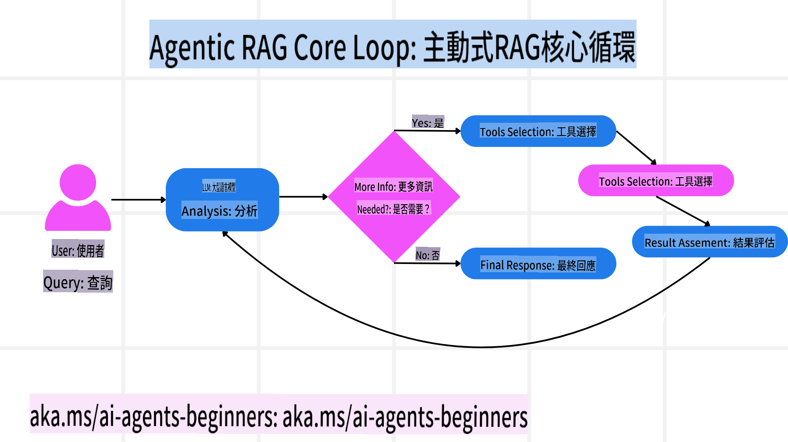
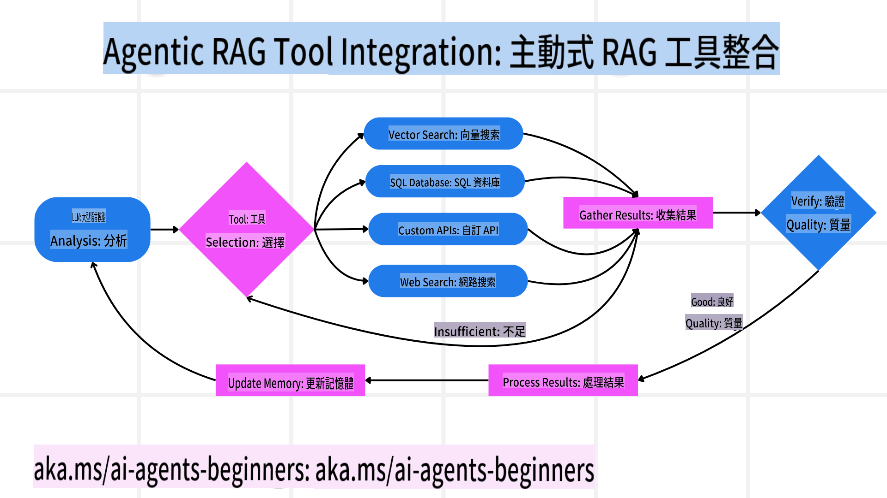
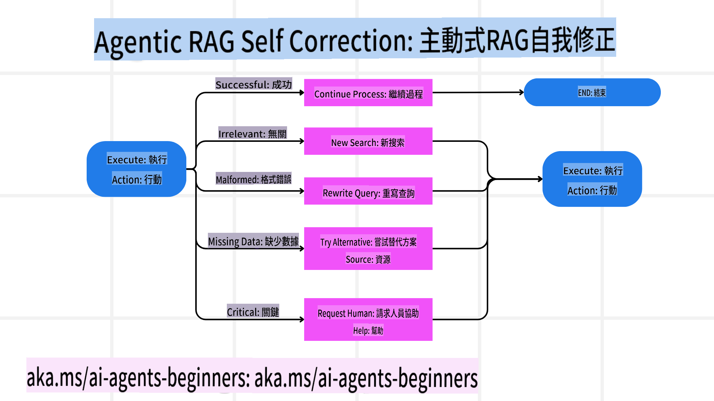
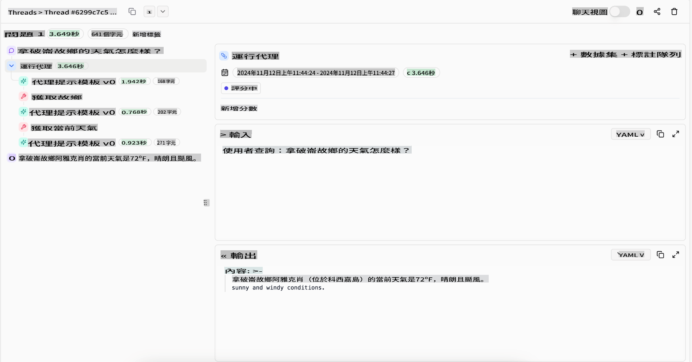
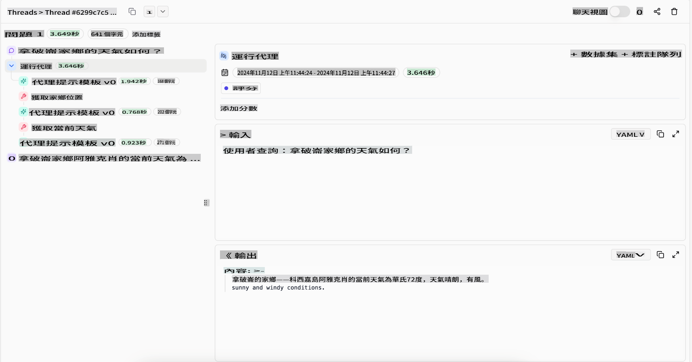

<!--
CO_OP_TRANSLATOR_METADATA:
{
  "original_hash": "4d215d159f2f3b96644fd62657988d23",
  "translation_date": "2025-03-28T14:12:54+00:00",
  "source_file": "05-agentic-rag\\README.md",
  "language_code": "tw"
}
-->

> _(點擊上方圖片觀看本課程影片)_

# Agentic RAG

本課程全面介紹了「Agentic Retrieval-Augmented Generation (Agentic RAG)」，這是一種新興的人工智慧範式，讓大型語言模型（LLMs）在從外部來源獲取資訊的同時，自主規劃下一步行動。不像靜態的檢索-閱讀模式，Agentic RAG 包含對 LLM 的反覆調用，穿插工具或函數調用以及結構化輸出。系統會評估結果、優化查詢、在需要時調用其他工具，並持續進行這個循環，直到達成令人滿意的解決方案。

## 課程介紹

本課程將涵蓋：

- **了解 Agentic RAG：** 探索一種新興的人工智慧範式，讓大型語言模型（LLMs）能夠自主規劃下一步行動，並從外部數據來源獲取資訊。
- **掌握迭代式「製作者-檢查者」模式：** 理解 LLM 的反覆調用循環，穿插工具或函數調用以及結構化輸出，旨在提升正確性並處理不良查詢。
- **探索實際應用：** 確認 Agentic RAG 的適用場景，例如以正確性為優先的環境、複雜的資料庫互動以及延展性工作流程。

## 學習目標

完成本課程後，您將能夠：

- **了解 Agentic RAG：** 探索這種新興的人工智慧範式，讓大型語言模型（LLMs）能夠自主規劃下一步行動，並從外部數據來源獲取資訊。
- **迭代式「製作者-檢查者」模式：** 理解 LLM 的反覆調用循環，穿插工具或函數調用以及結構化輸出，旨在提升正確性並處理不良查詢。
- **掌握推理過程：** 理解系統如何掌握推理過程，決定解題方式，而非依賴預定的流程。
- **工作流程：** 了解 agentic 模型如何自主決定檢索市場趨勢報告、識別競爭者數據、關聯內部銷售指標、綜合發現結果，並評估策略。
- **迭代循環、工具整合與記憶功能：** 學習系統如何依賴循環式交互模式，在步驟間保持狀態與記憶，避免重複循環，並做出更明智的決策。
- **處理失敗模式與自我修正：** 探索系統的強大自我修正機制，包括反覆調整查詢、使用診斷工具，並在必要時求助於人工監督。
- **代理邊界：** 了解 Agentic RAG 的局限性，專注於領域特定的自主性、基礎設施依賴性，以及對防護措施的遵守。
- **實際應用案例與價值：** 確認 Agentic RAG 的適用場景，例如以正確性為優先的環境、複雜的資料庫互動以及延展性工作流程。
- **治理、透明性與信任：** 學習治理與透明性的必要性，包括解釋性推理、偏見控制及人工監督的重要性。

## 什麼是 Agentic RAG？

Agentic Retrieval-Augmented Generation (Agentic RAG) 是一種新興的人工智慧範式，讓大型語言模型（LLMs）在從外部來源獲取資訊的同時，自主規劃下一步行動。不像靜態的檢索-閱讀模式，Agentic RAG 包含對 LLM 的反覆調用，穿插工具或函數調用以及結構化輸出。系統會評估結果、優化查詢、在需要時調用其他工具，並持續進行這個循環，直到達成令人滿意的解決方案。

這種迭代式「製作者-檢查者」模式提升了正確性，處理了結構化數據庫（例如 NL2SQL）的不良查詢，並確保了高品質的結果。系統會主動掌握其推理過程，重寫失敗的查詢，選擇不同的檢索方法，並整合多種工具——例如 Azure AI Search 的向量檢索、SQL 資料庫或自定義 API——最終完成答案。Agentic 系統的顯著特點是能夠掌握其推理過程。傳統的 RAG 實現依賴預定的流程，但 agentic 系統則會根據獲取資訊的質量，自主決定步驟順序。

## 定義 Agentic Retrieval-Augmented Generation (Agentic RAG)

Agentic Retrieval-Augmented Generation (Agentic RAG) 是人工智慧開發中的一種新興範式，其中 LLMs 不僅從外部數據來源獲取資訊，還能自主規劃下一步行動。不像靜態的檢索-閱讀模式或精心設計的提示序列，Agentic RAG 包括 LLM 的迭代調用循環，穿插工具或函數調用以及結構化輸出。每一步驟，系統都會評估獲得的結果，決定是否需要優化查詢、調用其他工具，並持續進行這個循環，直到達成令人滿意的解決方案。

這種迭代式「製作者-檢查者」運作模式旨在提升正確性，處理結構化數據庫（例如 NL2SQL）的不良查詢，並確保平衡且高品質的結果。與僅依賴精心設計的提示鏈不同，系統會主動掌握其推理過程。它可以重寫失敗的查詢，選擇不同的檢索方法，並整合多種工具——例如 Azure AI Search 的向量檢索、SQL 資料庫或自定義 API——最終完成答案。這樣一來，不需要過於複雜的編排框架，只需一個相對簡單的循環「LLM 調用 → 工具使用 → LLM 調用 → …」即可產生精緻且扎實的輸出。

## 掌握推理過程

使系統具備「代理性」的關鍵特徵是其掌握推理過程的能力。傳統的 RAG 實現通常依賴人類預先定義的模型路徑：一條檢索和推理的思路，指出何時檢索什麼內容。但當系統真正具備代理性時，它能內部決定如何解決問題。它不僅僅是在執行腳本，而是根據所獲取資訊的質量，自主決定步驟順序。

例如，當被要求制定產品發佈策略時，它不依賴一個完全描述研究和決策工作流程的提示。相反，agentic 模型會自主決定：

1. 使用 Bing Web Grounding 檢索當前市場趨勢報告。
2. 使用 Azure AI Search 識別相關的競爭者數據。
3. 利用 Azure SQL Database 關聯歷史內部銷售指標。
4. 透過 Azure OpenAI Service 將發現結果整合成一個連貫的策略。
5. 評估策略是否存在缺陷或不一致之處，若必要則再次檢索。
所有這些步驟——優化查詢、選擇來源、迭代直到對答案「滿意」——都是由模型決定的，而非由人類預先編寫。

## 迭代循環、工具整合與記憶功能

Agentic 系統依賴於循環式交互模式：

- **初始調用：** 使用者目標（即使用者提示）被提交給 LLM。
- **工具調用：** 如果模型發現資訊不足或指令不明確，它會選擇一種工具或檢索方法，例如向量資料庫查詢（例如 Azure AI Search Hybrid search over private data）或結構化 SQL 調用，來獲取更多上下文。
- **評估與優化：** 在審查返回的數據後，模型決定這些資訊是否足夠。如果不夠，它會優化查詢、嘗試不同的工具或調整方法。
- **重複直到滿意：** 這個循環會持續進行，直到模型認為已經有足夠的清晰度和證據來提供一個最終的、經過深思熟慮的回應。
- **記憶與狀態：** 因為系統在步驟間保持狀態與記憶，它能夠記住先前的嘗試及其結果，避免重複循環，並在過程中做出更明智的決策。

隨著時間的推移，這種運作模式產生了一種逐步理解的感覺，使模型能夠在無需人類不斷介入或重塑提示的情況下，處理複雜的多步驟任務。

## 處理失敗模式與自我修正

Agentic RAG 的自主性還包括強大的自我修正機制。當系統遇到瓶頸——例如檢索到不相關的文件或遇到不良查詢時，它能夠：

- **迭代與重新查詢：** 不會返回低價值的回應，模型會嘗試新的檢索策略、重寫資料庫查詢，或尋找替代的數據集。
- **使用診斷工具：** 系統可能會調用額外的功能，幫助其調試推理步驟或確認檢索數據的正確性。像 Azure AI Tracing 這樣的工具對於實現穩健的可觀察性和監控非常重要。
- **依賴人工監督：** 對於高風險或多次失敗的場景，模型可能會標記不確定性並請求人工指導。一旦人類提供了糾正意見，模型可以在後續過程中吸收這些教訓。

這種迭代且動態的方法使模型能夠持續改進，確保它不僅僅是一次性系統，而是在每次會話中從其錯誤中學習。

## 代理邊界

儘管在任務內部具備自主性，Agentic RAG 並不等同於通用人工智慧。其「代理性」能力被限制於人類開發者提供的工具、數據來源和政策範圍內。它無法自行創建工具或超越既定的領域邊界，而是擅長於動態編排現有資源。

與更高級人工智慧形式的關鍵區別包括：

1. **領域特定的自主性：** Agentic RAG 系統專注於在已知領域內達成使用者定義的目標，採用例如查詢重寫或工具選擇等策略來改進結果。
2. **基礎設施依賴性：** 系統的能力取決於開發者整合的工具和數據。若無人類介入，它無法超越這些限制。
3. **遵守防護措施：** 道德準則、合規規則和業務政策仍然非常重要。代理的自由始終受到安全措施和監管機制的約束（希望如此？）。

## 實際應用案例與價值

Agentic RAG 在需要反覆優化和精準度的場景中表現突出：

1. **以正確性為優先的環境：** 在合規檢查、法規分析或法律研究中，代理模型可以反覆驗證事實、查詢多個來源，並重寫查詢，直到產生經過全面審核的答案。
2. **複雜的資料庫互動：** 在處理結構化數據時，查詢可能經常失敗或需要調整，系統可以自主使用 Azure SQL 或 Microsoft Fabric OneLake 優化查詢，確保最終檢索符合使用者意圖。
3. **延展性工作流程：** 當新的資訊浮現時，長時間運行的會話可能會演變。Agentic RAG 可以持續整合新數據，隨著對問題空間的了解加深而調整策略。

## 治理、透明性與信任

隨著這些系統在推理過程中變得更加自主，治理和透明性至關重要：

- **解釋性推理：** 模型可以提供其所做查詢、所參考來源以及推理步驟的審計記錄。像 Azure AI Content Safety 和 Azure AI Tracing / GenAIOps 這樣的工具可以幫助維持透明性並降低風險。
- **偏見控制與平衡檢索：** 開發者可以調整檢索策略，以確保考慮平衡且具代表性的數據來源，並定期審核輸出以檢測偏見或不均衡模式，這對於使用 Azure Machine Learning 的高級數據科學組織尤為重要。
- **人工監督與合規：** 對於敏感任務，人工審查仍然是必要的。Agentic RAG 並未取代高風險決策中的人類判斷——它通過提供經過更全面審核的選項來輔助人類。

擁有能夠清晰記錄操作的工具至關重要。否則，調試多步驟過程可能會非常困難。以下是來自 Literal AI（Chainlit 背後的公司）的代理執行範例：

## 結論

Agentic RAG 代表了人工智慧系統在處理複雜且數據密集任務方面的自然進化。透過採用循環式交互模式、自主選擇工具並優化查詢直到達成高品質結果，系統超越了靜態的提示跟隨，成為更具適應性、上下文感知的決策者。儘管仍受限於人類定義的基礎設施和倫理準則，這些代理性能力為企業和終端使用者提供了更豐富、更動態且更實用的人工智慧互動。

## 其他資源

- <a href="https://learn.microsoft.com/training/modules/use-own-data-azure-openai" target="_blank">使用 Azure OpenAI Service 實現檢索增強生成（RAG）：學習如何使用自己的數據進行實現。本 Microsoft Learn 模組提供了實施 RAG 的全面指南</a>
- <a href="https://learn.microsoft.com/azure/ai-studio/concepts/evaluation-approach-gen-ai" target="_blank">使用 Azure AI Foundry 評估生成式 AI 應用：本文涵蓋了在公開數據集上對模型的評估與比較，包括 Agentic AI 應用和 RAG 架構</a>
- <a href="https://weaviate.io/blog/what-is-agentic-rag" target="_blank">什麼是 Agentic RAG | Weaviate</a>
- <a href="https://ragaboutit.com/agentic-rag-a-complete-guide-to-agent-based-retrieval-augmented-generation/" target="_blank">Agentic RAG：基於代理的檢索增強生成完整指南 – generation RAG 新聞</a>
- <a href="https://huggingface.co/learn/cookbook/agent_rag" target="_blank">Agentic RAG：透過查詢重構和自我查詢為您的 RAG 提速！Hugging Face 開源 AI 食譜</a>
- <a href="https://youtu.be/aQ4yQXeB1Ss?si=2HUqBzHoeB5tR04U" target="_blank">為 RAG 添加代理層</a>
- <a href="https://www.youtube.com/watch?v=zeAyuLc_f3Q&t=244s" target="_blank">知識助手的未來：Jerry Liu</a>
- <a href="https://www.youtube.com/watch?v=AOSjiXP1jmQ" target="_blank">如何構建 Agentic RAG 系統</a>
- <a href="https://ignite.microsoft.com/sessions/BRK102?source=sessions" target="_blank">使用 Azure AI Foundry Agent Service 擴展您的 AI 代理</a>

### 學術論文

- <a href="https://arxiv.org/abs/2303.

**免責聲明**：  
本文檔使用 AI 翻譯服務 [Co-op Translator](https://github.com/Azure/co-op-translator) 進行翻譯。雖然我們努力確保翻譯的準確性，但請注意，自動翻譯可能包含錯誤或不準確之處。原始語言的文件應被視為權威來源。對於關鍵信息，建議尋求專業人工翻譯。我們對使用此翻譯引起的任何誤解或錯誤解釋不承擔責任。