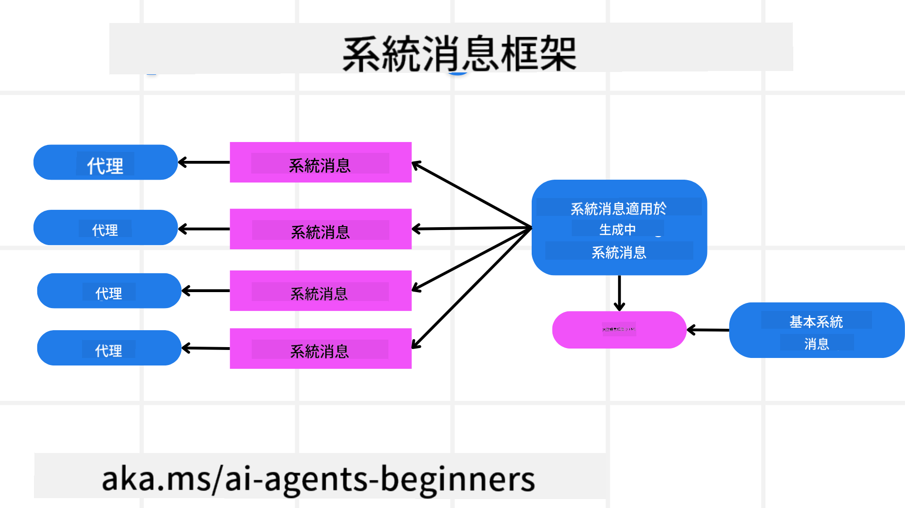
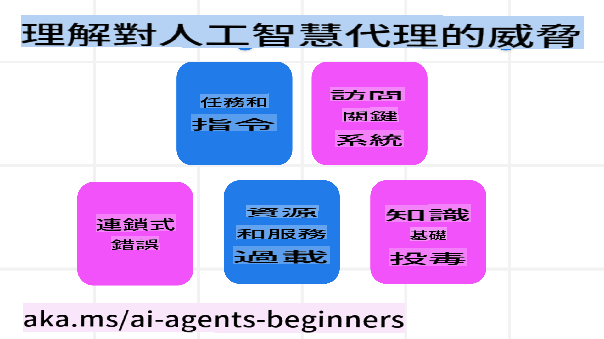
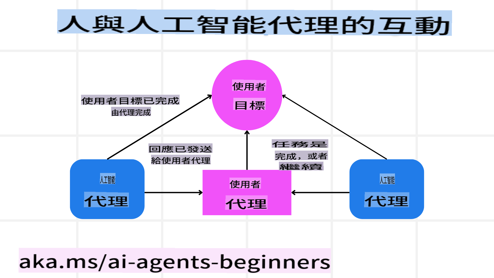

<!--
CO_OP_TRANSLATOR_METADATA:
{
  "original_hash": "c069d7ff0feca3027f88819355866ca1",
  "translation_date": "2025-03-28T14:14:01+00:00",
  "source_file": "06-building-trustworthy-agents\\README.md",
  "language_code": "tw"
}
-->
[](https://youtu.be/iZKkMEGBCUQ?si=Q-kEbcyHUMPoHp8L)

> _(點擊上方圖片觀看本課程影片)_

# 建立值得信賴的 AI Agent

## 課程簡介

本課程將涵蓋：

- 如何建立並部署安全且有效的 AI Agent  
- 開發 AI Agent 時的重要安全考量  
- 如何在開發 AI Agent 時維護資料與使用者隱私  

## 學習目標

完成本課程後，你將能夠：

- 辨識並減輕開發 AI Agent 時的風險  
- 實施安全措施，確保資料和存取權的正確管理  
- 建立能維護資料隱私並提供優質使用者體驗的 AI Agent  

## 安全性

首先，我們來探討如何建立安全的智能應用程式。安全性意味著 AI Agent 能按照設計執行。作為智能應用程式的開發者，我們擁有方法和工具來最大化安全性：

### 建立系統訊息框架

如果你曾使用大型語言模型 (LLM) 建立 AI 應用程式，就會知道設計一個穩健的系統提示或系統訊息有多重要。這些提示負責建立 LLM 與使用者和資料互動的元規則、指令和指導方針。

對於 AI Agent，系統提示更為重要，因為這些 Agent 需要非常具體的指令來完成我們為其設計的任務。

為了創建可擴展的系統提示，我們可以使用系統訊息框架來建立應用程式中的一個或多個 Agent：



#### 步驟 1：創建元系統訊息

元提示將由 LLM 使用來生成我們創建的 Agent 的系統提示。我們將其設計為一個模板，以便在需要時高效創建多個 Agent。

以下是一個元系統訊息範例，我們會提供給 LLM：

```plaintext
You are an expert at creating AI agent assistants. 
You will be provided a company name, role, responsibilities and other
information that you will use to provide a system prompt for.
To create the system prompt, be descriptive as possible and provide a structure that a system using an LLM can better understand the role and responsibilities of the AI assistant. 
```

#### 步驟 2：創建基本提示

下一步是創建一個描述 AI Agent 的基本提示。你應該包括 Agent 的角色、需要完成的任務，以及 Agent 的其他責任。

以下是一個範例：

```plaintext
You are a travel agent for Contoso Travel that is great at booking flights for customers. To help customers you can perform the following tasks: lookup available flights, book flights, ask for preferences in seating and times for flights, cancel any previously booked flights and alert customers on any delays or cancellations of flights.  
```

#### 步驟 3：向 LLM 提供基本系統訊息

現在，我們可以將元系統訊息作為系統訊息，並加入我們的基本系統訊息來進行優化。

這將產生一個更適合指導我們 AI Agent 的系統訊息：

```markdown
**Company Name:** Contoso Travel  
**Role:** Travel Agent Assistant

**Objective:**  
You are an AI-powered travel agent assistant for Contoso Travel, specializing in booking flights and providing exceptional customer service. Your main goal is to assist customers in finding, booking, and managing their flights, all while ensuring that their preferences and needs are met efficiently.

**Key Responsibilities:**

1. **Flight Lookup:**
    
    - Assist customers in searching for available flights based on their specified destination, dates, and any other relevant preferences.
    - Provide a list of options, including flight times, airlines, layovers, and pricing.
2. **Flight Booking:**
    
    - Facilitate the booking of flights for customers, ensuring that all details are correctly entered into the system.
    - Confirm bookings and provide customers with their itinerary, including confirmation numbers and any other pertinent information.
3. **Customer Preference Inquiry:**
    
    - Actively ask customers for their preferences regarding seating (e.g., aisle, window, extra legroom) and preferred times for flights (e.g., morning, afternoon, evening).
    - Record these preferences for future reference and tailor suggestions accordingly.
4. **Flight Cancellation:**
    
    - Assist customers in canceling previously booked flights if needed, following company policies and procedures.
    - Notify customers of any necessary refunds or additional steps that may be required for cancellations.
5. **Flight Monitoring:**
    
    - Monitor the status of booked flights and alert customers in real-time about any delays, cancellations, or changes to their flight schedule.
    - Provide updates through preferred communication channels (e.g., email, SMS) as needed.

**Tone and Style:**

- Maintain a friendly, professional, and approachable demeanor in all interactions with customers.
- Ensure that all communication is clear, informative, and tailored to the customer's specific needs and inquiries.

**User Interaction Instructions:**

- Respond to customer queries promptly and accurately.
- Use a conversational style while ensuring professionalism.
- Prioritize customer satisfaction by being attentive, empathetic, and proactive in all assistance provided.

**Additional Notes:**

- Stay updated on any changes to airline policies, travel restrictions, and other relevant information that could impact flight bookings and customer experience.
- Use clear and concise language to explain options and processes, avoiding jargon where possible for better customer understanding.

This AI assistant is designed to streamline the flight booking process for customers of Contoso Travel, ensuring that all their travel needs are met efficiently and effectively.

```

#### 步驟 4：迭代與改進

這個系統訊息框架的價值在於，它能讓我們更輕鬆地為多個 Agent 創建系統訊息，並隨著時間的推移改進系統訊息。通常，第一次嘗試的系統訊息很難完全符合需求。通過修改基本系統訊息並運行框架，我們可以比較和評估結果，進行小幅調整和改進。

## 理解威脅

為了建立值得信賴的 AI Agent，理解並減輕 AI Agent 所面臨的風險與威脅至關重要。我們來看看一些常見的威脅類型，以及如何更好地規劃和應對它們。



### 任務與指令

**描述：** 攻擊者試圖通過提示或操縱輸入來改變 AI Agent 的指令或目標。

**緩解方法：** 執行驗證檢查和輸入過濾，檢測可能危險的提示，在它們被 AI Agent 處理之前攔截。由於這類攻擊通常需要與 Agent 頻繁互動，限制對話輪次也是防範此類攻擊的一種方法。

### 存取關鍵系統

**描述：** 如果 AI Agent 可以存取儲存敏感資料的系統與服務，攻擊者可能會破壞 Agent 與這些服務之間的通訊。這可能是直接攻擊，也可能是透過 Agent 間接獲取系統資訊的嘗試。

**緩解方法：** AI Agent 應僅在必要時存取系統，以防範此類攻擊。確保 Agent 與系統之間的通訊是安全的。實施身份驗證和存取控制也是保護這些資訊的一種方式。

### 資源與服務過載

**描述：** AI Agent 能存取不同的工具與服務來完成任務。攻擊者可能利用這一點，通過 AI Agent 向這些服務發送大量請求，導致系統故障或高昂的成本。

**緩解方法：** 實施策略限制 AI Agent 向服務發出的請求數量。限制對話輪次和請求數量也是防範此類攻擊的另一種方式。

### 知識庫污染

**描述：** 這類攻擊不是直接針對 AI Agent，而是針對其使用的知識庫和其他服務。這可能包括破壞 AI Agent 用於完成任務的數據或資訊，導致使用者收到偏頗或非預期的回應。

**緩解方法：** 定期驗證 AI Agent 在其工作流程中使用的數據。確保只有受信任的人員可以更改這些數據，防止此類攻擊。

### 錯誤連鎖

**描述：** AI Agent 存取各種工具和服務來完成任務。攻擊者造成的錯誤可能導致其他系統故障，進而使攻擊範圍擴大且更難排查。

**緩解方法：** 一種方法是讓 AI Agent 在受限環境中運行，例如在 Docker 容器中執行任務，以防止直接系統攻擊。建立後備機制和錯誤重試邏輯，當某些系統返回錯誤時可有效避免更大範圍的系統故障。

## 人類參與流程

另一種建立值得信賴的 AI Agent 系統的有效方式是引入人類參與流程。這種方法讓使用者能在 Agent 運行過程中提供回饋。使用者實際上成為多 Agent 系統中的一部分，可以批准或終止運行過程。



以下是使用 AutoGen 展示此概念實現的程式碼範例：

```python

# Create the agents.
model_client = OpenAIChatCompletionClient(model="gpt-4o-mini")
assistant = AssistantAgent("assistant", model_client=model_client)
user_proxy = UserProxyAgent("user_proxy", input_func=input)  # Use input() to get user input from console.

# Create the termination condition which will end the conversation when the user says "APPROVE".
termination = TextMentionTermination("APPROVE")

# Create the team.
team = RoundRobinGroupChat([assistant, user_proxy], termination_condition=termination)

# Run the conversation and stream to the console.
stream = team.run_stream(task="Write a 4-line poem about the ocean.")
# Use asyncio.run(...) when running in a script.
await Console(stream)

```

## 結論

建立值得信賴的 AI Agent 需要謹慎的設計、強大的安全措施以及持續的迭代改進。透過實施結構化的元提示系統、理解潛在威脅並採取緩解策略，開發者可以創建既安全又有效的 AI Agent。此外，採用人類參與流程能確保 AI Agent 符合使用者需求，同時將風險降到最低。隨著 AI 的不斷發展，對安全性、隱私性和倫理考量保持積極態度，將成為促進 AI 驅動系統信任與可靠性的關鍵。

## 其他資源

- <a href="https://learn.microsoft.com/azure/ai-studio/responsible-use-of-ai-overview" target="_blank">負責任 AI 概述</a>  
- <a href="https://learn.microsoft.com/azure/ai-studio/concepts/evaluation-approach-gen-ai" target="_blank">生成式 AI 模型與應用評估方法</a>  
- <a href="https://learn.microsoft.com/azure/ai-services/openai/concepts/system-message?context=%2Fazure%2Fai-studio%2Fcontext%2Fcontext&tabs=top-techniques" target="_blank">安全系統訊息</a>  
- <a href="https://blogs.microsoft.com/wp-content/uploads/prod/sites/5/2022/06/Microsoft-RAI-Impact-Assessment-Template.pdf?culture=en-us&country=us" target="_blank">風險評估模板</a>  

## 上一課

[Agentic RAG](../05-agentic-rag/README.md)

## 下一課

[規劃設計模式](../07-planning-design/README.md)

**免責聲明**：  
本文檔使用 AI 翻譯服務 [Co-op Translator](https://github.com/Azure/co-op-translator) 進行翻譯。我們致力於提供準確的翻譯，但請注意，自動翻譯可能包含錯誤或不準確之處。原始語言的文件應被視為權威來源。對於關鍵信息，建議使用專業的人類翻譯。我們不對因使用此翻譯而產生的任何誤解或錯誤解釋承擔責任。