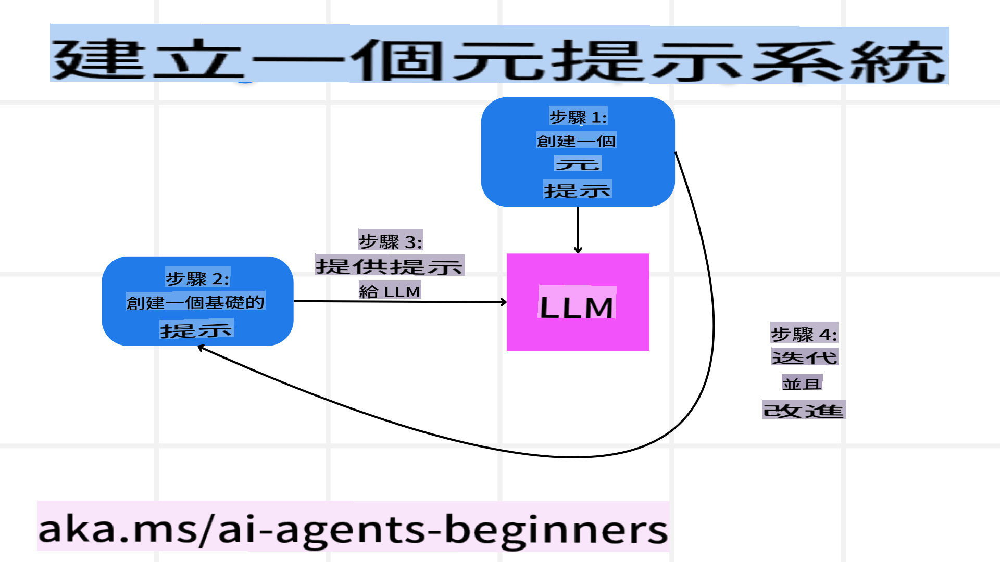

# 建立可信賴的 AI 代理

## 介紹

本課程將涵蓋以下內容：

- 如何構建和部署安全且有效的 AI 代理
- 開發 AI 代理時的重要安全考量
- 在開發 AI 代理時如何維護數據和用戶隱私

## 學習目標

完成本課程後，您將能夠：

- 識別並減輕在創建 AI 代理時可能面臨的風險。
- 實施安全措施，確保數據和訪問權限得到妥善管理。
- 創建能維護數據隱私並提供高品質用戶體驗的 AI 代理。

## 安全性

首先，我們來看看如何構建安全的代理應用程序。安全性意味著 AI 代理能按照設計執行其功能。作為代理應用程序的開發者，我們有一些方法和工具可以最大限度地提高安全性：

### 構建 Meta Prompt 系統

如果您曾使用大型語言模型（LLMs）開發過 AI 應用程序，您會知道設計一個穩健的系統提示或系統訊息的重要性。這些提示負責設定元規則、指令和指南，確保 LLM 能夠正確地與用戶和數據互動。

對於 AI 代理來說，系統提示更為重要，因為 AI 代理需要高度具體的指令來完成我們設計的任務。

為了創建可擴展的系統提示，我們可以使用 Meta Prompt 系統來構建應用中的一個或多個代理：



#### 步驟 1：創建 Meta 或模板提示

Meta Prompt 將由 LLM 用來生成我們所創建代理的系統提示。我們將其設計為模板，以便在需要時能高效地創建多個代理。

以下是一個我們提供給 LLM 的 Meta Prompt 範例：

```plaintext
You are an expert at creating AI agent assitants. 
You will be provided a company name, role, responsibilites and other
information that you will use to provide a system prompt for.
To create the system prompt, be descriptive as possible and provide a structure that a system using an LLM can better understand the role and responsibilites of the AI assistant. 
```

#### 步驟 2：創建基礎提示

下一步是創建一個基礎提示來描述 AI 代理。您應包括代理的角色、代理將完成的任務以及代理的其他職責。

以下是一個範例：

```plaintext
You are a travel agent for Contoso Travel with that is great at booking flights for customers. To help customers you can perform the following tasks: lookup available flights, book flights, ask for preferences in seating and times for flights, cancel any previously booked flights and alert customers on any delays or cancellations of flights.  
```

#### 步驟 3：將基礎提示提供給 LLM

現在，我們可以通過將 Meta Prompt 作為系統提示並添加我們的基礎提示來優化這個提示。

這將生成一個更適合指導我們 AI 代理的提示：

```markdown
**Company Name:** Contoso Travel  
**Role:** Travel Agent Assistant

**Objective:**  
You are an AI-powered travel agent assistant for Contoso Travel, specializing in booking flights and providing exceptional customer service. Your main goal is to assist customers in finding, booking, and managing their flights, all while ensuring that their preferences and needs are met efficiently.

**Key Responsibilities:**

1. **Flight Lookup:**
    
    - Assist customers in searching for available flights based on their specified destination, dates, and any other relevant preferences.
    - Provide a list of options, including flight times, airlines, layovers, and pricing.
2. **Flight Booking:**
    
    - Facilitate the booking of flights for customers, ensuring that all details are correctly entered into the system.
    - Confirm bookings and provide customers with their itinerary, including confirmation numbers and any other pertinent information.
3. **Customer Preference Inquiry:**
    
    - Actively ask customers for their preferences regarding seating (e.g., aisle, window, extra legroom) and preferred times for flights (e.g., morning, afternoon, evening).
    - Record these preferences for future reference and tailor suggestions accordingly.
4. **Flight Cancellation:**
    
    - Assist customers in canceling previously booked flights if needed, following company policies and procedures.
    - Notify customers of any necessary refunds or additional steps that may be required for cancellations.
5. **Flight Monitoring:**
    
    - Monitor the status of booked flights and alert customers in real-time about any delays, cancellations, or changes to their flight schedule.
    - Provide updates through preferred communication channels (e.g., email, SMS) as needed.

**Tone and Style:**

- Maintain a friendly, professional, and approachable demeanor in all interactions with customers.
- Ensure that all communication is clear, informative, and tailored to the customer's specific needs and inquiries.

**User Interaction Instructions:**

- Respond to customer queries promptly and accurately.
- Use a conversational style while ensuring professionalism.
- Prioritize customer satisfaction by being attentive, empathetic, and proactive in all assistance provided.

**Additional Notes:**

- Stay updated on any changes to airline policies, travel restrictions, and other relevant information that could impact flight bookings and customer experience.
- Use clear and concise language to explain options and processes, avoiding jargon where possible for better customer understanding.

This AI assistant is designed to streamline the flight booking process for customers of Contoso Travel, ensuring that all their travel needs are met efficiently and effectively.

```

#### 步驟 4：迭代與改進

Meta Prompt 系統的價值在於能夠更輕鬆地擴展多個代理的提示創建過程，並隨著時間的推移改進您的提示。很少有提示能在第一次就完全滿足您的使用需求。通過對基礎提示進行小幅調整並通過系統運行，您可以比較和評估結果以進行改進。

## 理解威脅

為了構建可信賴的 AI 代理，理解並減輕 AI 代理可能面臨的風險和威脅是非常重要的。接下來，我們將探討部分 AI 代理可能遭遇的威脅以及如何更好地規劃和應對。


### 任務與指令

**描述：** 攻擊者試圖通過提示或操縱輸入來更改 AI 代理的指令或目標。

**緩解措施：** 執行驗證檢查和輸入過濾，以檢測在被 AI 代理處理之前可能存在的危險提示。由於這類攻擊通常需要與代理頻繁交互，限制對話輪次也是防止此類攻擊的另一種方法。

### 訪問關鍵系統

**描述：** 如果 AI 代理可以訪問存儲敏感數據的系統和服務，攻擊者可能會破壞代理與這些服務之間的通信。這些可能是直接攻擊或通過代理間接獲取這些系統信息的嘗試。

**緩解措施：** AI 代理應僅在必要時訪問系統，以防止此類攻擊。代理與系統之間的通信也應保持安全。實施身份驗證和訪問控制是保護此類信息的另一種方法。

### 資源與服務超載

**描述：** AI 代理可以訪問不同的工具和服務來完成任務。攻擊者可能利用這一點通過 AI 代理向這些服務發送大量請求，導致系統故障或高額成本。

**緩解措施：** 實施策略限制 AI 代理向服務發送請求的數量。限制對話輪次和 AI 代理的請求數量也是防止此類攻擊的另一種方法。

### 知識庫污染

**描述：** 這類攻擊不直接針對 AI 代理，而是針對代理將使用的知識庫和其他服務。這可能涉及破壞代理用於完成任務的數據或信息，導致用戶收到偏頗或非預期的回應。

**緩解措施：** 定期驗證 AI 代理在工作流中使用的數據。確保這些數據的訪問權限是安全的，並且只有可信任的人員才能更改，以避免此類攻擊。

### 錯誤連鎖效應

**描述：** AI 代理會訪問各種工具和服務來完成任務。由攻擊者引發的錯誤可能導致代理連接的其他系統失效，使得攻擊範圍擴大且更難排查。

**緩解措施：** 避免此類情況的一種方法是讓 AI 代理在受限環境中運行，例如在 Docker 容器中執行任務，以防止直接系統攻擊。為某些系統出現錯誤時創建備援機制和重試邏輯，也是防止更大範圍系統故障的另一種方法。

## 人類介入

另一種構建可信賴 AI 代理系統的有效方式是引入人類介入（Human-in-the-loop）。這種方式創建了一個流程，允許用戶在代理運行期間提供反饋。用戶本質上充當多代理系統中的一個代理，通過批准或終止正在運行的流程來參與。


以下是一段使用 AutoGen 的代碼範例，展示如何實現這一概念：

```python

# Create the agents.
model_client = OpenAIChatCompletionClient(model="gpt-4o-mini")
assistant = AssistantAgent("assistant", model_client=model_client)
user_proxy = UserProxyAgent("user_proxy", input_func=input)  # Use input() to get user input from console.

# Create the termination condition which will end the conversation when the user says "APPROVE".
termination = TextMentionTermination("APPROVE")

# Create the team.
team = RoundRobinGroupChat([assistant, user_proxy], termination_condition=termination)

# Run the conversation and stream to the console.
stream = team.run_stream(task="Write a 4-line poem about the ocean.")
# Use asyncio.run(...) when running in a script.
await Console(stream)

```

**免責聲明**：  
本文檔是使用機器翻譯人工智慧服務進行翻譯的。儘管我們努力確保準確性，但請注意，自動翻譯可能包含錯誤或不準確之處。應以原始語言的文件為權威來源。對於關鍵資訊，建議尋求專業人工翻譯。我們對因使用此翻譯而產生的任何誤解或誤讀不承擔責任。