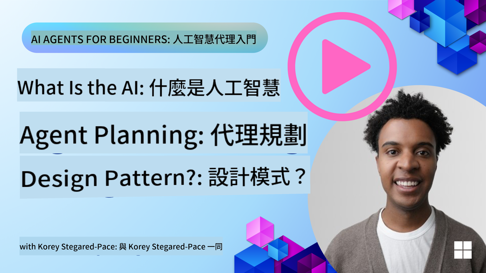
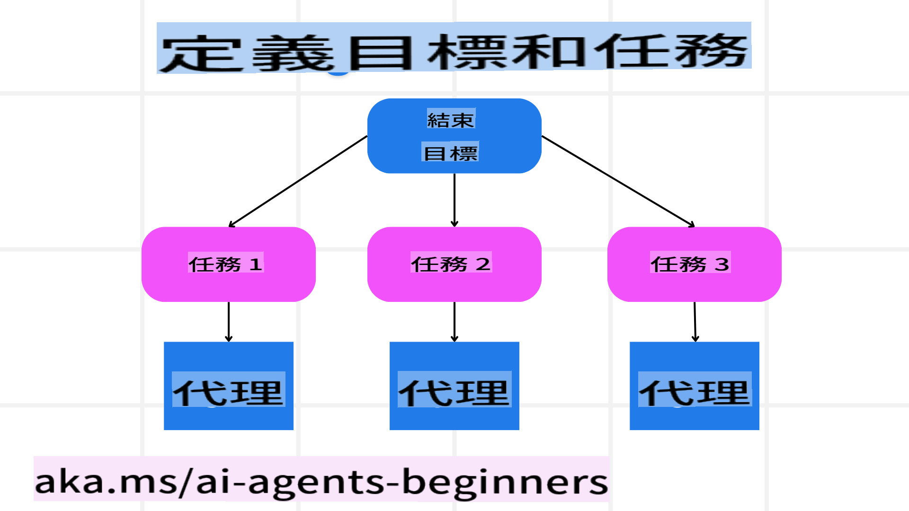

<!--
CO_OP_TRANSLATOR_METADATA:
{
  "original_hash": "8dd9a05d4dc18d3ff510e68e3798a080",
  "translation_date": "2025-03-28T14:14:32+00:00",
  "source_file": "07-planning-design\\README.md",
  "language_code": "tw"
}
-->
[](https://youtu.be/kPfJ2BrBCMY?si=9pYpPXp0sSbK91Dr)

> _(點擊上方圖片觀看本課影片)_

# 規劃設計

## 簡介

本課內容將涵蓋：

* 定義清晰的整體目標，並將複雜任務拆解為可管理的子任務。
* 利用結構化輸出以獲得更可靠且易於機器讀取的回應。
* 採用事件驅動的方法處理動態任務及應對突發輸入。

## 學習目標

完成本課後，你將了解：

* 為 AI 代理設定整體目標，確保其明確知道需要達成的目標。
* 將複雜任務分解為可管理的子任務，並將其組織成邏輯順序。
* 為代理配備適當的工具（例如搜尋工具或數據分析工具），決定何時及如何使用這些工具，並處理意外情況。
* 評估子任務結果、衡量性能，並迭代行動以改進最終輸出。

## 定義整體目標並拆解任務



大多數現實世界的任務過於複雜，無法在一步中完成。AI 代理需要一個簡潔的目標來引導其規劃和行動。例如，考慮以下目標：

    "生成一份三天的旅行行程表。"

雖然這個目標表述簡單，但仍需要進一步細化。目標越清晰，代理（以及任何人類合作者）越能專注於達成正確的結果，例如創建包含航班選項、酒店推薦及活動建議的完整行程表。

### 任務拆解

大型或複雜任務可拆分為較小的、目標導向的子任務以更容易處理。
以旅行行程為例，可以將目標拆解為：

* 航班預訂
* 酒店預訂
* 汽車租賃
* 個性化設置

每個子任務可由專門的代理或流程處理。一個代理可能專注於搜尋最佳航班交易，另一個代理則專注於酒店預訂，等等。一個協調或“下游”代理則可以將這些結果整合成一份完整的行程提供給最終用戶。

這種模組化方法還能實現漸進式改進。例如，你可以新增專門的代理來提供美食推薦或當地活動建議，並隨時間改進行程表。

### 結構化輸出

大型語言模型（LLMs）能生成結構化輸出（例如 JSON），使下游代理或服務更容易解析及處理。這在多代理情境中特別有用，我們可以在接收到規劃輸出後執行這些任務。快速概覽如下：

以下 Python 程式碼片段展示了一個簡單的規劃代理如何將目標分解為子任務並生成結構化計劃：

```python
from pydantic import BaseModel
from enum import Enum
from typing import List, Optional, Union
import json
import os
from typing import Optional
from pprint import pprint
from autogen_core.models import UserMessage, SystemMessage, AssistantMessage
from autogen_ext.models.azure import AzureAIChatCompletionClient
from azure.core.credentials import AzureKeyCredential

class AgentEnum(str, Enum):
    FlightBooking = "flight_booking"
    HotelBooking = "hotel_booking"
    CarRental = "car_rental"
    ActivitiesBooking = "activities_booking"
    DestinationInfo = "destination_info"
    DefaultAgent = "default_agent"
    GroupChatManager = "group_chat_manager"

# Travel SubTask Model
class TravelSubTask(BaseModel):
    task_details: str
    assigned_agent: AgentEnum  # we want to assign the task to the agent

class TravelPlan(BaseModel):
    main_task: str
    subtasks: List[TravelSubTask]
    is_greeting: bool

client = AzureAIChatCompletionClient(
    model="gpt-4o-mini",
    endpoint="https://models.inference.ai.azure.com",
    # To authenticate with the model you will need to generate a personal access token (PAT) in your GitHub settings.
    # Create your PAT token by following instructions here: https://docs.github.com/en/authentication/keeping-your-account-and-data-secure/managing-your-personal-access-tokens
    credential=AzureKeyCredential(os.environ["GITHUB_TOKEN"]),
    model_info={
        "json_output": False,
        "function_calling": True,
        "vision": True,
        "family": "unknown",
    },
)

# Define the user message
messages = [
    SystemMessage(content="""You are an planner agent.
    Your job is to decide which agents to run based on the user's request.
                      Provide your response in JSON format with the following structure:
{'main_task': 'Plan a family trip from Singapore to Melbourne.',
 'subtasks': [{'assigned_agent': 'flight_booking',
               'task_details': 'Book round-trip flights from Singapore to '
                               'Melbourne.'}
    Below are the available agents specialised in different tasks:
    - FlightBooking: For booking flights and providing flight information
    - HotelBooking: For booking hotels and providing hotel information
    - CarRental: For booking cars and providing car rental information
    - ActivitiesBooking: For booking activities and providing activity information
    - DestinationInfo: For providing information about destinations
    - DefaultAgent: For handling general requests""", source="system"),
    UserMessage(
        content="Create a travel plan for a family of 2 kids from Singapore to Melboune", source="user"),
]

response = await client.create(messages=messages, extra_create_args={"response_format": 'json_object'})

response_content: Optional[str] = response.content if isinstance(
    response.content, str) else None
if response_content is None:
    raise ValueError("Response content is not a valid JSON string" )

pprint(json.loads(response_content))

# # Ensure the response content is a valid JSON string before loading it
# response_content: Optional[str] = response.content if isinstance(
#     response.content, str) else None
# if response_content is None:
#     raise ValueError("Response content is not a valid JSON string")

# # Print the response content after loading it as JSON
# pprint(json.loads(response_content))

# Validate the response content with the MathReasoning model
# TravelPlan.model_validate(json.loads(response_content))
```

### 規劃代理與多代理協作

在這個例子中，一個語義路由代理接收到使用者請求（例如：“我需要一份酒店計劃供旅行使用。”）。

規劃器的流程如下：

* 接收酒店計劃：規劃器根據使用者的訊息以及系統提示（包含可用代理的詳細信息），生成結構化的旅行計劃。
* 列出代理及其工具：代理註冊表保存代理列表（例如航班、酒店、汽車租賃及活動代理）以及它們提供的功能或工具。
* 將計劃路由至相關代理：根據子任務的數量，規劃器可直接將訊息發送至專屬代理（適用於單任務情境）或透過群聊管理器協調多代理合作。
* 彙總結果：最後，規劃器對生成的計劃進行彙總以便更清晰呈現。

以下 Python 程式碼範例展示了這些步驟：

```python

from pydantic import BaseModel

from enum import Enum
from typing import List, Optional, Union

class AgentEnum(str, Enum):
    FlightBooking = "flight_booking"
    HotelBooking = "hotel_booking"
    CarRental = "car_rental"
    ActivitiesBooking = "activities_booking"
    DestinationInfo = "destination_info"
    DefaultAgent = "default_agent"
    GroupChatManager = "group_chat_manager"

# Travel SubTask Model

class TravelSubTask(BaseModel):
    task_details: str
    assigned_agent: AgentEnum # we want to assign the task to the agent

class TravelPlan(BaseModel):
    main_task: str
    subtasks: List[TravelSubTask]
    is_greeting: bool
import json
import os
from typing import Optional

from autogen_core.models import UserMessage, SystemMessage, AssistantMessage
from autogen_ext.models.openai import AzureOpenAIChatCompletionClient

# Create the client with type-checked environment variables

client = AzureOpenAIChatCompletionClient(
    azure_deployment=os.getenv("AZURE_OPENAI_DEPLOYMENT_NAME"),
    model=os.getenv("AZURE_OPENAI_DEPLOYMENT_NAME"),
    api_version=os.getenv("AZURE_OPENAI_API_VERSION"),
    azure_endpoint=os.getenv("AZURE_OPENAI_ENDPOINT"),
    api_key=os.getenv("AZURE_OPENAI_API_KEY"),
)

from pprint import pprint

# Define the user message

messages = [
    SystemMessage(content="""You are an planner agent.
    Your job is to decide which agents to run based on the user's request.
    Below are the available agents specialized in different tasks:
    - FlightBooking: For booking flights and providing flight information
    - HotelBooking: For booking hotels and providing hotel information
    - CarRental: For booking cars and providing car rental information
    - ActivitiesBooking: For booking activities and providing activity information
    - DestinationInfo: For providing information about destinations
    - DefaultAgent: For handling general requests""", source="system"),
    UserMessage(content="Create a travel plan for a family of 2 kids from Singapore to Melbourne", source="user"),
]

response = await client.create(messages=messages, extra_create_args={"response_format": TravelPlan})

# Ensure the response content is a valid JSON string before loading it

response_content: Optional[str] = response.content if isinstance(response.content, str) else None
if response_content is None:
    raise ValueError("Response content is not a valid JSON string")

# Print the response content after loading it as JSON

pprint(json.loads(response_content))
```

上述程式碼的輸出示例如下，您可以使用這些結構化輸出路由至 `assigned_agent` 並將旅行計劃彙總給最終使用者。

```json
{
    "is_greeting": "False",
    "main_task": "Plan a family trip from Singapore to Melbourne.",
    "subtasks": [
        {
            "assigned_agent": "flight_booking",
            "task_details": "Book round-trip flights from Singapore to Melbourne."
        },
        {
            "assigned_agent": "hotel_booking",
            "task_details": "Find family-friendly hotels in Melbourne."
        },
        {
            "assigned_agent": "car_rental",
            "task_details": "Arrange a car rental suitable for a family of four in Melbourne."
        },
        {
            "assigned_agent": "activities_booking",
            "task_details": "List family-friendly activities in Melbourne."
        },
        {
            "assigned_agent": "destination_info",
            "task_details": "Provide information about Melbourne as a travel destination."
        }
    ]
}
```

可在[此處](../../../07-planning-design/07-autogen.ipynb)找到包含上述程式碼的示例筆記本。

### 迭代規劃

某些任務需要反覆調整或重新規劃，其中一個子任務的結果可能影響下一步。例如，代理在預訂航班時發現意外的數據格式，可能需要先調整策略再進行酒店預訂。

此外，使用者的反饋（例如人類選擇更早的航班）也可能觸發部分重新規劃。這種動態、迭代的方法可確保最終解決方案符合現實世界的限制及不斷變化的使用者偏好。

例如，以下是示例程式碼：

```python
from autogen_core.models import UserMessage, SystemMessage, AssistantMessage
#.. same as previous code and pass on the user history, current plan
messages = [
    SystemMessage(content="""You are a planner agent to optimize the
    Your job is to decide which agents to run based on the user's request.
    Below are the available agents specialized in different tasks:
    - FlightBooking: For booking flights and providing flight information
    - HotelBooking: For booking hotels and providing hotel information
    - CarRental: For booking cars and providing car rental information
    - ActivitiesBooking: For booking activities and providing activity information
    - DestinationInfo: For providing information about destinations
    - DefaultAgent: For handling general requests""", source="system"),
    UserMessage(content="Create a travel plan for a family of 2 kids from Singapore to Melbourne", source="user"),
    AssistantMessage(content=f"Previous travel plan - {TravelPlan}", source="assistant")
]
# .. re-plan and send the tasks to respective agents
```

若需更全面的規劃，請查看 Magnetic One 解決複雜任務的能力。

## 總結

本文探討了如何建立一個規劃器，它能動態選擇已定義的可用代理。規劃器的輸出能將任務分解並分配給代理執行。假設代理能存取執行任務所需的功能/工具。除了代理，您還可以加入其他模式，例如反思、摘要器及輪詢聊天，以進一步自訂。

## 附加資源

* AutoGen Magnetic One - 一個通用的多代理系統，用於解決複雜任務，並在多個具有挑戰性的代理基準測試中取得了令人印象深刻的成果。參考：

. 在此實現中，協調器創建針對任務的計劃，並將這些任務委派給可用代理。除了規劃，協調器還採用追蹤機制來監控任務進度並在需要時重新規劃。

## 前一課程

[建立可信賴的 AI 代理](../06-building-trustworthy-agents/README.md)

## 下一課程

[多代理設計模式](../08-multi-agent/README.md)

**免責聲明**：  
本文件使用 AI 翻譯服務 [Co-op Translator](https://github.com/Azure/co-op-translator) 進行翻譯。儘管我們致力於提供準確的翻譯，但請注意，自動翻譯可能包含錯誤或不準確之處。原始文件的母語版本應被視為權威來源。對於關鍵信息，建議使用專業人工翻譯。我們對因使用此翻譯而產生的任何誤解或錯誤概不負責。