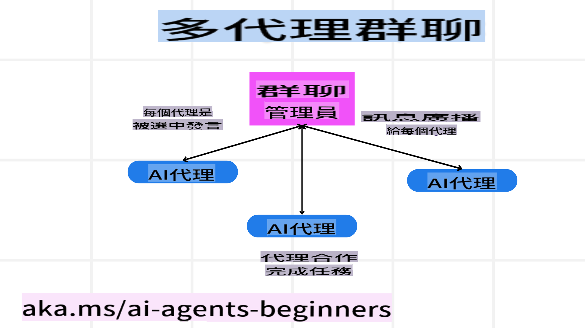
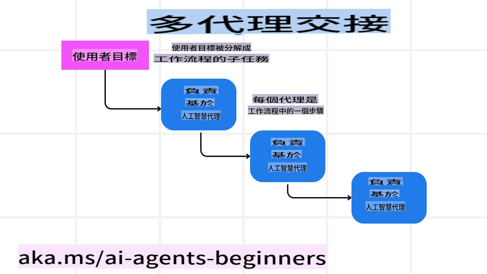
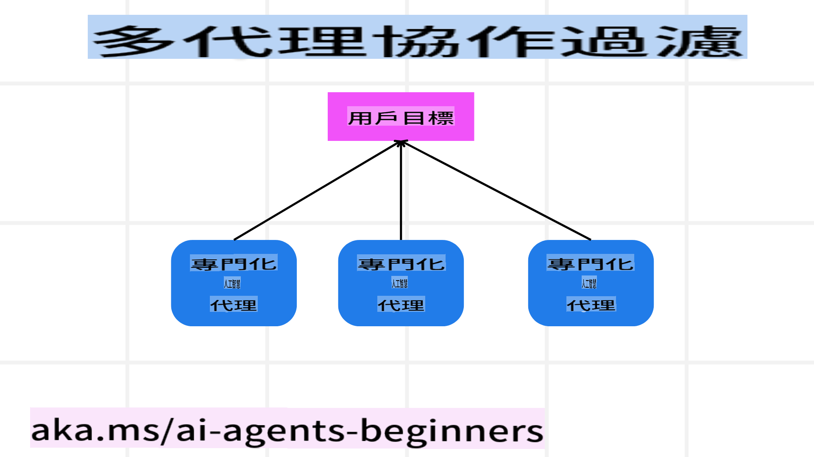

<!--
CO_OP_TRANSLATOR_METADATA:
{
  "original_hash": "bdb0a92e5a437d5fa985a6863f4a836c",
  "translation_date": "2025-03-28T14:15:21+00:00",
  "source_file": "08-multi-agent\\README.md",
  "language_code": "tw"
}
-->

> _(點擊上方圖片觀看本課程影片)_

# 多代理設計模式

當你開始處理涉及多個代理的專案時，你需要考慮多代理設計模式。然而，何時切換到多代理模式以及其優勢可能並不那麼明顯。

## 簡介

在本課程中，我們將回答以下問題：

- 哪些情境適合使用多代理？
- 使用多代理相較於單一代理執行多項任務有何優勢？
- 實現多代理設計模式的基本構成有哪些？
- 如何了解多個代理之間的互動情況？

## 學習目標

完成本課程後，你應該能夠：

- 識別適合使用多代理的情境
- 認識使用多代理相較於單一代理的優勢
- 理解實現多代理設計模式的基本構成

更大的圖景是什麼？

*多代理是一種設計模式，允許多個代理協同合作以達成共同目標。*

這種模式廣泛應用於各個領域，包括機器人技術、自主系統和分散式計算。

## 適合使用多代理的情境

那麼，哪些情境適合使用多代理呢？答案是，許多情境中使用多代理都能帶來好處，特別是在以下幾種情況：

- **大規模工作量**：將大規模工作量分解為較小的任務並分配給不同的代理，能夠實現並行處理並加速完成。例如，大型資料處理任務就是一個例子。
- **複雜任務**：複雜任務可以像大規模工作量一樣分解為較小的子任務，並分配給不同的代理，每個代理專注於任務的特定方面。例如，自主車輛中，不同的代理分別負責導航、障礙物檢測和與其他車輛的通信。
- **多樣化專業知識**：不同的代理擁有多樣化的專業知識，能比單一代理更有效地處理任務的不同方面。例如，在醫療保健領域，代理可以分別負責診斷、治療計劃和患者監測。

## 使用多代理相較於單一代理的優勢

單一代理系統在處理簡單任務時表現良好，但對於更複雜的任務，使用多代理可以提供多種優勢：

- **專業化**：每個代理可以專注於特定任務。單一代理缺乏專業化可能導致它在面對複雜任務時感到困惑。例如，它可能執行了一項它並不擅長的任務。
- **可擴展性**：通過添加更多代理來擴展系統比超載單一代理更容易。
- **容錯性**：如果一個代理失敗，其他代理仍能繼續運作，確保系統的可靠性。

舉個例子，假設為使用者預訂旅行。一個單一代理系統需要處理旅行預訂流程的所有方面，從查找航班到預訂酒店和租車。要實現這一點，單一代理需要具備處理所有這些任務的工具。這可能導致系統過於複雜和難以維護及擴展。而多代理系統可以有不同的代理專注於查找航班、預訂酒店和租車。這樣的系統更加模組化，易於維護和擴展。

將其與一家夫妻店經營的旅行社和一家連鎖旅行社相比較。夫妻店旅行社由一個代理處理旅行預訂流程的所有方面，而連鎖旅行社則有不同的代理分別負責不同的預訂流程。

## 實現多代理設計模式的基本構成

在實現多代理設計模式之前，你需要了解構成這種模式的基本元素。

讓我們再次以為使用者預訂旅行的例子來具體化。在這種情況下，基本構成包括：

- **代理通信**：負責查找航班、預訂酒店和租車的代理需要相互通信並共享使用者的偏好和限制。你需要決定通信的協議和方法。具體而言，查找航班的代理需要與預訂酒店的代理通信，以確保酒店的預訂日期與航班日期一致。這意味著代理需要共享使用者的旅行日期，因此你需要決定*哪些代理共享信息以及如何共享信息*。
- **協調機制**：代理需要協調它們的行動，以確保滿足使用者的偏好和限制。使用者的偏好可能是希望酒店靠近機場，而限制可能是租車僅在機場可用。這意味著預訂酒店的代理需要與租車的代理協調，以確保滿足使用者的偏好和限制。因此，你需要決定*代理如何協調它們的行動*。
- **代理架構**：代理需要具備內部結構，以便做出決策並從與使用者的互動中學習。這意味著查找航班的代理需要具備內部結構，以便做出推薦航班的決策。因此，你需要決定*代理如何做出決策並從與使用者的互動中學習*。例如，查找航班的代理可以使用機器學習模型，根據使用者的過去偏好推薦航班。
- **多代理互動的可見性**：你需要了解多個代理之間的互動情況。這意味著你需要擁有追蹤代理活動和互動的工具和技術。這可以是日誌和監控工具、可視化工具以及性能指標。
- **多代理模式**：實現多代理系統有不同的模式，例如集中式、分散式和混合架構。你需要選擇最適合你的使用案例的模式。
- **人為介入**：在大多數情況下，你需要人為介入並指導代理何時需要尋求人類干預。例如，使用者可能要求特定酒店或航班，而代理未推薦，或者在預訂航班或酒店前要求確認。

## 多代理互動的可見性

了解多個代理之間的互動情況非常重要。這種可見性對於調試、優化以及確保整個系統的效能至關重要。為了實現這一點，你需要擁有追蹤代理活動和互動的工具和技術。這可以是日誌和監控工具、可視化工具以及性能指標。

例如，在為使用者預訂旅行的情境中，你可以設置一個儀表板，顯示每個代理的狀態、使用者的偏好和限制，以及代理之間的互動。這個儀表板可以顯示使用者的旅行日期、航班代理推薦的航班、酒店代理推薦的酒店以及租車代理推薦的租車。這將讓你清楚了解代理如何相互互動以及使用者的偏好和限制是否得到滿足。

讓我們更詳細地探討這些方面。

- **日誌和監控工具**：你需要為代理執行的每個動作記錄日誌。日誌條目可以存儲代理執行的動作、動作的時間以及動作的結果等信息。這些信息可以用於調試、優化等。
  
- **可視化工具**：可視化工具可以幫助你更直觀地看到代理之間的互動。例如，你可以設置一個圖表顯示代理之間的信息流。這可以幫助你識別系統中的瓶頸、低效以及其他問題。

- **性能指標**：性能指標可以幫助你追蹤多代理系統的效能。例如，你可以追蹤完成任務所需的時間、每單位時間完成的任務數量以及代理推薦的準確性。這些信息可以幫助你識別需要改進的地方並優化系統。

## 多代理模式

讓我們深入探討一些可以用來創建多代理應用的具體模式。以下是一些值得考慮的模式：

### 群聊

當你想要創建一個群聊應用，讓多個代理能夠相互通信時，此模式非常有用。此模式的典型使用案例包括團隊合作、客戶支持和社交網絡。

在此模式中，每個代理代表群聊中的一個使用者，並通過消息協議交換消息。代理可以向群聊發送消息，接收群聊中的消息，並回應其他代理的消息。

此模式可以使用集中式架構（所有消息通過中央伺服器路由）或分散式架構（消息直接交換）。

### 交接

當你想要創建一個應用，允許多個代理交接任務時，此模式非常有用。

此模式的典型使用案例包括客戶支持、任務管理和工作流程自動化。

在此模式中，每個代理代表一個任務或工作流程中的一個步驟，代理可以根據預定規則將任務交接給其他代理。

### 協作過濾

當你想要創建一個應用，讓多個代理協作為使用者提供推薦時，此模式非常有用。

你可能希望多個代理協作的原因是每個代理擁有不同的專業知識，能以不同方式貢獻推薦過程。

舉個例子，假設使用者希望獲得股票市場上最佳股票的推薦。

- **行業專家**：一個代理可以是某個行業的專家。
- **技術分析**：另一個代理可以是技術分析的專家。
- **基本面分析**：還有一個代理可以是基本面分析的專家。通過協作，這些代理可以為使用者提供更全面的推薦。

## 情境：退款流程

考慮一個情境，當客戶試圖為某產品申請退款時，可能涉及到許多代理，但我們可以將其分為專門針對退款流程的代理以及可用於其他流程的通用代理。

**專門針對退款流程的代理**：

以下是一些可能參與退款流程的代理：

- **客戶代理**：代表客戶並負責啟動退款流程。
- **賣家代理**：代表賣家並負責處理退款。
- **支付代理**：代表支付流程並負責退還客戶付款。
- **解決代理**：代表解決流程並負責解決退款流程中出現的問題。
- **合規代理**：代表合規流程並負責確保退款流程符合規定和政策。

**通用代理**：

這些代理可以在你的業務其他部分使用。

- **運輸代理**：代表運輸流程並負責將產品運回賣家。此代理可用於退款流程，也可用於一般的產品運輸，例如購買時的運送。
- **反饋代理**：代表反饋流程並負責收集客戶的反饋。反饋可以在任何時候進行，不僅限於退款流程。
- **升級代理**：代表升級流程並負責將問題升級至更高級別的支持。此類代理可用於任何需要升級問題的流程。
- **通知代理**：代表通知流程並負責在退款流程的各個階段向客戶發送通知。
- **分析代理**：代表分析流程並負責分析與退款流程相關的數據。
- **審核代理**：代表審核流程並負責審核退款流程，以確保流程正確執行。
- **報告代理**：代表報告流程並負責生成與退款流程相關的報告。
- **知識代理**：代表知識流程並負責維護與退款流程相關的信息知識庫。此代理可以既專注於退款也涵蓋業務的其他部分。
- **安全代理**：代表安全流程並負責確保退款流程的安全性。
- **質量代理**：代表質量流程並負責確保退款流程的品質。

上述列出的代理既包括專門針對退款流程的代理，也包括可用於業務其他部分的通用代理。希望這些例子能幫助你了解如何在多代理系統中選擇使用哪些代理。

## 作業

設計一個針對客戶支持流程的多代理系統。識別參與流程的代理、它們的角色和職責，以及它們如何互動。考慮既針對客戶支持流程的代理，也包括可用於業務其他部分的通用代理。

> 在查看以下解答前先思考一下，你可能需要的代理比你想像的更多。

> 提示：考慮客戶支持流程的不同階段，也考慮任何系統所需的代理。

## 解答

[解答](./solution/solution.md)

## 知識檢查

問題：什麼時候應考慮使用多代理？

- [ ] A1: 當你有小型工作量且任務簡單時。
- [ ] A2: 當你有大型工作量時。
- [ ] A3: 當你有簡單任務時。

[測驗解答](./solution/solution-quiz.md)

## 總結

在本課程中，我們探討了多代理設計模式，包括適合使用多代理的情境、使用多代理相較於單一代理的優勢、實現多代理設計模式的基本構成，以及如何了解多個代理之間的互動情況。

## 額外資源

- ## 上一課程

[規劃設計](../07-planning-design/README.md)

## 下一課程

[AI代理中的元認知](../09-metacognition/README.md)

**免責聲明**：  
本文件使用 AI 翻譯服務 [Co-op Translator](https://github.com/Azure/co-op-translator) 進行翻譯。我們致力於提供準確的翻譯，但請注意，自動翻譯可能包含錯誤或不精確之處。應以原始語言的文件作為權威來源。對於重要資訊，建議尋求專業的人工翻譯。我們對於使用此翻譯可能引起的任何誤解或錯誤解釋不承擔責任。