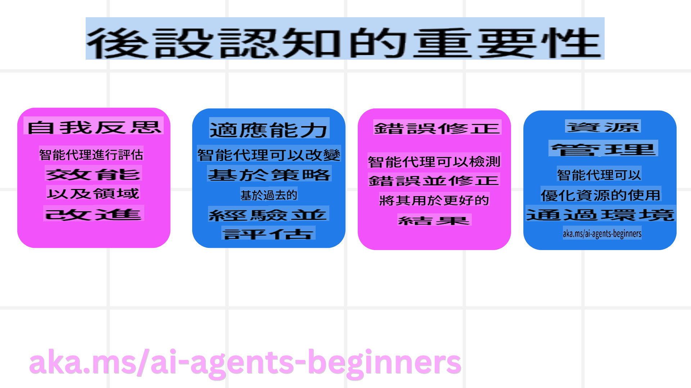
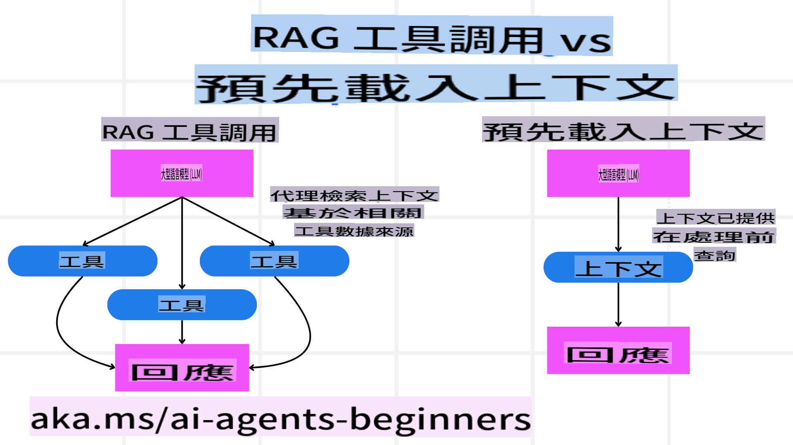

<!--
CO_OP_TRANSLATOR_METADATA:
{
  "original_hash": "3171ed887315c3ddeaccf966e40e9a50",
  "translation_date": "2025-03-28T14:18:37+00:00",
  "source_file": "09-metacognition\\README.md",
  "language_code": "tw"
}
-->
[](https://youtu.be/His9R6gw6Ec?si=3_RMb8VprNvdLRhX)

> _(點擊上方圖片觀看本課程影片)_

# AI代理的元認知

## 簡介

歡迎來到有關AI代理元認知的課程！本章節專為對AI代理如何思考其自身思考過程感興趣的初學者設計。學完本課後，您將了解關鍵概念，並能運用實際範例將元認知應用於AI代理設計中。

## 學習目標

完成本課程後，您將能夠：

1. 理解在代理定義中推理循環的影響。
2. 使用規劃和評估技術幫助代理自我修正。
3. 創建能操控代碼以完成任務的代理。

## 元認知簡介

元認知指的是涉及思考自身思考的高階認知過程。對於AI代理而言，這意味著能基於自我意識和過去經驗評估並調整行動。元認知，或稱“思考的思考”，是開發具主動性AI系統的重要概念。這包括AI系統對自身內部過程的意識，以及監控、調節和適應行為的能力。就像我們在人際互動或解決問題時會讀取環境氛圍一樣。

這種自我意識能幫助AI系統做出更好的決策，識別錯誤，並隨時間提升其性能——這也再次聯繫到圖靈測試以及關於AI是否會接管的爭論。

在主動性AI系統的背景下，元認知能幫助解決以下挑戰：

- **透明性**：確保AI系統能解釋其推理過程和決策。
- **推理能力**：提升AI系統綜合信息並做出合理決策的能力。
- **適應性**：使AI系統能適應新環境和變化的條件。
- **感知能力**：改善AI系統從環境中識別和解釋數據的準確性。

### 什麼是元認知？

元認知，或“思考的思考”，是一種高階認知過程，涉及對自身認知過程的自我意識和自我調節。在AI領域，元認知賦予代理評估和調整策略及行動的能力，從而提升解決問題和決策的能力。

通過理解元認知，您可以設計更智能、更具適應性和效率的AI代理。在真正的元認知中，AI會明確地對自身推理進行推理。

**範例**：  
“我優先選擇便宜的航班是因為……但我可能錯過了直飛航班，所以我需要重新檢查。”  
記錄下為何選擇某條路徑，並指出因過度依賴之前的用戶偏好而犯的錯誤，然後修改其決策策略，而不僅僅是最終的推薦結果。

**診斷模式**：  
“每當我看到用戶提到‘太擁擠’，我不僅應該刪除某些景點，還應該反思我的‘熱門景點’選擇方法是否有問題，如果我總是以受歡迎程度排序。”

### 元認知在AI代理中的重要性

元認知在AI代理設計中扮演著至關重要的角色，原因如下：  



- **自我反思**：代理可以評估自身表現並找出改進空間。
- **適應性**：代理能基於過去經驗和變化的環境調整策略。
- **錯誤修正**：代理能自主檢測並修正錯誤，提升結果準確性。
- **資源管理**：代理能通過規劃和評估行動來優化資源使用，例如時間和計算能力。

## AI代理的組成部分

在深入了解元認知過程之前，必須了解AI代理的基本組成部分。AI代理通常由以下部分組成：

- **人格**：代理的個性和特徵，定義了它如何與用戶互動。
- **工具**：代理可執行的能力和功能。
- **技能**：代理所擁有的知識和專業能力。

這些組成部分共同構成一個能執行特定任務的“專業單元”。

**範例**：  
考慮一個旅行代理，它不僅能計劃您的假期，還能根據實時數據和過往用戶旅程經驗調整路徑。

### 範例：旅行代理服務中的元認知

假設您正在設計一個由AI驅動的旅行代理服務。這個代理“旅行代理”協助用戶規劃假期。為了融入元認知，“旅行代理”需要基於自我意識和過往經驗評估並調整其行動。

#### 當前任務

幫助用戶規劃巴黎之旅。

#### 完成任務的步驟

1. **收集用戶偏好**：詢問用戶的旅行日期、預算、興趣（如博物館、美食、購物）以及任何特定需求。
2. **檢索信息**：搜尋符合用戶偏好的航班選項、住宿、景點和餐廳。
3. **生成推薦**：提供個性化行程，包括航班詳情、酒店預訂和建議活動。
4. **根據反饋調整**：詢問用戶對推薦的意見並進行必要調整。

#### 所需資源

- 航班和酒店預訂數據庫的訪問權限。
- 巴黎景點和餐廳的信息。
- 來自過往互動的用戶反饋數據。

#### 經驗與自我反思

“旅行代理”利用元認知來評估其表現並從過往經驗中學習。例如：

1. **分析用戶反饋**：檢視用戶反饋以確定哪些推薦受歡迎，哪些不受歡迎，並相應調整未來建議。
2. **適應性**：如果用戶之前提到不喜歡擁擠的地方，“旅行代理”會避免在未來推薦高峰時段的熱門景點。
3. **錯誤修正**：如果“旅行代理”在過去的預訂中出錯，例如建議已滿房的酒店，它會學習更嚴格地檢查可用性。

#### 實際開發者範例

以下是一個簡化的“旅行代理”代碼範例，展示如何融入元認知：  
```python
class Travel_Agent:
    def __init__(self):
        self.user_preferences = {}
        self.experience_data = []

    def gather_preferences(self, preferences):
        self.user_preferences = preferences

    def retrieve_information(self):
        # Search for flights, hotels, and attractions based on preferences
        flights = search_flights(self.user_preferences)
        hotels = search_hotels(self.user_preferences)
        attractions = search_attractions(self.user_preferences)
        return flights, hotels, attractions

    def generate_recommendations(self):
        flights, hotels, attractions = self.retrieve_information()
        itinerary = create_itinerary(flights, hotels, attractions)
        return itinerary

    def adjust_based_on_feedback(self, feedback):
        self.experience_data.append(feedback)
        # Analyze feedback and adjust future recommendations
        self.user_preferences = adjust_preferences(self.user_preferences, feedback)

# Example usage
travel_agent = Travel_Agent()
preferences = {
    "destination": "Paris",
    "dates": "2025-04-01 to 2025-04-10",
    "budget": "moderate",
    "interests": ["museums", "cuisine"]
}
travel_agent.gather_preferences(preferences)
itinerary = travel_agent.generate_recommendations()
print("Suggested Itinerary:", itinerary)
feedback = {"liked": ["Louvre Museum"], "disliked": ["Eiffel Tower (too crowded)"]}
travel_agent.adjust_based_on_feedback(feedback)
```

#### 為什麼元認知很重要

- **自我反思**：代理可以分析其表現並找出改進空間。
- **適應性**：代理能根據反饋和變化的條件調整策略。
- **錯誤修正**：代理能自主檢測並修正錯誤。
- **資源管理**：代理能優化資源使用，例如時間和計算能力。

通過融入元認知，“旅行代理”能提供更個性化和準確的旅行建議，提升整體用戶體驗。

---

## 2. 代理中的規劃

規劃是AI代理行為中的關鍵組成部分。它涉及在考慮當前狀態、資源和可能障礙的基礎上，制定實現目標的步驟。

### 規劃的要素

- **當前任務**：清楚地定義任務。
- **完成任務的步驟**：將任務分解為可管理的步驟。
- **所需資源**：確定必要的資源。
- **經驗**：利用過去的經驗為規劃提供參考。

**範例**：  
以下是“旅行代理”有效協助用戶規劃旅行的步驟：

### “旅行代理”的步驟

1. **收集用戶偏好**  
   - 詢問用戶旅行日期、預算、興趣及任何特定需求。  
   - 範例問題：“您計劃何時旅行？”“您的預算範圍是多少？”“您在假期中喜歡哪些活動？”

2. **檢索信息**  
   - 根據用戶偏好搜尋相關旅行選項。  
   - **航班**：搜尋符合用戶預算和偏好的航班。  
   - **住宿**：尋找符合用戶地點、價格及設施偏好的酒店或租賃物業。  
   - **景點和餐廳**：識別符合用戶興趣的熱門景點、活動和餐飲選擇。

3. **生成推薦**  
   - 將檢索到的信息編制成個性化行程。  
   - 提供航班選項、酒店預訂及建議活動的詳細信息，確保推薦符合用戶偏好。

4. **向用戶展示行程**  
   - 與用戶分享建議行程供其審閱。  
   - 範例：“這是您巴黎之旅的建議行程，包括航班詳情、酒店預訂及推薦活動和餐廳。請告訴我您的想法！”

5. **收集反饋**  
   - 詢問用戶對建議行程的意見。  
   - 範例：“您喜歡這些航班選項嗎？”“這家酒店符合您的需求嗎？”“有沒有需要添加或刪除的活動？”

6. **根據反饋調整**  
   - 根據用戶反饋修改行程。  
   - 對航班、住宿和活動建議進行必要更改，以更符合用戶偏好。

7. **最終確認**  
   - 向用戶展示更新後的行程供最終確認。  
   - 範例：“我已根據您的反饋進行了調整。這是更新後的行程。您覺得一切是否合適？”

8. **預訂並確認預約**  
   - 用戶批准行程後，進行航班、住宿及任何預先計劃活動的預訂。  
   - 向用戶發送確認詳情。

9. **提供持續支持**  
   - 隨時準備在用戶出行前及旅途中提供協助或處理額外請求。  
   - 範例：“如果您在旅行期間需要進一步協助，隨時聯繫我！”

### 範例互動

```python
class Travel_Agent:
    def __init__(self):
        self.user_preferences = {}
        self.experience_data = []

    def gather_preferences(self, preferences):
        self.user_preferences = preferences

    def retrieve_information(self):
        flights = search_flights(self.user_preferences)
        hotels = search_hotels(self.user_preferences)
        attractions = search_attractions(self.user_preferences)
        return flights, hotels, attractions

    def generate_recommendations(self):
        flights, hotels, attractions = self.retrieve_information()
        itinerary = create_itinerary(flights, hotels, attractions)
        return itinerary

    def adjust_based_on_feedback(self, feedback):
        self.experience_data.append(feedback)
        self.user_preferences = adjust_preferences(self.user_preferences, feedback)

# Example usage within a booing request
travel_agent = Travel_Agent()
preferences = {
    "destination": "Paris",
    "dates": "2025-04-01 to 2025-04-10",
    "budget": "moderate",
    "interests": ["museums", "cuisine"]
}
travel_agent.gather_preferences(preferences)
itinerary = travel_agent.generate_recommendations()
print("Suggested Itinerary:", itinerary)
feedback = {"liked": ["Louvre Museum"], "disliked": ["Eiffel Tower (too crowded)"]}
travel_agent.adjust_based_on_feedback(feedback)
```

## 3. 修正型RAG系統

首先，讓我們了解RAG工具與預先上下文加載的區別：  



### 檢索增強生成（RAG）

RAG將檢索系統與生成模型結合。當發出查詢時，檢索系統從外部來源提取相關文檔或數據，並使用這些提取的信息來增強生成模型的輸入。這有助於模型生成更準確且語境相關的響應。

在RAG系統中，代理從知識庫檢索相關信息，並利用這些信息生成合適的響應或行動。

### 修正型RAG方法

修正型RAG方法專注於使用RAG技術來糾正錯誤並提高AI代理的準確性。這包括：

1. **提示技術**：使用特定提示引導代理檢索相關信息。
2. **工具**：實施算法和機制，使代理能評估檢索信息的相關性並生成準確響應。
3. **評估**：持續評估代理性能並進行調整以提高其準確性和效率。

####
考正型RAG在搜索代理中的应用  
考虑一个从网络中检索信息以回答用户查询的搜索代理，考正型RAG方法可能包括：  
1. **提示技术**：根据用户输入制定搜索查询。  
2. **工具**：使用自然语言处理和机器学习算法对搜索结果进行排名和筛选。  
3. **评估**：分析用户反馈以识别并纠正检索信息中的不准确之处。  

### 考正型RAG在旅行代理中的应用  
考正型RAG（检索增强生成）提升了AI检索和生成信息的能力，同时能纠正任何不准确的信息。让我们看看旅行代理如何使用考正型RAG方法提供更准确且相关的旅行推荐。这包括：  
- **提示技术**：使用特定提示引导代理检索相关信息。  
- **工具**：实施算法和机制，使代理能够评估检索信息的相关性并生成准确的响应。  
- **评估**：持续评估代理的表现，并进行调整以提高其准确性和效率。  

#### 在旅行代理中实施考正型RAG的步骤  
1. **初始用户交互**  
   - 旅行代理从用户处收集初始偏好，例如目的地、旅行日期、预算和兴趣点。  
   - 示例：```python
     preferences = {
         "destination": "Paris",
         "dates": "2025-04-01 to 2025-04-10",
         "budget": "moderate",
         "interests": ["museums", "cuisine"]
     }
     ```  

2. **信息检索**  
   - 旅行代理根据用户偏好检索有关航班、住宿、景点和餐厅的信息。  
   - 示例：```python
     flights = search_flights(preferences)
     hotels = search_hotels(preferences)
     attractions = search_attractions(preferences)
     ```  

3. **生成初始推荐**  
   - 旅行代理使用检索到的信息生成个性化的行程。  
   - 示例：```python
     itinerary = create_itinerary(flights, hotels, attractions)
     print("Suggested Itinerary:", itinerary)
     ```  

4. **收集用户反馈**  
   - 旅行代理向用户询问对初始推荐的反馈。  
   - 示例：```python
     feedback = {
         "liked": ["Louvre Museum"],
         "disliked": ["Eiffel Tower (too crowded)"]
     }
     ```  

5. **考正型RAG过程**  
   - **提示技术**：旅行代理根据用户反馈制定新的搜索查询。  
     - 示例：```python
       if "disliked" in feedback:
           preferences["avoid"] = feedback["disliked"]
       ```  
   - **工具**：旅行代理使用算法对新的搜索结果进行排名和筛选，强调基于用户反馈的相关性。  
     - 示例：```python
       new_attractions = search_attractions(preferences)
       new_itinerary = create_itinerary(flights, hotels, new_attractions)
       print("Updated Itinerary:", new_itinerary)
       ```  
   - **评估**：旅行代理通过分析用户反馈并进行必要调整，持续评估其推荐的相关性和准确性。  
     - 示例：```python
       def adjust_preferences(preferences, feedback):
           if "liked" in feedback:
               preferences["favorites"] = feedback["liked"]
           if "disliked" in feedback:
               preferences["avoid"] = feedback["disliked"]
           return preferences

       preferences = adjust_preferences(preferences, feedback)
       ```  

#### 实用示例  
以下是一个在旅行代理中应用考正型RAG方法的简化Python代码示例：  
```python
class Travel_Agent:
    def __init__(self):
        self.user_preferences = {}
        self.experience_data = []

    def gather_preferences(self, preferences):
        self.user_preferences = preferences

    def retrieve_information(self):
        flights = search_flights(self.user_preferences)
        hotels = search_hotels(self.user_preferences)
        attractions = search_attractions(self.user_preferences)
        return flights, hotels, attractions

    def generate_recommendations(self):
        flights, hotels, attractions = self.retrieve_information()
        itinerary = create_itinerary(flights, hotels, attractions)
        return itinerary

    def adjust_based_on_feedback(self, feedback):
        self.experience_data.append(feedback)
        self.user_preferences = adjust_preferences(self.user_preferences, feedback)
        new_itinerary = self.generate_recommendations()
        return new_itinerary

# Example usage
travel_agent = Travel_Agent()
preferences = {
    "destination": "Paris",
    "dates": "2025-04-01 to 2025-04-10",
    "budget": "moderate",
    "interests": ["museums", "cuisine"]
}
travel_agent.gather_preferences(preferences)
itinerary = travel_agent.generate_recommendations()
print("Suggested Itinerary:", itinerary)
feedback = {"liked": ["Louvre Museum"], "disliked": ["Eiffel Tower (too crowded)"]}
new_itinerary = travel_agent.adjust_based_on_feedback(feedback)
print("Updated Itinerary:", new_itinerary)
```  

### 预加载上下文  
预加载上下文涉及在处理查询之前将相关上下文或背景信息加载到模型中。这意味着模型从一开始就可以访问这些信息，从而有助于它生成更有见地的响应，而无需在过程中检索额外数据。以下是预加载上下文在旅行代理应用中的一个简化示例（Python）：  
```python
class TravelAgent:
    def __init__(self):
        # Pre-load popular destinations and their information
        self.context = {
            "Paris": {"country": "France", "currency": "Euro", "language": "French", "attractions": ["Eiffel Tower", "Louvre Museum"]},
            "Tokyo": {"country": "Japan", "currency": "Yen", "language": "Japanese", "attractions": ["Tokyo Tower", "Shibuya Crossing"]},
            "New York": {"country": "USA", "currency": "Dollar", "language": "English", "attractions": ["Statue of Liberty", "Times Square"]},
            "Sydney": {"country": "Australia", "currency": "Dollar", "language": "English", "attractions": ["Sydney Opera House", "Bondi Beach"]}
        }

    def get_destination_info(self, destination):
        # Fetch destination information from pre-loaded context
        info = self.context.get(destination)
        if info:
            return f"{destination}:\nCountry: {info['country']}\nCurrency: {info['currency']}\nLanguage: {info['language']}\nAttractions: {', '.join(info['attractions'])}"
        else:
            return f"Sorry, we don't have information on {destination}."

# Example usage
travel_agent = TravelAgent()
print(travel_agent.get_destination_info("Paris"))
print(travel_agent.get_destination_info("Tokyo"))
```  

#### 解释  
1. **初始化**：`__init__`方法加载背景信息到上下文字典中。  
2. **检索信息**：`get_destination_info`方法从预加载的上下文字典中获取相关信息。  
通过预加载上下文，旅行代理应用可以快速响应用户查询，而无需实时从外部来源检索信息。这使应用更加高效和响应迅速。  

### 在迭代前以目标引导计划  
以目标引导计划的启动涉及从一开始就明确目标或预期结果。通过提前定义这一目标，模型可以将其作为整个迭代过程中的指导原则。这有助于确保每次迭代都朝着实现预期结果的方向迈进，从而使过程更高效且更具针对性。  

以下是一个为旅行代理在迭代前以目标引导计划的示例：  

### 场景  
旅行代理希望为客户规划一个定制化的假期。目标是根据客户的偏好和预算创建一个最大化客户满意度的旅行行程。  

### 步骤  
1. 定义客户的偏好和预算。  
2. 基于这些偏好启动初始计划。  
3. 迭代以优化计划，从而提高客户满意度。  

#### Python代码  
```python
class TravelAgent:
    def __init__(self, destinations):
        self.destinations = destinations

    def bootstrap_plan(self, preferences, budget):
        plan = []
        total_cost = 0

        for destination in self.destinations:
            if total_cost + destination['cost'] <= budget and self.match_preferences(destination, preferences):
                plan.append(destination)
                total_cost += destination['cost']

        return plan

    def match_preferences(self, destination, preferences):
        for key, value in preferences.items():
            if destination.get(key) != value:
                return False
        return True

    def iterate_plan(self, plan, preferences, budget):
        for i in range(len(plan)):
            for destination in self.destinations:
                if destination not in plan and self.match_preferences(destination, preferences) and self.calculate_cost(plan, destination) <= budget:
                    plan[i] = destination
                    break
        return plan

    def calculate_cost(self, plan, new_destination):
        return sum(destination['cost'] for destination in plan) + new_destination['cost']

# Example usage
destinations = [
    {"name": "Paris", "cost": 1000, "activity": "sightseeing"},
    {"name": "Tokyo", "cost": 1200, "activity": "shopping"},
    {"name": "New York", "cost": 900, "activity": "sightseeing"},
    {"name": "Sydney", "cost": 1100, "activity": "beach"},
]

preferences = {"activity": "sightseeing"}
budget = 2000

travel_agent = TravelAgent(destinations)
initial_plan = travel_agent.bootstrap_plan(preferences, budget)
print("Initial Plan:", initial_plan)

refined_plan = travel_agent.iterate_plan(initial_plan, preferences, budget)
print("Refined Plan:", refined_plan)
```  

#### 代码解释  
1. **初始化**：`__init__`方法加载客户偏好和预算。  
2. **启动计划**：`bootstrap_plan`方法根据客户偏好创建初始计划。  
3. **匹配偏好**：`match_preferences`方法确保计划与客户偏好一致。  
4. **迭代计划**：`iterate_plan`方法优化计划。  
5. **计算成本**：`calculate_cost`方法计算当前计划的总成本，包括潜在的新目的地。  

#### 示例用法  
- **初始计划**：旅行代理根据客户对观光的偏好和2000美元预算创建初始计划。  
- **优化计划**：旅行代理迭代计划，优化客户的偏好和预算。  

通过以明确的目标（如最大化客户满意度）启动计划并迭代优化计划，旅行代理可以为客户创建一个定制化且优化的旅行行程。这种方法确保旅行计划从一开始就符合客户的偏好和预算，并在每次迭代中不断改进。  

### 利用LLM进行重新排名和评分  
大型语言模型（LLMs）可通过评估检索文档或生成响应的相关性和质量来用于重新排名和评分。以下是其工作原理：  
**检索**：初始检索步骤根据查询获取一组候选文档或响应。  
**重新排名**：LLM评估这些候选项并根据其相关性和质量重新排名。这一步确保最相关且高质量的信息被优先呈现。  
**评分**：LLM为每个候选项分配分数，反映其相关性和质量。这有助于选择用户最佳的响应或文档。  

通过利用LLM进行重新排名和评分，系统可以提供更准确且上下文相关的信息，从而改善整体用户体验。  

以下是一个旅行代理如何使用大型语言模型（LLM）根据用户偏好重新排名和评分旅行目的地的示例（Python）：  

#### 场景  
- 基于偏好旅行  
旅行代理希望根据客户的偏好推荐最佳旅行目的地。LLM将帮助重新排名和评分目的地，以确保呈现最相关的选项。  

#### 步骤  
1. 收集用户偏好。  
2. 检索潜在旅行目的地列表。  
3. 使用LLM根据用户偏好重新排名和评分目的地。  

以下是如何更新之前的示例以使用Azure OpenAI服务：  

#### 要求  
1. 您需要拥有Azure订阅。  
2. 创建Azure OpenAI资源并获取您的API密钥。  

#### 示例Python代码  
```python
import requests
import json

class TravelAgent:
    def __init__(self, destinations):
        self.destinations = destinations

    def get_recommendations(self, preferences, api_key, endpoint):
        # Generate a prompt for the Azure OpenAI
        prompt = self.generate_prompt(preferences)
        
        # Define headers and payload for the request
        headers = {
            'Content-Type': 'application/json',
            'Authorization': f'Bearer {api_key}'
        }
        payload = {
            "prompt": prompt,
            "max_tokens": 150,
            "temperature": 0.7
        }
        
        # Call the Azure OpenAI API to get the re-ranked and scored destinations
        response = requests.post(endpoint, headers=headers, json=payload)
        response_data = response.json()
        
        # Extract and return the recommendations
        recommendations = response_data['choices'][0]['text'].strip().split('\n')
        return recommendations

    def generate_prompt(self, preferences):
        prompt = "Here are the travel destinations ranked and scored based on the following user preferences:\n"
        for key, value in preferences.items():
            prompt += f"{key}: {value}\n"
        prompt += "\nDestinations:\n"
        for destination in self.destinations:
            prompt += f"- {destination['name']}: {destination['description']}\n"
        return prompt

# Example usage
destinations = [
    {"name": "Paris", "description": "City of lights, known for its art, fashion, and culture."},
    {"name": "Tokyo", "description": "Vibrant city, famous for its modernity and traditional temples."},
    {"name": "New York", "description": "The city that never sleeps, with iconic landmarks and diverse culture."},
    {"name": "Sydney", "description": "Beautiful harbour city, known for its opera house and stunning beaches."},
]

preferences = {"activity": "sightseeing", "culture": "diverse"}
api_key = 'your_azure_openai_api_key'
endpoint = 'https://your-endpoint.com/openai/deployments/your-deployment-name/completions?api-version=2022-12-01'

travel_agent = TravelAgent(destinations)
recommendations = travel_agent.get_recommendations(preferences, api_key, endpoint)
print("Recommended Destinations:")
for rec in recommendations:
    print(rec)
```  

#### 代码解释  
- 偏好匹配  
1. **初始化**：`TravelAgent`类初始化用户偏好和API密钥。  
2. **获取推荐**：`get_recommendations`方法使用LLM重新排名和评分目的地。  
3. **生成提示**：`generate_prompt`方法创建提示以指导LLM。  
4. **发送请求**：通过`requests`模块向Azure OpenAI API发送请求。  

通过利用LLM进行重新排名和评分，旅行代理可以为客户提供更个性化且相关的旅行推荐，从而提升整体体验。  

### RAG：提示技术与工具  
检索增强生成（RAG）既可以作为提示技术，也可以作为开发AI代理的工具。理解两者之间的区别可以帮助您更有效地利用RAG进行项目开发。  

#### RAG作为提示技术  
**是什么？**  
- 作为提示技术，RAG涉及制定特定查询或提示，以引导从大型语料库或数据库中检索相关信息。这些信息随后用于生成响应或采取行动。  

**工作原理：**  
1. **制定提示**：根据任务或用户输入创建结构良好的提示或查询。  
2. **检索信息**：使用提示从预先存在的知识库或数据集中搜索相关数据。  
3. **生成响应**：结合检索到的信息与生成式AI模型生成全面且连贯的响应。  

**在旅行代理中的示例**：  
- 用户输入：“我想参观巴黎的博物馆。”  
- 提示：“查找巴黎的顶级博物馆。”  
- 检索到的信息：有关卢浮宫、奥赛博物馆等的详细信息。  
- 生成的响应：“以下是巴黎的一些顶级博物馆：卢浮宫、奥赛博物馆和蓬皮杜中心。”  

#### RAG作为工具  
**是什么？**  
- 作为工具，RAG是一个集成系统，自动化检索和生成过程，使开发人员能够更轻松地实现复杂的AI功能，而无需为每个查询手动编写提示。  

**工作原理：**  
1. **集成**：将RAG嵌入AI代理的架构中，使其能够自动处理检索和生成任务。  
2. **自动化**：该工具管理整个过程，从接收用户输入到生成最终响应，而无需为每一步明确提示。  
3. **效率**：通过简化检索和生成过程，提升代理的性能，使响应更快且更准确。  

**在旅行代理中的示例**：  
- 用户输入：“我想参观巴黎的博物馆。”  
- RAG工具：自动检索有关博物馆的信息并生成响应。  
- 生成的响应：“以下是巴黎的一些顶级博物馆：卢浮宫、奥赛博物馆和蓬皮杜中心。”  

### 比较  

| 方面               | 提示技术                                                | 工具                                           |  
|--------------------|-------------------------------------------------------|-----------------------------------------------|  
| **手动与自动**      | 手动为每个查询制定提示。                                 | 检索和生成过程的自动化。                       |  
| **控制**           | 提供对检索过程的更多控制。                               | 简化并自动化检索和生成。                       |  
| **灵活性**         | 允许根据具体需求定制提示。                               | 对大规模实施更高效。                           |  
| **复杂性**         | 需要设计和调整提示。                                     | 更易于集成到AI代理架构中。                     |  

### 实用示例  
**提示技术示例：**  
```python
def search_museums_in_paris():
    prompt = "Find top museums in Paris"
    search_results = search_web(prompt)
    return search_results

museums = search_museums_in_paris()
print("Top Museums in Paris:", museums)
```  

**工具示例：**  
```python
class Travel_Agent:
    def __init__(self):
        self.rag_tool = RAGTool()

    def get_museums_in_paris(self):
        user_input = "I want to visit museums in Paris."
        response = self.rag_tool.retrieve_and_generate(user_input)
        return response

travel_agent = Travel_Agent()
museums = travel_agent.get_museums_in_paris()
print("Top Museums in Paris:", museums)
```  

### 评估相关性  
评估相关性是AI代理性能的重要方面。它确保代理检索和生成的信息对用户来说是适当、准确且有用的。让我们探讨如何在AI代理中评估相关性，包括实际示例和技术。  

#### 评估相关性的关键概念  
1. **上下文意识**：  
   - 代理必须理解用户查询的上下文，以检索和生成相关信息。  
   - 示例：如果用户询问“巴黎最好的餐馆”，代理应考虑用户的偏好，例如菜系类型和预算。  

2. **准确性**：  
   - 代理提供的信息应是事实正确且最新的。  
   - 示例：推荐当前营业且评价良好的餐馆，而不是过时或已关闭的选项。  

3. **用户意图**：  
代理應該根據用戶查詢的意圖來提供最相關的信息。  
- 示例：如果用戶詢問“经济实惠的酒店”，代理应该优先推荐价格合理的选项。  

4. **反馈循环**：  
- 持续收集和分析用户反馈有助于代理优化其相关性评估过程。  
- 示例：结合用户对之前推荐的评分和反馈来改进未来的响应。  

#### 评估相关性的实用技术  
1. **相关性评分**：  
- 根据检索项与用户查询及偏好的匹配程度分配相关性评分。  
- 示例：```python
     def relevance_score(item, query):
         score = 0
         if item['category'] in query['interests']:
             score += 1
         if item['price'] <= query['budget']:
             score += 1
         if item['location'] == query['destination']:
             score += 1
         return score
     ```  

2. **过滤和排序**：  
- 过滤掉不相关的项，并根据相关性评分对剩余项进行排序。  
- 示例：```python
     def filter_and_rank(items, query):
         ranked_items = sorted(items, key=lambda item: relevance_score(item, query), reverse=True)
         return ranked_items[:10]  # Return top 10 relevant items
     ```  

3. **自然语言处理 (NLP)**：  
- 使用 NLP 技术理解用户查询并检索相关信息。  
- 示例：```python
     def process_query(query):
         # Use NLP to extract key information from the user's query
         processed_query = nlp(query)
         return processed_query
     ```  

4. **用户反馈集成**：  
- 收集用户对推荐的反馈，并利用这些反馈调整未来的相关性评估。  
- 示例：```python
     def adjust_based_on_feedback(feedback, items):
         for item in items:
             if item['name'] in feedback['liked']:
                 item['relevance'] += 1
             if item['name'] in feedback['disliked']:
                 item['relevance'] -= 1
         return items
     ```  

#### 示例：在旅游代理中评估相关性  
以下是旅游代理如何评估旅游推荐相关性的一个实用示例：  
```python
class Travel_Agent:
    def __init__(self):
        self.user_preferences = {}
        self.experience_data = []

    def gather_preferences(self, preferences):
        self.user_preferences = preferences

    def retrieve_information(self):
        flights = search_flights(self.user_preferences)
        hotels = search_hotels(self.user_preferences)
        attractions = search_attractions(self.user_preferences)
        return flights, hotels, attractions

    def generate_recommendations(self):
        flights, hotels, attractions = self.retrieve_information()
        ranked_hotels = self.filter_and_rank(hotels, self.user_preferences)
        itinerary = create_itinerary(flights, ranked_hotels, attractions)
        return itinerary

    def filter_and_rank(self, items, query):
        ranked_items = sorted(items, key=lambda item: self.relevance_score(item, query), reverse=True)
        return ranked_items[:10]  # Return top 10 relevant items

    def relevance_score(self, item, query):
        score = 0
        if item['category'] in query['interests']:
            score += 1
        if item['price'] <= query['budget']:
            score += 1
        if item['location'] == query['destination']:
            score += 1
        return score

    def adjust_based_on_feedback(self, feedback, items):
        for item in items:
            if item['name'] in feedback['liked']:
                item['relevance'] += 1
            if item['name'] in feedback['disliked']:
                item['relevance'] -= 1
        return items

# Example usage
travel_agent = Travel_Agent()
preferences = {
    "destination": "Paris",
    "dates": "2025-04-01 to 2025-04-10",
    "budget": "moderate",
    "interests": ["museums", "cuisine"]
}
travel_agent.gather_preferences(preferences)
itinerary = travel_agent.generate_recommendations()
print("Suggested Itinerary:", itinerary)
feedback = {"liked": ["Louvre Museum"], "disliked": ["Eiffel Tower (too crowded)"]}
updated_items = travel_agent.adjust_based_on_feedback(feedback, itinerary['hotels'])
print("Updated Itinerary with Feedback:", updated_items)
```  

### 意图搜索  
意图搜索涉及理解和解释用户查询背后的目的或目标，以检索并生成最相关和最有用的信息。这种方法不仅仅是匹配关键词，还关注于掌握用户的实际需求和上下文。  

#### 意图搜索的关键概念  
1. **理解用户意图**：  
- 用户意图可以分为三种主要类型：信息型、导航型和交易型。  
- **信息型意图**：用户寻找关于某个主题的信息（例如，“巴黎最好的博物馆有哪些？”）。  
- **导航型意图**：用户希望导航到特定网站或页面（例如，“卢浮宫官方网站”）。  
- **交易型意图**：用户旨在完成某项交易，例如预订航班或购买商品（例如，“预订飞往巴黎的航班”）。  

2. **上下文意识**：  
- 分析用户查询的上下文有助于准确识别其意图。这包括考虑之前的互动、用户偏好以及当前查询的具体细节。  

3. **自然语言处理 (NLP)**：  
- 使用 NLP 技术理解和解释用户提供的自然语言查询。这包括实体识别、情感分析和查询解析等任务。  

4. **个性化**：  
- 根据用户的历史记录、偏好和反馈对搜索结果进行个性化处理，提升检索信息的相关性。  

#### 实用示例：在旅游代理中进行意图搜索  
以下是如何在旅游代理中实施意图搜索的示例：  

1. **收集用户偏好**  
```python
   class Travel_Agent:
       def __init__(self):
           self.user_preferences = {}

       def gather_preferences(self, preferences):
           self.user_preferences = preferences
   ```  

2. **理解用户意图**  
```python
   def identify_intent(query):
       if "book" in query or "purchase" in query:
           return "transactional"
       elif "website" in query or "official" in query:
           return "navigational"
       else:
           return "informational"
   ```  

3. **上下文意识**  
```python
   def analyze_context(query, user_history):
       # Combine current query with user history to understand context
       context = {
           "current_query": query,
           "user_history": user_history
       }
       return context
   ```  

4. **搜索并个性化结果**  
```python
   def search_with_intent(query, preferences, user_history):
       intent = identify_intent(query)
       context = analyze_context(query, user_history)
       if intent == "informational":
           search_results = search_information(query, preferences)
       elif intent == "navigational":
           search_results = search_navigation(query)
       elif intent == "transactional":
           search_results = search_transaction(query, preferences)
       personalized_results = personalize_results(search_results, user_history)
       return personalized_results

   def search_information(query, preferences):
       # Example search logic for informational intent
       results = search_web(f"best {preferences['interests']} in {preferences['destination']}")
       return results

   def search_navigation(query):
       # Example search logic for navigational intent
       results = search_web(query)
       return results

   def search_transaction(query, preferences):
       # Example search logic for transactional intent
       results = search_web(f"book {query} to {preferences['destination']}")
       return results

   def personalize_results(results, user_history):
       # Example personalization logic
       personalized = [result for result in results if result not in user_history]
       return personalized[:10]  # Return top 10 personalized results
   ```  

5. **示例使用**  
```python
   travel_agent = Travel_Agent()
   preferences = {
       "destination": "Paris",
       "interests": ["museums", "cuisine"]
   }
   travel_agent.gather_preferences(preferences)
   user_history = ["Louvre Museum website", "Book flight to Paris"]
   query = "best museums in Paris"
   results = search_with_intent(query, preferences, user_history)
   print("Search Results:", results)
   ```  

---  

## 4. 生成代码作为工具  
代码生成代理使用 AI 模型编写并执行代码，以解决复杂问题并自动化任务。  

### 代码生成代理  
代码生成代理使用生成式 AI 模型编写并执行代码。这些代理可以解决复杂问题、自动化任务，并通过生成和运行各种编程语言的代码提供有价值的见解。  

#### 实用应用  
1. **自动化代码生成**：生成用于特定任务的代码片段，例如数据分析、网络抓取或机器学习。  
2. **SQL 作为 RAG**：使用 SQL 查询从数据库中检索和操作数据。  
3. **问题解决**：创建并执行代码以解决特定问题，例如优化算法或分析数据。  

#### 示例：用于数据分析的代码生成代理  
假设您正在设计一个代码生成代理。以下是其工作方式：  

1. **任务**：分析数据集以识别趋势和模式。  
2. **步骤**：  
- 将数据集加载到数据分析工具中。  
- 生成 SQL 查询以过滤和聚合数据。  
- 执行查询并检索结果。  
- 使用结果生成可视化和洞察。  

3. **所需资源**：访问数据集、数据分析工具和 SQL 功能。  
4. **经验**：利用过去的分析结果提高未来分析的准确性和相关性。  

### 示例：用于旅游代理的代码生成代理  
在此示例中，我们将设计一个代码生成代理“旅游代理”，通过生成和执行代码来协助用户规划旅行。该代理可以处理任务，例如获取旅游选项、过滤结果和使用生成式 AI 编译行程。  

#### 代码生成代理概述  
1. **收集用户偏好**：收集用户输入，例如目的地、旅行日期、预算和兴趣。  
2. **生成代码以获取数据**：生成代码片段以检索有关航班、酒店和景点的数据。  
3. **执行生成的代码**：运行生成的代码以获取实时信息。  
4. **生成行程**：将获取的数据编译为个性化的旅行计划。  
5. **根据反馈调整**：接收用户反馈，并在必要时重新生成代码以优化结果。  

#### 分步实施  
1. **收集用户偏好**  
```python
   class Travel_Agent:
       def __init__(self):
           self.user_preferences = {}

       def gather_preferences(self, preferences):
           self.user_preferences = preferences
   ```  

2. **生成代码以获取数据**  
```python
   def generate_code_to_fetch_data(preferences):
       # Example: Generate code to search for flights based on user preferences
       code = f"""
       def search_flights():
           import requests
           response = requests.get('https://api.example.com/flights', params={preferences})
           return response.json()
       """
       return code

   def generate_code_to_fetch_hotels(preferences):
       # Example: Generate code to search for hotels
       code = f"""
       def search_hotels():
           import requests
           response = requests.get('https://api.example.com/hotels', params={preferences})
           return response.json()
       """
       return code
   ```  

3. **执行生成的代码**  
```python
   def execute_code(code):
       # Execute the generated code using exec
       exec(code)
       result = locals()
       return result

   travel_agent = Travel_Agent()
   preferences = {
       "destination": "Paris",
       "dates": "2025-04-01 to 2025-04-10",
       "budget": "moderate",
       "interests": ["museums", "cuisine"]
   }
   travel_agent.gather_preferences(preferences)
   
   flight_code = generate_code_to_fetch_data(preferences)
   hotel_code = generate_code_to_fetch_hotels(preferences)
   
   flights = execute_code(flight_code)
   hotels = execute_code(hotel_code)

   print("Flight Options:", flights)
   print("Hotel Options:", hotels)
   ```  

4. **生成行程**  
```python
   def generate_itinerary(flights, hotels, attractions):
       itinerary = {
           "flights": flights,
           "hotels": hotels,
           "attractions": attractions
       }
       return itinerary

   attractions = search_attractions(preferences)
   itinerary = generate_itinerary(flights, hotels, attractions)
   print("Suggested Itinerary:", itinerary)
   ```  

5. **根据反馈调整**  
```python
   def adjust_based_on_feedback(feedback, preferences):
       # Adjust preferences based on user feedback
       if "liked" in feedback:
           preferences["favorites"] = feedback["liked"]
       if "disliked" in feedback:
           preferences["avoid"] = feedback["disliked"]
       return preferences

   feedback = {"liked": ["Louvre Museum"], "disliked": ["Eiffel Tower (too crowded)"]}
   updated_preferences = adjust_based_on_feedback(feedback, preferences)
   
   # Regenerate and execute code with updated preferences
   updated_flight_code = generate_code_to_fetch_data(updated_preferences)
   updated_hotel_code = generate_code_to_fetch_hotels(updated_preferences)
   
   updated_flights = execute_code(updated_flight_code)
   updated_hotels = execute_code(updated_hotel_code)
   
   updated_itinerary = generate_itinerary(updated_flights, updated_hotels, attractions)
   print("Updated Itinerary:", updated_itinerary)
   ```  

### 利用环境意识和推理  
基于表的模式确实可以通过利用环境意识和推理来增强查询生成过程。以下是实现方式的示例：  

1. **理解模式**：系统将理解表的模式，并利用这些信息为查询生成提供依据。  
2. **根据反馈调整**：系统将根据反馈调整用户偏好，并推理需要更新模式中的哪些字段。  
3. **生成和执行查询**：系统将生成并执行查询，以根据新的偏好获取更新的航班和酒店数据。  

以下是一个包含这些概念的更新版 Python 代码示例：  
```python
def adjust_based_on_feedback(feedback, preferences, schema):
    # Adjust preferences based on user feedback
    if "liked" in feedback:
        preferences["favorites"] = feedback["liked"]
    if "disliked" in feedback:
        preferences["avoid"] = feedback["disliked"]
    # Reasoning based on schema to adjust other related preferences
    for field in schema:
        if field in preferences:
            preferences[field] = adjust_based_on_environment(feedback, field, schema)
    return preferences

def adjust_based_on_environment(feedback, field, schema):
    # Custom logic to adjust preferences based on schema and feedback
    if field in feedback["liked"]:
        return schema[field]["positive_adjustment"]
    elif field in feedback["disliked"]:
        return schema[field]["negative_adjustment"]
    return schema[field]["default"]

def generate_code_to_fetch_data(preferences):
    # Generate code to fetch flight data based on updated preferences
    return f"fetch_flights(preferences={preferences})"

def generate_code_to_fetch_hotels(preferences):
    # Generate code to fetch hotel data based on updated preferences
    return f"fetch_hotels(preferences={preferences})"

def execute_code(code):
    # Simulate execution of code and return mock data
    return {"data": f"Executed: {code}"}

def generate_itinerary(flights, hotels, attractions):
    # Generate itinerary based on flights, hotels, and attractions
    return {"flights": flights, "hotels": hotels, "attractions": attractions}

# Example schema
schema = {
    "favorites": {"positive_adjustment": "increase", "negative_adjustment": "decrease", "default": "neutral"},
    "avoid": {"positive_adjustment": "decrease", "negative_adjustment": "increase", "default": "neutral"}
}

# Example usage
preferences = {"favorites": "sightseeing", "avoid": "crowded places"}
feedback = {"liked": ["Louvre Museum"], "disliked": ["Eiffel Tower (too crowded)"]}
updated_preferences = adjust_based_on_feedback(feedback, preferences, schema)

# Regenerate and execute code with updated preferences
updated_flight_code = generate_code_to_fetch_data(updated_preferences)
updated_hotel_code = generate_code_to_fetch_hotels(updated_preferences)

updated_flights = execute_code(updated_flight_code)
updated_hotels = execute_code(updated_hotel_code)

updated_itinerary = generate_itinerary(updated_flights, updated_hotels, feedback["liked"])
print("Updated Itinerary:", updated_itinerary)
```  

#### 解释 - 基于反馈的预订  
1. **模式意识**：  
` dictionary defines how preferences should be adjusted based on feedback. It includes fields like `favorites` and `avoid`, with corresponding adjustments.
2. **Adjusting Preferences (`adjust_based_on_feedback` method)**: This method adjusts preferences based on user feedback and the schema.
3. **Environment-Based Adjustments (`adjust_based_on_environment` 方法)**：此方法根据模式和反馈定制调整。  

4. **生成和执行查询**：系统生成代码以根据调整后的偏好获取更新的航班和酒店数据，并模拟这些查询的执行。  

5. **生成行程**：系统根据新的航班、酒店和景点数据创建更新的行程。  

通过使系统具有环境意识并基于模式进行推理，它可以生成更准确和相关的查询，从而提供更好的旅行推荐和更个性化的用户体验。  

### 使用 SQL 作为检索增强生成 (RAG) 技术  
SQL（结构化查询语言）是与数据库交互的强大工具。当作为检索增强生成 (RAG) 方法的一部分使用时，SQL 可以从数据库中检索相关数据，以在 AI 代理中提供信息并生成响应或操作。以下是如何在旅游代理中使用 SQL 作为 RAG 技术的探索。  

#### 关键概念  
1. **数据库交互**：  
- 使用 SQL 查询数据库，检索相关信息并操作数据。  
- 示例：从旅游数据库中获取航班详情、酒店信息和景点。  

2. **与 RAG 的集成**：  
- 根据用户输入和偏好生成 SQL 查询。  
- 然后使用检索到的数据生成个性化推荐或操作。  

3. **动态查询生成**：  
- AI 代理根据上下文和用户需求生成动态 SQL 查询。  
- 示例：定制 SQL 查询以根据预算、日期和兴趣筛选结果。  

#### 应用  
- **自动化代码生成**：生成用于特定任务的代码片段。  
- **SQL 作为 RAG**：使用 SQL 查询操作数据。  
- **问题解决**：创建并执行代码以解决问题。  

**示例**：一个数据分析代理：  
1. **任务**：分析数据集以发现趋势。  
2. **步骤**：  
- 加载数据集。  
- 生成 SQL 查询以过滤数据。  
- 执行查询并检索结果。  
- 生成可视化和洞察。  

3. **资源**：数据集访问、SQL 功能。  
4. **经验**：利用过去的结果改进未来的分析。  

#### 实用示例：在旅游代理中使用 SQL  
1. **收集用户偏好**  
```python
   class Travel_Agent:
       def __init__(self):
           self.user_preferences = {}

       def gather_preferences(self, preferences):
           self.user_preferences = preferences
   ```  

2. **生成 SQL 查询**  
```python
   def generate_sql_query(table, preferences):
       query = f"SELECT * FROM {table} WHERE "
       conditions = []
       for key, value in preferences.items():
           conditions.append(f"{key}='{value}'")
       query += " AND ".join(conditions)
       return query
   ```  

3. **执行 SQL 查询**  
```python
   import sqlite3

   def execute_sql_query(query, database="travel.db"):
       connection = sqlite3.connect(database)
       cursor = connection.cursor()
       cursor.execute(query)
       results = cursor.fetchall()
       connection.close()
       return results
   ```  

4. **生成推荐**  
```python
   def generate_recommendations(preferences):
       flight_query = generate_sql_query("flights", preferences)
       hotel_query = generate_sql_query("hotels", preferences)
       attraction_query = generate_sql_query("attractions", preferences)
       
       flights = execute_sql_query(flight_query)
       hotels = execute_sql_query(hotel_query)
       attractions = execute_sql_query(attraction_query)
       
       itinerary = {
           "flights": flights,
           "hotels": hotels,
           "attractions": attractions
       }
       return itinerary

   travel_agent = Travel_Agent()
   preferences = {
       "destination": "Paris",
       "dates": "2025-04-01 to 2025-04-10",
       "budget": "moderate",
       "interests": ["museums", "cuisine"]
   }
   travel_agent.gather_preferences(preferences)
   itinerary = generate_recommendations(preferences)
   print("Suggested Itinerary:", itinerary)
   ```  

#### 示例 SQL 查询  
1. **航班查询**  
```sql
   SELECT * FROM flights WHERE destination='Paris' AND dates='2025-04-01 to 2025-04-10' AND budget='moderate';
   ```  

2. **酒店查询**  
```sql
   SELECT * FROM hotels WHERE destination='Paris' AND budget='moderate';
   ```  

3. **景点查询**  
```sql
   SELECT * FROM attractions WHERE destination='Paris' AND interests='museums, cuisine';
   ```  

通过将 SQL 作为检索增强生成 (RAG) 技术的一部分，像旅游代理这样的 AI 代理可以动态地检索并利用相关数据，以提供准确和个性化的推荐。  

### 元认知示例  
为了展示元认知的实现，让我们创建一个简单的代理，它在解决问题时“反思其决策过程”。在此示例中，我们将构建一个系统，其中代理尝试优化酒店选择，但在做出错误或次优选择时评估自己的推理并调整策略。  

我们将通过一个基本示例进行模拟，其中代理根据价格和质量的组合选择酒店，但它会“反思”自己的决策并进行调整。  

#### 这如何说明元认知：  
1. **初始决策**：代理将选择最便宜的酒店，而不考虑质量影响。  
2. **反思和评估**：在初次选择后，代理将检查酒店是否是“糟糕”的选择，并利用用户反馈。如果发现酒店质量太低，它将反思其推理。  
3. **调整策略**：代理根据其反思调整策略，从“最便宜”切换到“最高质量”，从而在未来迭代中改进其决策过程。  

以下是一个示例：  
```python
class HotelRecommendationAgent:
    def __init__(self):
        self.previous_choices = []  # Stores the hotels chosen previously
        self.corrected_choices = []  # Stores the corrected choices
        self.recommendation_strategies = ['cheapest', 'highest_quality']  # Available strategies

    def recommend_hotel(self, hotels, strategy):
        """
        Recommend a hotel based on the chosen strategy.
        The strategy can either be 'cheapest' or 'highest_quality'.
        """
        if strategy == 'cheapest':
            recommended = min(hotels, key=lambda x: x['price'])
        elif strategy == 'highest_quality':
            recommended = max(hotels, key=lambda x: x['quality'])
        else:
            recommended = None
        self.previous_choices.append((strategy, recommended))
        return recommended

    def reflect_on_choice(self):
        """
        Reflect on the last choice made and decide if the agent should adjust its strategy.
        The agent considers if the previous choice led to a poor outcome.
        """
        if not self.previous_choices:
            return "No choices made yet."

        last_choice_strategy, last_choice = self.previous_choices[-1]
        # Let's assume we have some user feedback that tells us whether the last choice was good or not
        user_feedback = self.get_user_feedback(last_choice)

        if user_feedback == "bad":
            # Adjust strategy if the previous choice was unsatisfactory
            new_strategy = 'highest_quality' if last_choice_strategy == 'cheapest' else 'cheapest'
            self.corrected_choices.append((new_strategy, last_choice))
            return f"Reflecting on choice. Adjusting strategy to {new_strategy}."
        else:
            return "The choice was good. No need to adjust."

    def get_user_feedback(self, hotel):
        """
        Simulate user feedback based on hotel attributes.
        For simplicity, assume if the hotel is too cheap, the feedback is "bad".
        If the hotel has quality less than 7, feedback is "bad".
        """
        if hotel['price'] < 100 or hotel['quality'] < 7:
            return "bad"
        return "good"

# Simulate a list of hotels (price and quality)
hotels = [
    {'name': 'Budget Inn', 'price': 80, 'quality': 6},
    {'name': 'Comfort Suites', 'price': 120, 'quality': 8},
    {'name': 'Luxury Stay', 'price': 200, 'quality': 9}
]

# Create an agent
agent = HotelRecommendationAgent()

# Step 1: The agent recommends a hotel using the "cheapest" strategy
recommended_hotel = agent.recommend_hotel(hotels, 'cheapest')
print(f"Recommended hotel (cheapest): {recommended_hotel['name']}")

# Step 2: The agent reflects on the choice and adjusts strategy if necessary
reflection_result = agent.reflect_on_choice()
print(reflection_result)

# Step 3: The agent recommends again, this time using the adjusted strategy
adjusted_recommendation = agent.recommend_hotel(hotels, 'highest_quality')
print(f"Adjusted hotel recommendation (highest_quality): {adjusted_recommendation['name']}")
```  

#### 代理的元认知能力  
关键在于代理能够：  
- 评估其之前的选择和决策过程。  
- 根据反思调整其策略，即元认知在行动中。  

这是元认知的一个简单形式，其中系统能够根据内部反馈调整其推理过程。  

### 结论  
元认知是一种强大的工具，可以显著增强 AI 代理的能力。通过结合元认知
流程，您可以設計出更智能、適應性更強且更高效的代理。利用額外的資源進一步探索人工智慧代理中元認知的迷人世界。  
## 上一課程  
[多代理設計模式](../08-multi-agent/README.md)  
## 下一課程  
[人工智慧代理的生產應用](../10-ai-agents-production/README.md)  

**免責聲明**：  
本文件使用 AI 翻譯服務 [Co-op Translator](https://github.com/Azure/co-op-translator) 進行翻譯。儘管我們致力於確保翻譯的準確性，但請注意，自動翻譯可能包含錯誤或不準確之處。原始文件的母語版本應被視為權威來源。對於關鍵資訊，建議使用專業人工翻譯。我們對因使用此翻譯而引起的任何誤解或錯誤解釋不承擔責任。