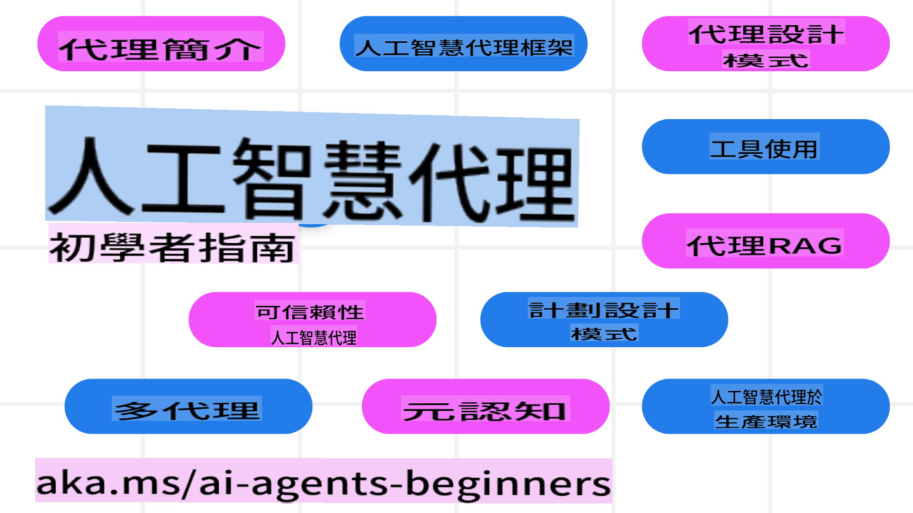

<!--
CO_OP_TRANSLATOR_METADATA:
{
  "original_hash": "26d55c61f327f41dedaac7819c13dc06",
  "translation_date": "2025-03-28T14:03:52+00:00",
  "source_file": "README.md",
  "language_code": "tw"
}
-->
# AI Agents 初學者課程

## 10堂課教你從零開始建立 AI Agents

### 語言支援

     
 

 

  
 
 

## 🌱 快速入門

這門課程共有10堂課，涵蓋建立 AI Agents 的基礎知識。每堂課都有自己的主題，您可以從任何一課開始學習！

此課程支援多語言版本，請查看我們的[可用語言版本](../..)。

如果您是第一次使用生成式 AI 模型，建議您參考我們的 [生成式 AI 初學者課程](https://aka.ms/genai-beginners)，該課程包含21堂關於生成式 AI 的教學。

別忘了 [收藏（🌟）這個倉庫](https://docs.github.com/en/get-started/exploring-projects-on-github/saving-repositories-with-stars?WT.mc_id=academic-105485-koreyst)以及[分叉這個倉庫](https://github.com/microsoft/ai-agents-for-beginners/fork)以便執行程式碼。

### 您需要準備什麼

每堂課都包含程式碼範例，這些範例存放於 code_samples 資料夾中。您可以 [分叉這個倉庫](https://github.com/microsoft/ai-agents-for-beginners/fork)來建立自己的副本。

這些練習中的程式碼範例使用 Azure AI Foundry 和 GitHub Model Catalogs 與語言模型進行互動：

- [Github Models](https://aka.ms/ai-agents-beginners/github-models) - 免費 / 限制版
- [Azure AI Foundry](https://aka.ms/ai-agents-beginners/ai-foundry) - 需要 Azure 帳戶

此課程還使用了以下來自 Microsoft 的 AI Agent 框架和服務：

- [Azure AI Agent Service](https://aka.ms/ai-agents-beginners/ai-agent-service)
- [Semantic Kernel](https://aka.ms/ai-agents-beginners/semantic-kernel)  
- [AutoGen](https://aka.ms/ai-agents/autogen)  

如需了解更多關於運行本課程代碼的信息，請參考[課程設置](./00-course-setup/README.md)。  

## 🙏 想要幫忙嗎？  

有任何建議，或發現拼寫或代碼錯誤？[提交問題](https://github.com/microsoft/ai-agents-for-beginners/issues?WT.mc_id=academic-105485-koreyst)或[創建拉取請求](https://github.com/microsoft/ai-agents-for-beginners/pulls?WT.mc_id=academic-105485-koreyst)。  

如果你遇到困難，或者對構建 AI Agents 有任何疑問，歡迎加入我們的 [Azure AI Community Discord](https://discord.gg/kzRShWzttr)。  

## 📂 每個課程包括  

- README 中的書面課程以及一段簡短的影片  
- 支持 Azure AI Foundry 和 Github Models（免費）的 Python 代碼範例  
- 用於進一步學習的額外資源鏈接  

## 🗃️ 課程  

| **課程**                                | **文字與代碼**                                    | **影片**                                                   | **額外學習**                                                                        |
|-----------------------------------------|---------------------------------------------------|------------------------------------------------------------|-------------------------------------------------------------------------------------|
| AI Agents 簡介及應用場景                | [鏈接](./01-intro-to-ai-agents/README.md)         | [影片](https://youtu.be/3zgm60bXmQk?si=z8QygFvYQv-9WtO1)   | [鏈接](https://aka.ms/ai-agents-beginners/collection?WT.mc_id=academic-105485-koreyst) |
| 探索 AI Agentic 框架                    | [鏈接](./02-explore-agentic-frameworks/README.md) | [影片](https://youtu.be/ODwF-EZo_O8?si=Vawth4hzVaHv-u0H)   | [鏈接](https://aka.ms/ai-agents-beginners/collection?WT.mc_id=academic-105485-koreyst) |
| 理解 AI Agentic 設計模式                | [鏈接](./03-agentic-design-patterns/README.md)    | [影片](https://youtu.be/m9lM8qqoOEA?si=BIzHwzstTPL8o9GF)   | [鏈接](https://aka.ms/ai-agents-beginners/collection?WT.mc_id=academic-105485-koreyst) |
| 工具使用設計模式                        | [鏈接](./04-tool-use/README.md)                   | [影片](https://youtu.be/vieRiPRx-gI?si=2z6O2Xu2cu_Jz46N)   | [鏈接](https://aka.ms/ai-agents-beginners/collection?WT.mc_id=academic-105485-koreyst) |
| Agentic RAG                             | [鏈接](./05-agentic-rag/README.md)                | [影片](https://youtu.be/WcjAARvdL7I?si=gKPWsQpKiIlDH9A3)   | [鏈接](https://aka.ms/ai-agents-beginners/collection?WT.mc_id=academic-105485-koreyst) |
| 構建可信任的 AI Agents                  | [鏈接](./06-building-trustworthy-agents/README.md)| [影片](https://youtu.be/iZKkMEGBCUQ?si=jZjpiMnGFOE9L8OK)   | [鏈接](https://aka.ms/ai-agents-beginners/collection?WT.mc_id=academic-105485-koreyst) |
| 規劃設計模式                            | [鏈接](./07-planning-design/README.md)            | [影片](https://youtu.be/kPfJ2BrBCMY?si=6SC_iv_E5-mzucnC)   | [鏈接](https://aka.ms/ai-agents-beginners/collection?WT.mc_id=academic-105485-koreyst) |
| 多 Agent 設計模式                       | [鏈接](./08-multi-agent/README.md)                | [影片](https://youtu.be/V6HpE9hZEx0?si=rMgDhEu7wXo2uo6g)   | [鏈接](https://aka.ms/ai-agents-beginners/collection?WT.mc_id=academic-105485-koreyst) |  
| 元認知設計模式                     | [Link](./09-metacognition/README.md)               | [Video](https://youtu.be/His9R6gw6Ec?si=8gck6vvdSNCt6OcF)  | [Link](https://aka.ms/ai-agents-beginners/collection?WT.mc_id=academic-105485-koreyst) |
| AI代理在生產環境中                 | [Link](./10-ai-agents-production/README.md)        | [Video](https://youtu.be/l4TP6IyJxmQ?si=31dnhexRo6yLRJDl)  | [Link](https://aka.ms/ai-agents-beginners/collection?WT.mc_id=academic-105485-koreyst) |

## 🌐 多語言支援

| 語言                | 代碼 | 翻譯版README連結                                    | 最後更新日期   |
|---------------------|------|-----------------------------------------------------|----------------|
| 簡體中文            | zh   | [Chinese Translation](../zh/README.md)  | 2025-03-24     |
| 繁體中文            | tw   | [Chinese Translation](./README.md)  | 2025-02-13     |
| 香港中文            | hk   | [Chinese (Hong Kong) Translation](../hk/README.md) | 2025-03-28     |
| 法文                | fr   | [French Translation](../fr/README.md)   | 2025-03-28     |
| 日文                | ja   | [Japanese Translation](../ja/README.md) | 2025-03-28     |
| 韓文                | ko   | [Korean Translation](../ko/README.md)   | 2025-03-28     |
| 葡萄牙文            | pt   | [Portuguese Translation](../pt/README.md)| 2025-03-28     |
| 西班牙文            | es   | [Spanish Translation](../es/README.md)  | 2025-03-28     |
| 德文                | de   | [German Translation](../de/README.md)   | 2025-03-28     |
| 波斯文              | fa   | [Persian Translation](../fa/README.md)  | 2025-03-28     |
| 波蘭文              | pl   | [Polish Translation](../pl/README.md)   | 2025-03-28     |

## 🎒 其他課程

我們的團隊還製作了其他課程！快來看看：

- [**NEW** 初學者的生成式AI課程，使用.NET](https://github.com/microsoft/Generative-AI-for-beginners-dotnet?WT.mc_id=academic-105485-koreyst)
- [生成式AI課程，適合初學者](https://github.com/microsoft/generative-ai-for-beginners?WT.mc_id=academic-105485-koreyst)
- [初學者的機器學習課程](https://aka.ms/ml-beginners?WT.mc_id=academic-105485-koreyst)
- [初學者的數據科學課程](https://aka.ms/datascience-beginners?WT.mc_id=academic-105485-koreyst)
- [初學者的AI課程](https://aka.ms/ai-beginners?WT.mc_id=academic-105485-koreyst)
- [初學者的網絡安全課程](https://github.com/microsoft/Security-101??WT.mc_id=academic-96948-sayoung)
- [初學者的網頁開發課程](https://aka.ms/webdev-beginners?WT.mc_id=academic-105485-koreyst)
- [初學者的物聯網課程](https://aka.ms/iot-beginners?WT.mc_id=academic-105485-koreyst)
- [初學者的XR開發課程](https://github.com/microsoft/xr-development-for-beginners?WT.mc_id=academic-105485-koreyst)
- [掌握GitHub Copilot進行AI配對編程](https://aka.ms/GitHubCopilotAI?WT.mc_id=academic-105485-koreyst)
- [掌握GitHub Copilot，專為C#/.NET開發者設計](https://github.com/microsoft/mastering-github-copilot-for-dotnet-csharp-developers?WT.mc_id=academic-105485-koreyst)
- [選擇你自己的Copilot冒險](https://github.com/microsoft/CopilotAdventures?WT.mc_id=academic-105485-koreyst)

## 🌟 社群感謝

感謝 [Shivam Goyal](https://www.linkedin.com/in/shivam2003/) 提供重要的程式碼範例，展示Agentic RAG的應用。

## 貢獻指南

此專案歡迎貢獻和建議。大多數貢獻需要您同意一份貢獻者授權協議（CLA），聲明您有權且實際授予我們使用您的貢獻的權利。詳情請參閱 <https://cla.opensource.microsoft.com>。

當您提交拉取請求時，CLA機器人會自動判斷您是否需要提供CLA並適當標記PR（例如，狀態檢查、評論）。只需按照機器人提供的指示操作即可。您只需在使用CLA的所有存儲庫中執行一次此操作。
本專案採用了 [Microsoft 開放原始碼行為準則](https://opensource.microsoft.com/codeofconduct/)。  
如需更多資訊，請參閱 [行為準則 FAQ](https://opensource.microsoft.com/codeofconduct/faq/)，或  
透過 [opencode@microsoft.com](mailto:opencode@microsoft.com) 聯繫我們提出其他問題或意見。

## 商標

本專案可能包含專案、產品或服務的商標或標誌。使用 Microsoft 商標或標誌需經授權，並且必須遵守  
[Microsoft 商標與品牌準則](https://www.microsoft.com/legal/intellectualproperty/trademarks/usage/general)。  
在本專案的修改版本中使用 Microsoft 商標或標誌時，不得造成混淆或暗示 Microsoft 的贊助。  
任何使用第三方商標或標誌的行為需遵守該第三方的相關政策。

**免責聲明**：  
本文檔是使用 AI 翻譯服務 [Co-op Translator](https://github.com/Azure/co-op-translator) 翻譯的。我們努力確保翻譯的準確性，但請注意，自動翻譯可能會包含錯誤或不準確之處。原始語言的文件應被視為具有權威性的來源。對於關鍵信息，建議使用專業人工翻譯。我們對因使用此翻譯而引起的任何誤解或誤解不承擔責任。