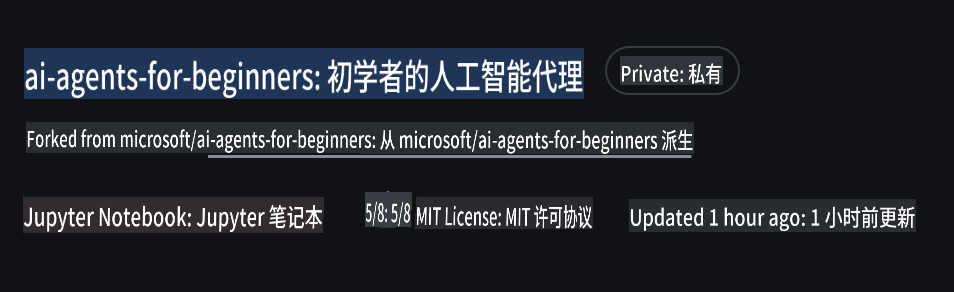
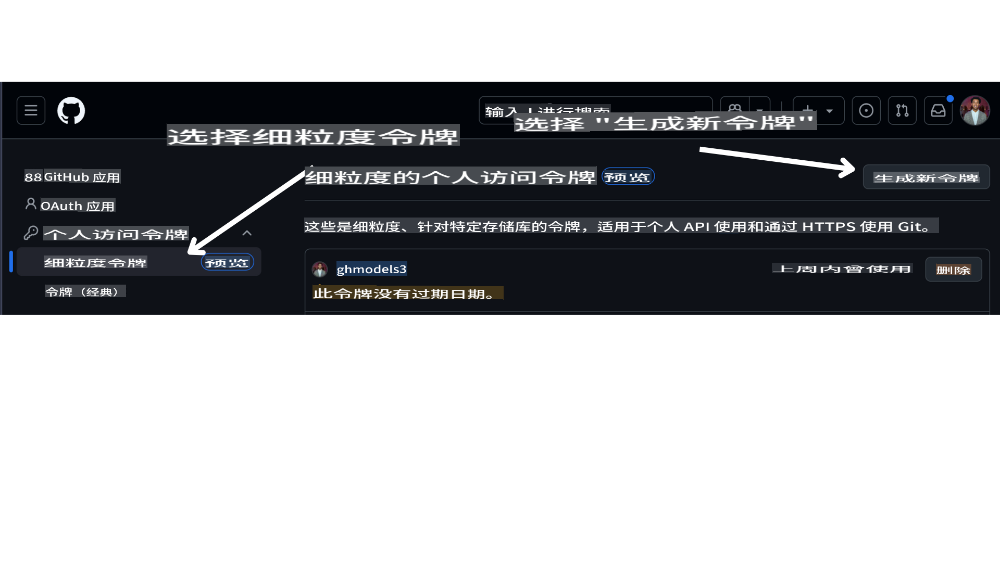

# 课程设置

## 简介

本课将讲解如何运行本课程的代码示例。

## 需求

- 一个 GitHub 账户
- Python 3.12+

## 克隆或派生此仓库

首先，请克隆或派生（Fork）GitHub 仓库。这将创建您自己的课程材料副本，方便您运行、测试和调整代码！

您可以通过点击此链接 [fork the repo](https://github.com/microsoft/ai-agents-for-beginners/fork) 来完成。

完成后，您将拥有如下所示的课程副本：



## 获取您的 GitHub 个人访问令牌 (PAT)

目前，本课程使用 GitHub Models Marketplace 提供对大语言模型（LLMs）的免费访问，这些模型将用于创建 AI Agent。

要访问此服务，您需要创建一个 GitHub 个人访问令牌。

您可以在 GitHub 账户的 [Personal Access Tokens settings](https://github.com/settings/personal-access-tokens) 页面创建。

在屏幕左侧选择 `Fine-grained tokens` 选项。

然后选择 `Generate new token`。



复制您刚刚创建的新令牌。接下来，您需要将此令牌添加到课程中的 `.env` 文件中。

## 添加到您的环境变量中

要创建 `.env` 文件，请在终端中运行以下命令：

```bash
cp .env.example .env
```

此命令会复制示例文件并在您的目录中创建一个 `.env` 文件。

打开该文件，并将您创建的令牌粘贴到 .env 文件中的 `GITHUB_TOKEN=` 字段。

## 安装所需的依赖包

为了确保您拥有运行代码所需的所有 Python 依赖包，请在终端中运行以下命令。

我们建议创建一个 Python 虚拟环境，以避免潜在的冲突和问题。

```bash
pip install -r requirements.txt
```

此命令将安装所需的 Python 包。

现在，您已经准备好运行本课程的代码了，祝您在 AI Agent 世界的学习中玩得开心！

如果在设置过程中遇到任何问题，请加入我们的 [Azure AI Community Discord](https://discord.gg/kzRShWzttr) 或 [创建一个问题](https://github.com/microsoft/ai-agents-for-beginners/issues?WT.mc_id=academic-105485-koreyst)。

**免责声明**：  
本文件使用基于机器的人工智能翻译服务进行翻译。虽然我们努力确保准确性，但请注意，自动翻译可能包含错误或不准确之处。应以原始语言的文件为权威来源。对于关键信息，建议寻求专业人工翻译。因使用本翻译而引起的任何误解或误读，我们概不负责。