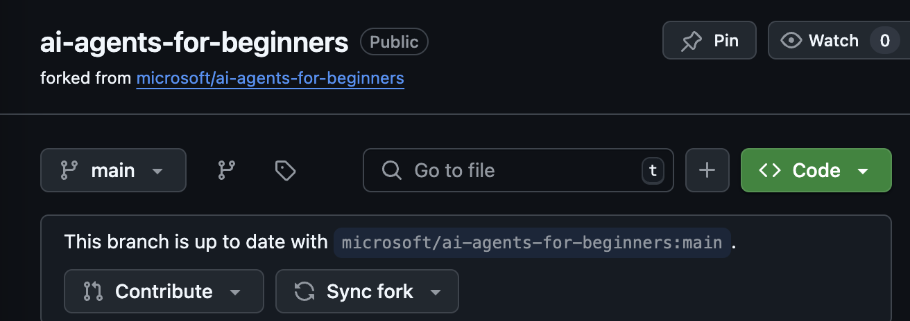
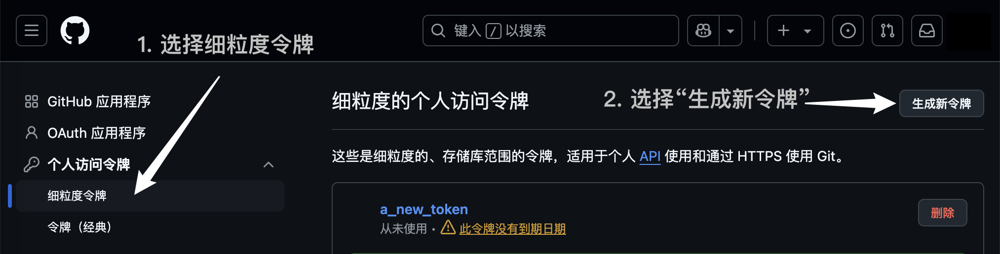

# 课程设置

## 介绍

本课将讲解如何运行本课程的代码示例。

## 要求

- 一个 GitHub 账户
- Python 3.12 及以上版本
- Azure 订阅
- Azure AI Foundry 账户

## 克隆或分叉此仓库

首先，请克隆或分叉 GitHub 仓库。这将创建您自己的课程材料副本，以便运行、测试和调整代码！

您可以通过点击此链接来 [分叉仓库](https://github.com/microsoft/ai-agents-for-beginners/fork)。

完成后，您将拥有如下所示的课程副本：



## 获取您的 GitHub 个人访问令牌（PAT）

目前，本课程使用 GitHub 模型市场提供对大语言模型（LLMs）的免费访问，这些模型将用于创建 AI Agent。

要访问此服务，您需要创建一个 GitHub 个人访问令牌。

您可以通过访问 GitHub 账户中的 [个人访问令牌设置](https://github.com/settings/personal-access-tokens) 来完成此操作。

在屏幕左侧选择 `细粒度令牌 (Fine-grained tokens)` 选项。

然后选择 `生成新令牌 (Generate new token)`。



复制您刚刚创建的新令牌。现在，您需要将其添加到课程中包含的 `.env` 文件中。

## 添加到您的环境变量

要创建 `.env` 文件，请在终端中运行以下命令：

```bash
cp .env.example .env
```

此命令会复制示例文件并在您的目录中创建一个 `.env` 文件，填写环境变量的值。您可以在 [Azure AI Foundry](https://ai.azure.com?WT.mc_id=academic-105485-koreyst) 门户的以下位置找到每个环境变量的值：

打开该文件，并将您创建的令牌粘贴到 `.env` 文件的 `GITHUB_TOKEN=` 字段中。

- `AZURE_SUBSCRIPTION_ID` - 在项目的**概览**页面内的**项目详情**中。
- `AZURE_AI_PROJECT_NAME` - 在项目的**概览**页面顶部。
- `AZURE_OPENAI_RESOURCE_GROUP` - 在**管理中心**的**项目属性**内的**概览**页面中。
- `AZURE_OPENAI_SERVICE` - 在项目的**概览**页面中的**Azure OpenAI 服务**的**包含功能**选项卡中。
- `AZURE_OPENAI_API_VERSION` - 在 [API 版本生命周期](https://learn.microsoft.com/azure/ai-services/openai/api-version-deprecation#latest-ga-api-release?WT.mc_id=academic-105485-koreyst) 网页的**最新 GA API 发布**部分中。
- `AZURE_OPENAI_ENDPOINT` - 在模型部署的**详情**选项卡内的**端点**（即**目标 URI**）中。

## 安装所需的依赖包

为了确保拥有运行代码所需的所有 Python 依赖包，请在终端中运行以下命令。

我们建议创建一个 Python 虚拟环境，以避免潜在的冲突和问题。

```bash
pip install -r requirements.txt
```

此命令将安装所需的 Python 包。

# 登录 Azure

作为安全最佳实践，我们将使用[无密钥认证](https://learn.microsoft.com/azure/developer/ai/keyless-connections?tabs=csharp%2Cazure-cli?WT.mc_id=academic-105485-koreyst)通过 Microsoft Entra ID 认证到 Azure OpenAI。在这样做之前，您需要根据您的操作系统的[安装说明](https://learn.microsoft.com/cli/azure/install-azure-cli?WT.mc_id=academic-105485-koreyst)安装**Azure CLI**。

接下来，打开一个终端并运行 `az login` 以登录到您的 Azure 账户。

## 登录 Azure

使用您用于配置 Azure 资源的 Azure AI 账户登录。

打开一个新的终端并输入以下命令，然后按照终端中的说明进行操作：

`az login --use-device-code`

登录后，在终端中选择您的订阅。

## 访问环境变量

我们将导入 `os` 和 `load_dotenv` 以便您可以访问环境变量。

```python
import os
from dotenv import load_dotenv

load_dotenv()
```

## 设置无密钥认证

我们将使用 Azure OpenAI 的无密钥连接，而不是硬编码您的凭证。为此，我们将导入 `DefaultAzureCredential` 并稍后调用 `DefaultAzureCredential` 函数以获取凭证。

```python
from azure.identity import DefaultAzureCredential, InteractiveBrowserCredential
```

现在，您已经准备好运行本课程的代码了，祝您在 AI Agent 世界的学习中玩得开心！

如果您在运行此设置时遇到任何问题，请加入我们的 [Azure AI 社区 Discord](https://discord.gg/kzRShWzttr) 或 [创建一个议题](https://github.com/microsoft/ai-agents-for-beginners/issues?WT.mc_id=academic-105485-koreyst)。

## 下一课

[AI Agents 介绍及应用案例](../01-intro-to-ai-agents/README.md)
