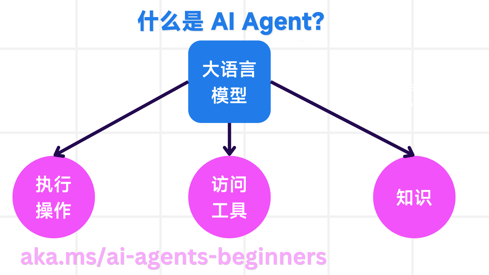
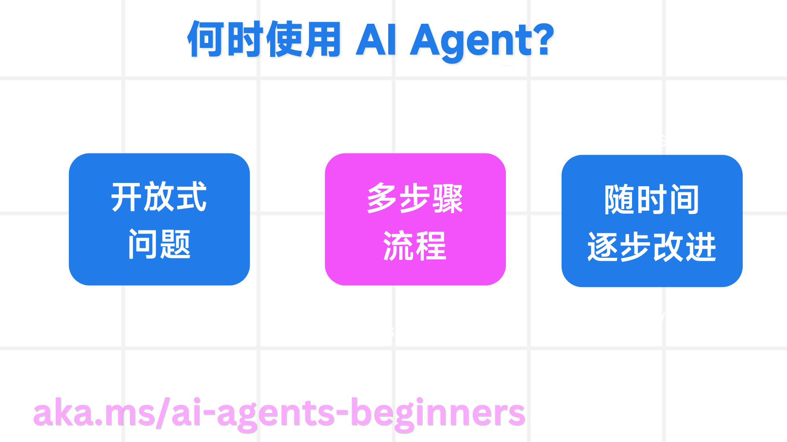

**嵌入视频**

<iframe width="560" height="315" src="https://www.youtube.com/embed/3zgm60bXmQk?si=9KSCevz-LZis6cPt" title="YouTube video player" frameborder="0" allow="accelerometer; autoplay; clipboard-write; encrypted-media; gyroscope; picture-in-picture; web-share" referrerpolicy="strict-origin-when-cross-origin" allowfullscreen></iframe>

[视频链接](https://youtu.be/3zgm60bXmQk?si=z8QygFvYQv-9WtO1)

# AI Agents 介绍及应用案例

欢迎来到 “AI Agents 入门” 课程！本课程提供构建 AI Agents 的基础知识和应用示例。

加入 [Azure AI Discord 社区](https://discord.gg/kzRShWzttr)，与其他学习者和 AI Agent 构建者交流，并提出您对本课程的任何问题。

在开始本课程之前，我们首先要更好地了解什么是 AI Agents，以及如何在构建的应用程序和工作流程中使用它们。

## 简介

本课程涵盖：

- 什么是 AI Agents，以及不同类型的 Agents？
- 哪些用例最适合 AI Agents，它们如何帮助我们？
- 设计 Agentic 解决方案时，有哪些基本的构建模块？

## 学习目标

完成本课程后，您应该能够：

- 理解 AI Agent 概念以及它们与其他 AI 解决方案的区别。
- 最有效地应用 AI Agents。
- 为用户和客户高效地设计 Agentic 解决方案。

## 定义 AI Agents 和 AI Agents 的类型

### 什么是 AI Agents？

AI Agents 是**系统**，它通过赋予 **大型语言模型 (LLMs)** **访问工具**和**知识**来扩展其能力，从而使 **LLMs** 能够**执行操作**。

让我们将这个定义分解为更小的部分：

- **系统** - 将 Agents 视为一个由许多组件组成的系统，而不仅仅是单个组件，这一点很重要。在基本层面上，AI Agent 的组件包括：
  - **环境** - AI Agent 运行的定义空间。例如，如果我们有一个旅行预订 AI Agent，则环境可以是 AI Agent 用来完成任务的旅行预订系统。
  - **传感器** - 环境具有信息并提供反馈。AI Agents 使用传感器来收集和解释有关环境当前状态的信息。在旅行预订 Agent 示例中，旅行预订系统可以提供诸如酒店可用性或航班价格之类的信息。
  - **执行器** - 一旦 AI Agent 接收到环境的当前状态，对于当前任务，Agent 会确定要执行的操作以更改环境。对于旅行预订 Agent，它可能是为用户预订可用房间。

- **大型语言模型** - Agents 的概念在 LLMs 创建之前就已存在。使用 LLMs 构建 AI Agents 的优势在于它们能够解释人类语言和数据。这种能力使 LLMs 能够解释环境信息并制定改变环境的计划。
- **执行操作** - 在 AI Agent 系统之外，LLMs 仅限于根据用户提示生成内容或信息的情况。在 AI Agent 系统内部，LLMs 可以通过解释用户请求并使用其环境中可用的工具来完成任务。
- **访问工具** - LLM 可以访问哪些工具由 1) 它运行的环境和 2) AI Agent 的开发者定义。对于我们的旅行 Agent 示例，Agent 的工具受预订系统中可用操作的限制，开发者可以将 Agent 的工具访问权限限制为航班。
- **知识** - 除了环境提供的信息外，AI Agents 还可以从其他系统、服务、工具甚至其他 Agents 中检索知识。在旅行 Agent 示例中，此知识可以是位于客户数据库中的用户旅行偏好信息。

### 不同类型的 Agents

现在我们对 AI Agents 有了一个通用的定义，让我们看看一些特定的 Agent 类型，以及它们如何应用于旅行预订 AI Agent。

| **Agent 类型**            | **描述**                                                                    | **示例**                                                                                                                 |
| ------------------------------- | --------------------------------------------------------------------------------- | ------------------------------------------------------------------------------------------------------------------------------ |
| **简单反射 Agents**       | 根据预定义的规则执行即时操作。                                                    | 旅行 Agent 解释电子邮件的上下文并将旅行投诉转发给客户服务。                                                                    |
| **基于模型的反射 Agents** | 根据世界模型和该模型的更改执行操作。                                              | 旅行 Agent 根据对历史定价数据的访问，优先考虑价格发生重大变化的路线。                                                          |
| **基于目标的 Agents**     | 通过解释目标并确定实现目标的行动来制定实现特定目标的计划。                        | 旅行 Agent 通过确定从当前位置到目的地的必要旅行安排（汽车、公共交通、航班）来预订旅程。                                        |
| **基于效用的 Agents**     | 考虑偏好并以数字方式权衡取舍，以确定如何实现目标。                                | 旅行 Agent 在预订旅行时权衡便利性与成本，从而最大化效用。                                                                      |
| **学习 Agents**           | 通过响应反馈并相应地调整行动来不断改进。                                          | 旅行 Agent 通过使用旅行后调查中的客户反馈来改进未来的预订。                                                                    |
| **分层 Agents**           | 在分层系统中具有多个 Agents，高级 Agents 将任务分解为子任务，供低级 Agents 完成。 | 旅行 Agent 通过将任务划分为子任务（例如，取消特定预订）并让低级 Agents 完成这些子任务，然后向高级 Agent 报告，从而取消行程。   |
| **多 Agent 系统 (MAS)**   | Agents 独立完成任务，可以是合作的，也可以是竞争的。                               | 合作：多个 Agents 预订特定的旅行服务，如酒店、航班和娱乐。竞争：多个 Agents 管理并竞争共享的酒店预订日历，以便为客户预订酒店。 |

## 何时使用 AI Agents

在前面的部分中，我们使用旅行 Agent 的用例来解释不同类型的 Agents 如何用于不同的旅行预订场景。我们将在整个课程中继续使用此应用程序。

让我们看看最适合使用 AI Agents 的用例类型：

- **开放式问题** - 允许 LLM 确定完成任务所需的步骤，因为它不能总是硬编码到工作流程中。
- **多步骤流程** - 需要一定复杂程度的任务，其中 AI Agent 需要在多个回合中使用工具或信息，而不是单次检索。
- **随时间改进** - Agent 可以通过从其环境或用户接收反馈来随时间改进的任务，以便提供更好的效用。

我们将在“构建可信赖的 AI Agents”课程中介绍更多使用 AI Agents 的注意事项。

## Agentic 解决方案的基础

### Agent 开发

设计 AI Agent 系统的第一步是定义工具、操作和行为。在本课程中，我们专注于使用 **Azure AI Agent 服务** 来定义我们的 Agents。它提供以下功能：

- 选择开放模型，如 OpenAI、Mistral 和 Llama
- 通过 Tripadvisor 等提供商使用许可数据
- 使用标准化的 OpenAPI 3.0 工具

### Agentic 模式

与 LLMs 的通信是通过提示进行的。鉴于 AI Agents 的半自主性，在环境发生变化后手动重新提示 LLM 并不总是可行或必需的。我们使用 **Agentic 模式**，允许我们以更具可扩展性的方式在多个步骤中提示 LLM。

本课程分为一些当前流行的 Agentic 模式。

### Agentic 框架

Agentic 框架允许开发者通过代码实现 Agentic 模式。这些框架提供模板、插件和工具，以实现更好的 AI Agent 协作。这些优势提供了更好的可观察性和 AI Agent 系统故障排除能力。

在本课程中，我们将探索研究驱动的 AutoGen 框架和来自 Semantic Kernel 的可用于生产 Agent 框架。

## 上一课

[课程设置](../00-course-setup/README.md)

## 下一课

[探索 Agentic 框架](../02-explore-agentic-frameworks/README.md)
