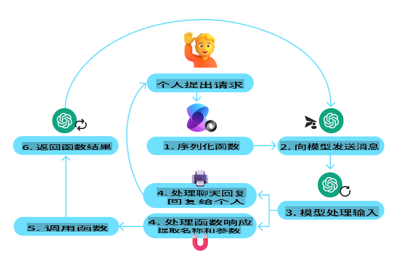

# 工具使用设计模式  

## 简介

在本课程中，我们将探索以下问题：

- 什么是工具使用设计模式？
- 它可以应用于哪些使用场景？
- 实现这一设计模式需要哪些关键元素/构件？
- 使用工具使用设计模式构建可信赖的 AI 代理需要注意哪些特殊事项？

## 学习目标

完成本课程后，您将能够：

- 定义工具使用设计模式及其目的。
- 识别适用于工具使用设计模式的使用场景。
- 理解实现该设计模式所需的关键元素。
- 认识在使用此设计模式的 AI 代理中确保可信赖性需要考虑的因素。

## 什么是工具使用设计模式？

**工具使用设计模式**的核心是赋予大型语言模型（LLM）与外部工具交互的能力，以完成特定目标。工具是代理可以执行的代码，可以是简单的函数（如计算器），也可以是调用第三方服务的 API（如股票价格查询或天气预报）。在 AI 代理的上下文中，工具是设计用来响应**模型生成的函数调用**而执行的。

## 它可以应用于哪些使用场景？

AI 代理可以利用工具完成复杂任务、检索信息或做出决策。工具使用设计模式通常应用于需要动态与外部系统交互的场景，例如数据库、Web 服务或代码解释器。这种能力在以下多种场景中非常有用：

- **动态信息检索**：代理可以查询外部 API 或数据库以获取最新数据（例如，查询 SQLite 数据库进行数据分析、获取股票价格或天气信息）。
- **代码执行和解释**：代理可以执行代码或脚本来解决数学问题、生成报告或进行模拟。
- **工作流自动化**：通过集成任务调度器、电子邮件服务或数据管道等工具，自动化重复性或多步骤的工作流。
- **客户支持**：代理可以与 CRM 系统、工单平台或知识库交互，以解决用户问题。
- **内容生成与编辑**：代理可以利用语法检查器、文本摘要工具或内容安全评估器等工具，协助完成内容创建任务。

## 实现工具使用设计模式需要哪些元素/构件？

### 函数/工具调用

函数调用是使大型语言模型（LLM）能够与工具交互的主要方式。您会发现“函数”和“工具”这两个术语常常互换使用，因为“函数”（可重用代码块）就是代理用于执行任务的“工具”。为了让函数的代码能够被调用，LLM 需要将用户的请求与函数的描述进行匹配。为此，需要向 LLM 提供包含所有可用函数描述的架构。LLM 会选择最适合任务的函数，并返回其名称和参数。选定的函数被调用，其响应会发送回 LLM，LLM 再利用这些信息回复用户的请求。

要为代理实现函数调用，开发者需要：

1. 支持函数调用的 LLM 模型
2. 包含函数描述的架构
3. 每个描述中提到的函数代码

以下通过获取某城市当前时间的示例来说明：

- **初始化支持函数调用的 LLM：**

    并非所有模型都支持函数调用，因此需要确认您使用的 LLM 是否支持。[Azure OpenAI](https://learn.microsoft.com/azure/ai-services/openai/how-to/function-calling) 支持函数调用。我们可以从初始化 Azure OpenAI 客户端开始。

    ```python
    # Initialize the Azure OpenAI client
    client = AzureOpenAI(
        azure_endpoint = os.getenv("AZURE_OPENAI_ENDPOINT"), 
        api_key=os.getenv("AZURE_OPENAI_API_KEY"),  
        api_version="2024-05-01-preview"
    )
    ```

- **创建函数架构：**

    接下来，我们将定义一个包含函数名称、功能描述以及参数名称和描述的 JSON 架构。然后将此架构与用户请求（例如查找旧金山的时间）一起传递给上述创建的客户端。需要注意的是，返回的是一个**工具调用**，而不是问题的最终答案。如前所述，LLM 返回其为任务选择的函数名称及其参数。

    ```python
    # Function description for the model to read
    tools = [
        {
            "type": "function",
            "function": {
                "name": "get_current_time",
                "description": "Get the current time in a given location",
                "parameters": {
                    "type": "object",
                    "properties": {
                        "location": {
                            "type": "string",
                            "description": "The city name, e.g. San Francisco",
                        },
                    },
                    "required": ["location"],
                },
            }
        }
    ]
    ```
   
    ```python
  
    # Initial user message
    messages = [{"role": "user", "content": "What's the current time in San Francisco"}] 
  
    # First API call: Ask the model to use the function
      response = client.chat.completions.create(
          model=deployment_name,
          messages=messages,
          tools=tools,
          tool_choice="auto",
      )
  
      # Process the model's response
      response_message = response.choices[0].message
      messages.append(response_message)
  
      print("Model's response:")  

      print(response_message)
  
    ```

    ```bash
    Model's response:
    ChatCompletionMessage(content=None, role='assistant', function_call=None, tool_calls=[ChatCompletionMessageToolCall(id='call_pOsKdUlqvdyttYB67MOj434b', function=Function(arguments='{"location":"San Francisco"}', name='get_current_time'), type='function')])
    ```
  
- **执行任务所需的函数代码：**

    现在，LLM 已经选择了需要运行的函数，接下来需要实现并执行完成任务的代码。我们可以用 Python 实现获取当前时间的代码，同时编写代码从 response_message 中提取函数名称和参数，以获得最终结果。

    ```python
      def get_current_time(location):
        """Get the current time for a given location"""
        print(f"get_current_time called with location: {location}")  
        location_lower = location.lower()
        
        for key, timezone in TIMEZONE_DATA.items():
            if key in location_lower:
                print(f"Timezone found for {key}")  
                current_time = datetime.now(ZoneInfo(timezone)).strftime("%I:%M %p")
                return json.dumps({
                    "location": location,
                    "current_time": current_time
                })
      
        print(f"No timezone data found for {location_lower}")  
        return json.dumps({"location": location, "current_time": "unknown"})
    ```

    ```python
     # Handle function calls
      if response_message.tool_calls:
          for tool_call in response_message.tool_calls:
              if tool_call.function.name == "get_current_time":
     
                  function_args = json.loads(tool_call.function.arguments)
     
                  time_response = get_current_time(
                      location=function_args.get("location")
                  )
     
                  messages.append({
                      "tool_call_id": tool_call.id,
                      "role": "tool",
                      "name": "get_current_time",
                      "content": time_response,
                  })
      else:
          print("No tool calls were made by the model.")  
  
      # Second API call: Get the final response from the model
      final_response = client.chat.completions.create(
          model=deployment_name,
          messages=messages,
      )
  
      return final_response.choices[0].message.content
     ```

    ```bash
      get_current_time called with location: San Francisco
      Timezone found for san francisco
      The current time in San Francisco is 09:24 AM.
     ```

函数调用是大多数代理工具使用设计的核心，但从零开始实现可能会有一定挑战。正如我们在 [第 2 课](../../../02-explore-agentic-frameworks) 中所学到的，代理框架为我们提供了预构建的模块，用于实现工具使用。

### 使用代理框架的工具使用示例

- ### **[Semantic Kernel](https://learn.microsoft.com/azure/ai-services/agents/overview)**

    Semantic Kernel 是一个面向 .NET、Python 和 Java 开发者的开源 AI 框架，专注于与大型语言模型（LLM）协作。它通过一个称为[序列化](https://learn.microsoft.com/semantic-kernel/concepts/ai-services/chat-completion/function-calling/?pivots=programming-language-python#1-serializing-the-functions)的过程，自动向模型描述函数及其参数，从而简化了函数调用的使用。此外，它还处理模型与代码之间的交互。使用像 Semantic Kernel 这样的代理框架的另一个好处是，它允许您访问预构建的工具，例如 [文件搜索](https://github.com/microsoft/semantic-kernel/blob/main/python/samples/getting_started_with_agents/openai_assistant/step4_assistant_tool_file_search.py) 和 [代码解释器](https://github.com/microsoft/semantic-kernel/blob/main/python/samples/getting_started_with_agents/openai_assistant/step3_assistant_tool_code_interpreter.py)。

    以下图示展示了使用 Semantic Kernel 进行函数调用的流程：

    

    在 Semantic Kernel 中，函数/工具被称为 [插件](https://learn.microsoft.com/semantic-kernel/concepts/plugins/?pivots=programming-language-python)。我们可以将 `get_current_time` function we saw earlier into a plugin by turning it into a class with the function in it. We can also import the `kernel_function` 装饰器用于函数描述。当您创建包含 GetCurrentTimePlugin 的内核时，内核会自动序列化函数及其参数，从而创建发送给 LLM 的架构。

    ```python
    from semantic_kernel.functions import kernel_function

    class GetCurrentTimePlugin:
        async def __init__(self, location):
            self.location = location

        @kernel_function(
            description="Get the current time for a given location"
        )
        def get_current_time(location: str = ""):
            ...

    ```

    ```python 
    from semantic_kernel import Kernel

    # Create the kernel
    kernel = Kernel()

    # Create the plugin
    get_current_time_plugin = GetCurrentTimePlugin(location)

    # Add the plugin to the kernel
    kernel.add_plugin(get_current_time_plugin)
    ```
  
- ### **[Azure AI Agent Service](https://learn.microsoft.com/azure/ai-services/agents/overview)**

    Azure AI Agent Service 是一个较新的代理框架，旨在帮助开发者安全地构建、部署和扩展高质量、可扩展的 AI 代理，而无需管理底层的计算和存储资源。它特别适用于企业应用，因为它是一个具有企业级安全性的完全托管服务。

    与直接使用 LLM API 开发相比，Azure AI Agent Service 提供了一些优势，包括：
  - 自动工具调用——无需解析工具调用、调用工具以及处理响应；所有这些都在服务器端完成。
  - 安全管理数据——无需自行管理会话状态，您可以依赖线程存储所需的所有信息。
  - 开箱即用的工具——可用于与数据源交互的工具，例如 Bing、Azure AI 搜索和 Azure Functions。

    Azure AI Agent Service 中的工具可分为两类：

    1. 知识工具：
        - [通过 Bing 搜索进行信息获取](https://learn.microsoft.com/azure/ai-services/agents/how-to/tools/bing-grounding?tabs=python&pivots=overview)
        - [文件搜索](https://learn.microsoft.com/azure/ai-services/agents/how-to/tools/file-search?tabs=python&pivots=overview)
        - [Azure AI 搜索](https://learn.microsoft.com/azure/ai-services/agents/how-to/tools/azure-ai-search?tabs=azurecli%2Cpython&pivots=overview-azure-ai-search)

    2. 操作工具：
        - [函数调用](https://learn.microsoft.com/azure/ai-services/agents/how-to/tools/function-calling?tabs=python&pivots=overview)
        - [代码解释器](https://learn.microsoft.com/azure/ai-services/agents/how-to/tools/code-interpreter?tabs=python&pivots=overview)
        - [OpenAI 定义的工具](https://learn.microsoft.com/azure/ai-services/agents/how-to/tools/openapi-spec?tabs=python&pivots=overview)
        - [Azure Functions](https://learn.microsoft.com/azure/ai-services/agents/how-to/tools/azure-functions?pivots=overview)

    Agent Service 允许我们将这些工具组合为一个 `toolset`. It also utilizes `threads` which keep track of the history of messages from a particular conversation.

    Imagine you are a sales agent at a company called Contoso. You want to develop a conversational agent that can answer questions about your sales data.

    The image below illustrates how you could use Azure AI Agent Service to analyze your sales data:

    

    To use any of these tools with the service we can create a client and define a tool or toolset. To implement this practically we can use the Python code below. The LLM will be able to look at the toolset and decide whether to use the user created function, `fetch_sales_data_using_sqlite_query`，或者根据用户请求使用预构建的代码解释器。

    ```python 
    import os
    from azure.ai.projects import AIProjectClient
    from azure.identity import DefaultAzureCredential
    from fecth_sales_data_functions import fetch_sales_data_using_sqlite_query # fetch_sales_data_using_sqlite_query function which can be found in a fecth_sales_data_functions.py file.
    from azure.ai.projects.models import ToolSet, FunctionTool, CodeInterpreterTool

    project_client = AIProjectClient.from_connection_string(
        credential=DefaultAzureCredential(),
        conn_str=os.environ["PROJECT_CONNECTION_STRING"],
    )

    # Initialize function calling agent with the fetch_sales_data_using_sqlite_query function and adding it to the toolset
    fetch_data_function = FunctionTool(fetch_sales_data_using_sqlite_query)
    toolset = ToolSet()
    toolset.add(fetch_data_function)

    # Initialize Code Interpreter tool and adding it to the toolset. 
    code_interpreter = code_interpreter = CodeInterpreterTool()
    toolset = ToolSet()
    toolset.add(code_interpreter)

    agent = project_client.agents.create_agent(
        model="gpt-4o-mini", name="my-agent", instructions="You are helpful agent", 
        toolset=toolset
    )
    ```

## 使用工具使用设计模式构建可信赖 AI 代理需要注意哪些特殊事项？

使用 LLM 动态生成 SQL 时，常见的担忧是安全性，尤其是 SQL 注入或恶意操作（如删除或篡改数据库）的风险。虽然这些担忧是合理的，但通过正确配置数据库访问权限可以有效缓解这些问题。对于大多数数据库，这包括将数据库配置为只读模式。对于 PostgreSQL 或 Azure SQL 等数据库服务，应用程序应被分配一个只读（SELECT）角色。

在安全环境中运行应用程序可以进一步增强保护。在企业场景中，通常会从操作系统中提取和转换数据到一个只读数据库或数据仓库中，并采用用户友好的架构。这种方法确保数据安全、性能优化且易于访问，同时限制了应用程序的只读访问权限。

## 其他资源

- [Azure AI Agents Service Workshop](https://microsoft.github.io/build-your-first-agent-with-azure-ai-agent-service-workshop/)
- [Contoso Creative Writer Multi-Agent Workshop](https://github.com/Azure-Samples/contoso-creative-writer/tree/main/docs/workshop)
- [Semantic Kernel Function Calling Tutorial](https://learn.microsoft.com/semantic-kernel/concepts/ai-services/chat-completion/function-calling/?pivots=programming-language-python#1-serializing-the-functions)
- [Semantic Kernel Code Interpreter](https://github.com/microsoft/semantic-kernel/blob/main/python/samples/getting_started_with_agents/openai_assistant/step3_assistant_tool_code_interpreter.py)
- [Autogen Tools](https://microsoft.github.io/autogen/dev/user-guide/core-user-guide/components/tools.html)

**免责声明**:  
本文件使用基于机器的人工智能翻译服务进行翻译。尽管我们努力确保准确性，但请注意，自动翻译可能包含错误或不准确之处。应以原始语言的原始文件作为权威来源。对于关键信息，建议寻求专业人工翻译服务。因使用本翻译而引起的任何误解或误读，我们概不负责。