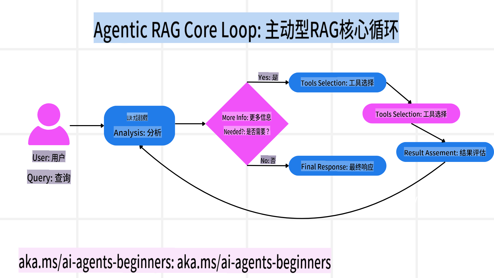
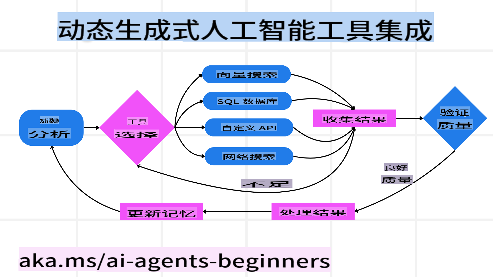
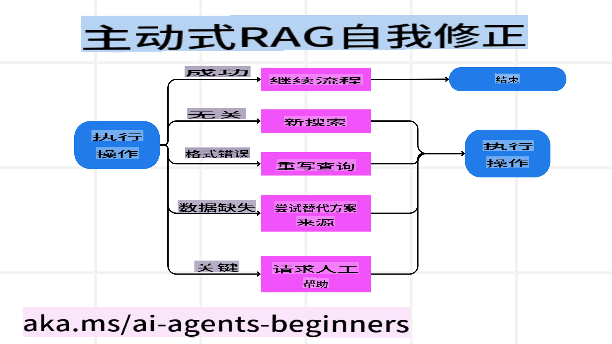
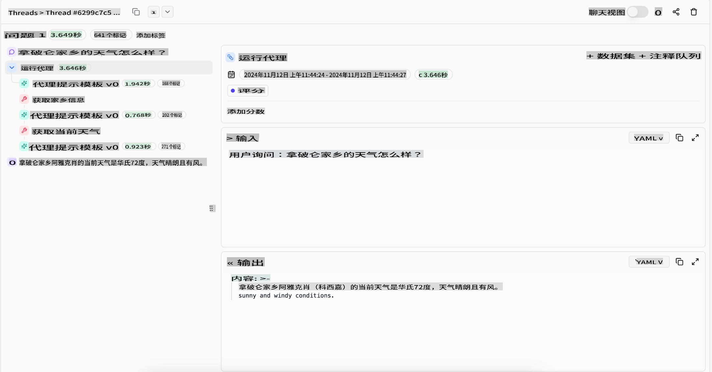
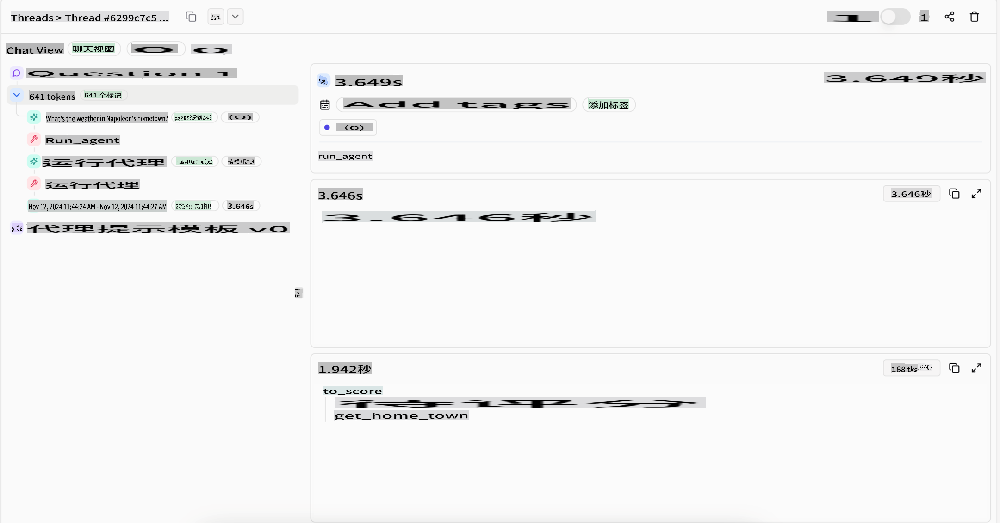

# Agentic RAG

本课程全面介绍了代理型检索增强生成（Agentic RAG），这是一种新兴的人工智能范式，其中大型语言模型（LLMs）在从外部数据源获取信息的同时，能够自主规划下一步的操作。与传统的静态“检索然后阅读”模式不同，Agentic RAG 采用了迭代调用 LLM 的方式，穿插工具或函数调用及结构化输出。系统会评估结果、优化查询、在必要时调用额外工具，并持续循环，直到找到满意的解决方案。

## 简介

本课程将涵盖以下内容：

- **了解 Agentic RAG**：学习一种新兴的人工智能范式，其中大型语言模型（LLMs）能够在从外部数据源获取信息的同时自主规划下一步操作。
- **掌握迭代式“制造者-检查者”风格**：理解这种循环模式，通过迭代调用 LLM，穿插工具或函数调用及结构化输出，旨在提升准确性并处理格式错误的查询。
- **探索实际应用**：识别 Agentic RAG 在特定场景中的优势，例如以准确性为优先的环境、复杂的数据库交互以及扩展的工作流。

## 学习目标

完成本课程后，您将能够了解/掌握以下内容：

- **理解 Agentic RAG**：学习一种新兴的人工智能范式，其中大型语言模型（LLMs）能够在从外部数据源获取信息的同时自主规划下一步操作。
- **迭代式“制造者-检查者”风格**：理解通过迭代调用 LLM，穿插工具或函数调用及结构化输出来提升准确性并处理格式错误查询的概念。
- **掌控推理过程**：理解系统掌控其推理过程的能力，能够自主决定如何解决问题，而不是依赖预定义的路径。
- **工作流**：了解代理型模型如何自主决定检索市场趋势报告、识别竞争对手数据、关联内部销售指标、综合发现并评估策略。
- **迭代循环、工具集成与记忆**：学习系统如何依赖循环交互模式，在步骤间保持状态和记忆，从而避免重复循环并做出更明智的决策。
- **处理失败模式与自我纠正**：探索系统的强大自我纠正机制，包括迭代与重新查询、使用诊断工具以及在必要时依赖人工监督。
- **代理的边界**：了解 Agentic RAG 的局限性，聚焦于领域特定的自主性、对基础设施的依赖以及对安全措施的遵守。
- **实际应用场景及价值**：识别 Agentic RAG 在特定场景中的优势，例如以准确性为优先的环境、复杂的数据库交互以及扩展的工作流。
- **治理、透明性与信任**：学习治理和透明性的重要性，包括可解释的推理、偏见控制以及人工监督。

## 什么是 Agentic RAG？

代理型检索增强生成（Agentic Retrieval-Augmented Generation，简称 Agentic RAG）是一种新兴的人工智能范式，其中大型语言模型（LLMs）能够在从外部数据源获取信息的同时自主规划下一步操作。与传统的静态“检索然后阅读”模式不同，Agentic RAG 采用了迭代调用 LLM 的方式，穿插工具或函数调用及结构化输出。系统会评估结果、优化查询、在必要时调用额外工具，并持续循环，直到找到满意的解决方案。这种迭代式“制造者-检查者”风格旨在提升准确性、处理格式错误的查询，并确保高质量的结果。

系统能够主动掌控其推理过程，重写失败的查询、选择不同的检索方法并整合多种工具——例如 Azure AI Search 的向量搜索、SQL 数据库或自定义 API——在最终生成答案之前完成这些操作。代理型系统的显著特性在于其能够掌控推理过程。传统的 RAG 实现依赖预定义的路径，而代理型系统则基于所获取信息的质量自主决定步骤顺序。

## 定义代理型检索增强生成（Agentic RAG）

代理型检索增强生成（Agentic Retrieval-Augmented Generation，简称 Agentic RAG）是一种新兴的人工智能开发范式，其中 LLM 不仅从外部数据源中获取信息，还能自主规划下一步操作。与传统的静态“检索然后阅读”模式或精心设计的提示序列不同，Agentic RAG 采用了一种迭代调用 LLM 的循环模式，穿插工具或函数调用及结构化输出。在每一步，系统都会评估已获得的结果，决定是否需要优化查询、调用额外工具，并持续这一循环直到找到满意的解决方案。

这种迭代式“制造者-检查者”操作风格旨在提升准确性、处理格式错误的查询（例如 NL2SQL）并确保高质量的结果。与依赖精心设计的提示链不同，系统能够主动掌控其推理过程。它可以重写失败的查询、选择不同的检索方法并整合多种工具——例如 Azure AI Search 的向量搜索、SQL 数据库或自定义 API——在最终生成答案之前完成这些操作。这消除了对过于复杂的编排框架的需求。相反，通过一个相对简单的循环模式“LLM 调用 → 工具使用 → LLM 调用 → …”，即可生成复杂且可靠的输出。

## 掌控推理过程

让系统具备“代理型”能力的关键特性在于其能够掌控推理过程。传统的 RAG 实现通常依赖于人类预先定义的路径：一个思维链条，明确指出需要检索什么以及何时检索。
而真正的代理型系统则能够内部决定如何解决问题。它不只是执行脚本，而是根据所获取信息的质量自主决定步骤顺序。
例如，如果被要求创建一个产品发布策略，它不会仅仅依赖一个明确列出所有研究和决策工作流的提示。相反，代理型模型会自主决定：

1. 使用 Bing Web Grounding 检索当前市场趋势报告。
2. 使用 Azure AI Search 识别相关的竞争对手数据。
3. 使用 Azure SQL Database 关联历史内部销售指标。
4. 通过 Azure OpenAI Service 综合这些发现形成一个连贯的策略。
5. 评估策略是否存在漏洞或不一致之处，如有必要，进行新一轮的检索。
所有这些步骤——优化查询、选择数据源、迭代直到对答案“满意”为止——都是由模型自主决定，而非由人类预先编写脚本。

## 迭代循环、工具集成与记忆

代理型系统依赖于一种循环交互模式：

- **初始调用**：用户目标（即用户提示）被传递给 LLM。
- **工具调用**：如果模型发现信息缺失或指令含糊，它会选择一个工具或检索方法——例如向量数据库查询（如 Azure AI Search 的混合搜索私有数据）或结构化 SQL 调用——以获取更多上下文。
- **评估与优化**：在审查返回的数据后，模型会决定这些信息是否足够。如果不足，它会优化查询、尝试不同工具或调整方法。
- **重复直到满意**：此循环会持续进行，直到模型认为已获得足够的清晰度和证据，可以给出一个最终的、经过充分推理的响应。
- **记忆与状态**：由于系统在步骤之间保持状态和记忆，它可以回忆起之前的尝试及其结果，从而避免重复循环，并在推进过程中做出更明智的决策。

随着时间推移，这种方式创造了一种不断演进的理解，使得模型能够处理复杂的多步骤任务，而无需人类不断干预或重塑提示。

## 处理失败模式与自我纠正

Agentic RAG 的自主性还包括强大的自我纠正机制。当系统遇到瓶颈（例如检索到无关文档或遇到格式错误的查询）时，它可以：

- **迭代与重新查询**：模型不会返回低价值的响应，而是尝试新的搜索策略、重写数据库查询或查找替代数据集。
- **使用诊断工具**：系统可能调用额外的函数来帮助其调试推理步骤或确认检索数据的正确性。像 Azure AI Tracing 这样的工具对于实现强大的可观测性和监控将非常重要。
- **依赖人工监督**：对于高风险或反复失败的场景，模型可能会标记不确定性并请求人工指导。一旦人类提供了纠正反馈，模型可以将这一经验融入后续操作。

这种迭代和动态的方法使得模型能够不断改进，确保它不仅是一次性系统，而是能够在当前会话中从错误中学习的系统。

## 代理的边界

尽管在任务范围内具备一定的自主性，Agentic RAG 并不等同于通用人工智能（AGI）。其“代理型”能力局限于开发者提供的工具、数据源和策略。它无法自主创建新工具或超出已设定的领域边界。相反，它擅长动态协调现有资源。

与更高级 AI 形式的关键区别包括：

1. **领域特定的自主性**：Agentic RAG 系统专注于在已知领域内实现用户定义的目标，采用查询重写或工具选择等策略来优化结果。
2. **依赖基础设施**：系统的能力依赖于开发者集成的工具和数据。没有人类干预，它无法超越这些限制。
3. **遵守安全措施**：道德准则、合规规则和业务政策仍然非常重要。代理的自由始终受到安全措施和监督机制的约束（希望如此？）。

## 实际应用场景及价值

Agentic RAG 在需要迭代优化和精确性的场景中表现出色：

1. **以准确性为优先的环境**：在合规检查、法规分析或法律研究中，代理型模型可以反复验证事实、咨询多个来源并重写查询，直到生成经过充分验证的答案。
2. **复杂的数据库交互**：处理结构化数据时，查询可能经常失败或需要调整，系统可以通过 Azure SQL 或 Microsoft Fabric OneLake 自主优化查询，确保最终检索结果符合用户意图。
3. **扩展工作流**：随着新信息的出现，长时间运行的会话可能会不断演变。Agentic RAG 可以持续整合新数据，并在了解问题空间的过程中调整策略。

## 治理、透明性与信任

随着这些系统在推理上变得更加自主，治理和透明性至关重要：

- **可解释的推理**：模型可以提供其所做查询、所咨询来源及其推理步骤的审计记录。像 Azure AI Content Safety 和 Azure AI Tracing / GenAIOps 这样的工具可以帮助保持透明性并降低风险。
- **偏见控制与平衡检索**：开发者可以调整检索策略以确保考虑到平衡且具有代表性的数据源，并定期审核输出以检测偏见或不平衡模式，适用于使用 Azure Machine Learning 的高级数据科学组织。
- **人工监督与合规性**：对于敏感任务，人工审查仍然是必不可少的。Agentic RAG 并不会在高风险决策中取代人类判断，而是通过提供经过更充分验证的选项来增强人类决策。

拥有能够清晰记录操作的工具至关重要。否则，调试多步骤过程将变得非常困难。以下是来自 Literal AI（Chainlit 背后的公司）的代理运行示例：

## 结论

Agentic RAG 代表了 AI 系统在处理复杂、数据密集型任务方面的一种自然演进。通过采用循环交互模式、自主选择工具并优化查询直到获得高质量结果，系统超越了静态的提示跟随，成为一种更具适应性和上下文感知的决策者。尽管仍然受限于人类定义的基础设施和伦理指南，这些代理型能力使企业和终端用户能够享受到更丰富、更动态、更有价值的 AI 交互。

## 其他资源

- 实现检索增强生成（RAG）与 Azure OpenAI 服务：学习如何使用 Azure OpenAI 服务与您自己的数据。[此 Microsoft Learn 模块提供了有关实现 RAG 的全面指南](https://learn.microsoft.com/training/modules/use-own-data-azure-openai)
- 使用 Azure AI Foundry 评估生成式 AI 应用程序：本文涵盖了基于公开可用数据集评估和比较模型的内容，包括 [代理型 AI 应用程序和 RAG 架构](https://learn.microsoft.com/azure/ai-studio/concepts/evaluation-approach-gen-ai)
- [What is Agentic RAG | Weaviate](https://weaviate.io/blog/what-is-agentic-rag)
- [Agentic RAG: A Complete Guide to Agent-Based Retrieval Augmented Generation – News from generation RAG](https://ragaboutit.com/agentic-rag-a-complete-guide-to-agent-based-retrieval-augmented-generation/)
- [Agentic RAG: turbocharge your RAG with query reformulation and self-query! Hugging Face Open-Source AI Cookbook](https://huggingface.co/learn/cookbook/agent_rag)
- [Adding Agentic Layers to RAG](https://youtu.be/aQ4yQXeB1Ss?si=2HUqBzHoeB5tR04U)
- [The Future of Knowledge Assistants: Jerry Liu](https://www.youtube.com/watch?v=zeAyuLc_f3Q&t=244s)
- [How to Build Agentic RAG Systems](https://www.youtube.com/watch?v=AOSjiXP1jmQ)
- [Using Azure AI Foundry Agent Service to scale your AI agents](https://ignite.microsoft.com/sessions/BRK102?source=sessions)

### 学术论文

- [2303.17651 Self-Refine: Iterative Refinement with Self-Feedback](https://arxiv.org/abs/2303.17651)
- [2303.11366 Reflexion: Language Agents with Verbal Reinforcement Learning](https://arxiv.org/abs/2303.11366)
- [2305.11738 CRITIC: Large Language Models Can Self-Correct with Tool-Interactive Critiquing](https://arxiv.org/abs/2305.11738)

**免责声明**：  
本文件使用基于机器的人工智能翻译服务进行翻译。尽管我们努力确保翻译的准确性，但请注意，自动翻译可能包含错误或不准确之处。应以原始语言的文件为权威来源。对于关键信息，建议使用专业人工翻译。我们不对因使用此翻译而引起的任何误解或误读承担责任。