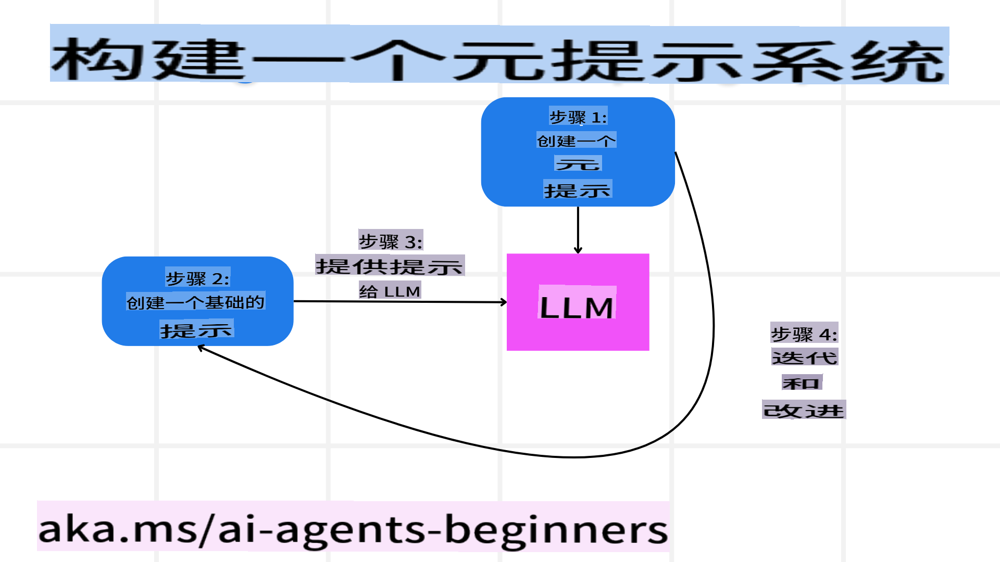
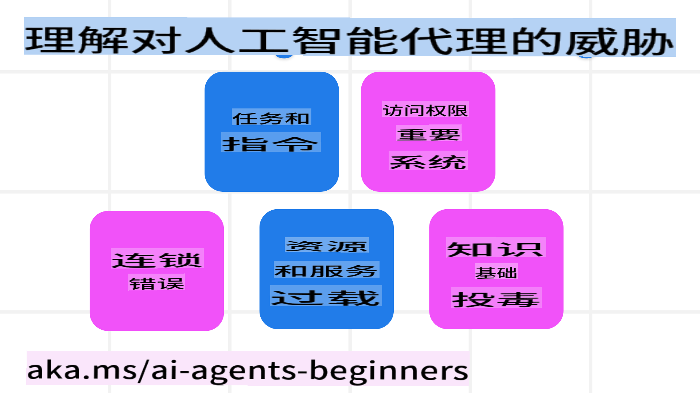
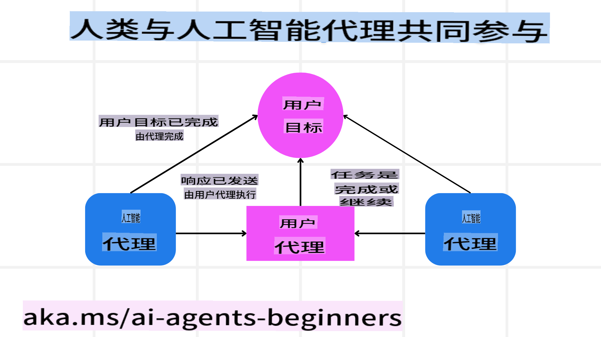

# 构建值得信赖的 AI 代理

## 简介

本课程将涵盖以下内容：

- 如何构建和部署安全且高效的 AI 代理。
- 开发 AI 代理时的重要安全注意事项。
- 如何在开发 AI 代理时维护数据和用户隐私。

## 学习目标

完成本课程后，您将能够：

- 识别并减轻在创建 AI 代理时可能面临的风险。
- 实施安全措施，确保数据和访问得到妥善管理。
- 创建既能维护数据隐私又能提供优质用户体验的 AI 代理。

## 安全性

首先，我们来看如何构建安全的代理型应用程序。安全性意味着 AI 代理能够按照设计执行任务。作为代理型应用程序的开发者，我们有一些方法和工具来最大化安全性：

### 构建元提示系统

如果您曾使用大型语言模型（LLMs）构建 AI 应用程序，您应该了解设计一个强大的系统提示或系统消息的重要性。这些提示定义了元规则、指令以及与用户和数据交互的指导方针。

对于 AI 代理来说，系统提示更为重要，因为它们需要非常具体的指令来完成我们为其设计的任务。

为了创建可扩展的系统提示，我们可以使用一个元提示系统来为应用程序中的一个或多个代理构建提示：



#### 第一步：创建元提示或模板提示

元提示将被提供给 LLM，用于生成我们为代理创建的系统提示。我们将其设计为模板，这样如果需要，可以高效地创建多个代理。

以下是我们可能提供给 LLM 的元提示示例：

```plaintext
You are an expert at creating AI agent assitants. 
You will be provided a company name, role, responsibilites and other
information that you will use to provide a system prompt for.
To create the system prompt, be descriptive as possible and provide a structure that a system using an LLM can better understand the role and responsibilites of the AI assistant. 
```

#### 第二步：创建基础提示

下一步是创建一个基础提示来描述 AI 代理。您应该包括代理的角色、代理需要完成的任务以及代理的其他职责。

示例如下：

```plaintext
You are a travel agent for Contoso Travel with that is great at booking flights for customers. To help customers you can perform the following tasks: lookup available flights, book flights, ask for preferences in seating and times for flights, cancel any previously booked flights and alert customers on any delays or cancellations of flights.  
```

#### 第三步：将基础提示提供给 LLM

现在，我们可以通过将元提示作为系统提示，并结合基础提示来优化这个提示。

这将生成一个更适合指导 AI 代理的提示：

```markdown
**Company Name:** Contoso Travel  
**Role:** Travel Agent Assistant

**Objective:**  
You are an AI-powered travel agent assistant for Contoso Travel, specializing in booking flights and providing exceptional customer service. Your main goal is to assist customers in finding, booking, and managing their flights, all while ensuring that their preferences and needs are met efficiently.

**Key Responsibilities:**

1. **Flight Lookup:**
    
    - Assist customers in searching for available flights based on their specified destination, dates, and any other relevant preferences.
    - Provide a list of options, including flight times, airlines, layovers, and pricing.
2. **Flight Booking:**
    
    - Facilitate the booking of flights for customers, ensuring that all details are correctly entered into the system.
    - Confirm bookings and provide customers with their itinerary, including confirmation numbers and any other pertinent information.
3. **Customer Preference Inquiry:**
    
    - Actively ask customers for their preferences regarding seating (e.g., aisle, window, extra legroom) and preferred times for flights (e.g., morning, afternoon, evening).
    - Record these preferences for future reference and tailor suggestions accordingly.
4. **Flight Cancellation:**
    
    - Assist customers in canceling previously booked flights if needed, following company policies and procedures.
    - Notify customers of any necessary refunds or additional steps that may be required for cancellations.
5. **Flight Monitoring:**
    
    - Monitor the status of booked flights and alert customers in real-time about any delays, cancellations, or changes to their flight schedule.
    - Provide updates through preferred communication channels (e.g., email, SMS) as needed.

**Tone and Style:**

- Maintain a friendly, professional, and approachable demeanor in all interactions with customers.
- Ensure that all communication is clear, informative, and tailored to the customer's specific needs and inquiries.

**User Interaction Instructions:**

- Respond to customer queries promptly and accurately.
- Use a conversational style while ensuring professionalism.
- Prioritize customer satisfaction by being attentive, empathetic, and proactive in all assistance provided.

**Additional Notes:**

- Stay updated on any changes to airline policies, travel restrictions, and other relevant information that could impact flight bookings and customer experience.
- Use clear and concise language to explain options and processes, avoiding jargon where possible for better customer understanding.

This AI assistant is designed to streamline the flight booking process for customers of Contoso Travel, ensuring that all their travel needs are met efficiently and effectively.

```

#### 第四步：迭代与改进

这个元提示系统的价值在于能够更轻松地为多个代理扩展创建提示，并随着时间推移改进提示。很少有提示能在第一次就完全适用于您的用例。通过更改基础提示并将其运行通过系统，您可以进行小幅调整和改进，从而比较和评估结果。

## 理解威胁  

要构建值得信赖的 AI 代理，理解并减轻可能对 AI 代理造成的风险和威胁是至关重要的。我们来看看一些常见的 AI 代理威胁以及如何更好地规划和应对它们。



### 任务与指令

**描述：** 攻击者试图通过提示或操控输入来更改 AI 代理的指令或目标。

**缓解措施：** 执行验证检查和输入过滤，以检测潜在危险的提示，在它们被 AI 代理处理之前拦截。由于这类攻击通常需要频繁与代理交互，限制对话轮数也是防止此类攻击的有效方法。

### 对关键系统的访问

**描述：** 如果 AI 代理可以访问存储敏感数据的系统和服务，攻击者可能会破坏代理与这些服务之间的通信。这可能是直接攻击，也可能是通过代理间接获取这些系统的信息。

**缓解措施：** AI 代理应仅在需要时访问相关系统，以防止此类攻击。代理与系统之间的通信应确保安全。实施身份验证和访问控制也是保护信息的有效手段。

### 资源和服务过载

**描述：** AI 代理可以访问不同的工具和服务来完成任务。攻击者可能利用这一能力，通过代理发送大量请求来攻击这些服务，可能导致系统故障或高昂成本。

**缓解措施：** 实施策略以限制 AI 代理对服务的请求数量。限制对话轮数和请求次数也是防止此类攻击的另一种方法。

### 知识库污染

**描述：** 这种攻击并不直接针对 AI 代理，而是针对代理将使用的知识库和其他服务。这可能包括篡改代理完成任务所需的数据或信息，导致代理向用户提供偏颇或意外的响应。

**缓解措施：** 定期验证 AI 代理在其工作流程中使用的数据。确保对这些数据的访问是安全的，并且只有受信任的人员才能更改，以避免此类攻击。

### 连锁错误

**描述：** AI 代理依赖多种工具和服务来完成任务。攻击者引发的错误可能导致其他系统的故障，使攻击范围扩大且更难排查。

**缓解措施：** 一种避免方法是让 AI 代理在受限环境中运行，例如在 Docker 容器中执行任务，以防止直接系统攻击。创建回退机制和重试逻辑，以应对某些系统返回错误的情况，也是防止更大范围系统故障的有效手段。

## 人类参与

另一种构建值得信赖的 AI 代理系统的有效方法是引入“人类参与”机制。这种机制允许用户在代理运行过程中提供反馈。用户实际上充当了多代理系统中的一个代理，可以批准或终止运行的流程。



以下是一个使用 AutoGen 实现此概念的代码示例：

```python

# Create the agents.
model_client = OpenAIChatCompletionClient(model="gpt-4o-mini")
assistant = AssistantAgent("assistant", model_client=model_client)
user_proxy = UserProxyAgent("user_proxy", input_func=input)  # Use input() to get user input from console.

# Create the termination condition which will end the conversation when the user says "APPROVE".
termination = TextMentionTermination("APPROVE")

# Create the team.
team = RoundRobinGroupChat([assistant, user_proxy], termination_condition=termination)

# Run the conversation and stream to the console.
stream = team.run_stream(task="Write a 4-line poem about the ocean.")
# Use asyncio.run(...) when running in a script.
await Console(stream)

```

**免责声明**：  
本文件使用基于机器的人工智能翻译服务进行翻译。尽管我们力求准确，但请注意，自动翻译可能包含错误或不准确之处。应以原文的母语版本为权威来源。对于关键信息，建议寻求专业人工翻译服务。对于因使用本翻译而引起的任何误解或误读，我们概不负责。