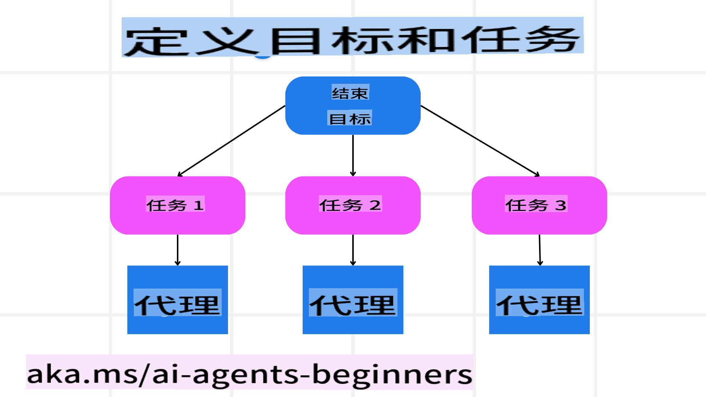

# 规划设计

## 简介

本课程将涵盖以下内容：

* 明确总体目标，并将复杂任务拆解为可管理的子任务。
* 利用结构化输出以生成更可靠且机器可读的响应。
* 应用事件驱动的方法来处理动态任务和意外输入。

## 学习目标

完成本课程后，您将能够：

* 为 AI 代理设定一个明确的总体目标，确保它清楚需要实现的内容。
* 将复杂任务分解为可管理的子任务，并以逻辑顺序组织它们。
* 为代理配备合适的工具（例如搜索工具或数据分析工具），决定何时以及如何使用这些工具，并处理可能出现的意外情况。
* 评估子任务的结果，衡量性能，并通过迭代改进最终输出。

## 定义总体目标并分解任务



大多数现实世界的任务都过于复杂，无法一步完成。AI 代理需要一个简洁的目标来指导其规划和行动。例如，考虑以下目标：

    "生成一个为期三天的旅行行程。"

尽管这个目标表述得很简单，但它仍然需要进一步细化。目标越清晰，代理（以及任何人类协作者）就越能够专注于实现正确的结果，例如创建一个包含航班选项、酒店推荐和活动建议的全面行程。

### 任务分解

将大型或复杂的任务分解为更小的、以目标为导向的子任务，可以使其更易于管理。
以旅行行程为例，您可以将目标分解为：

* 航班预订
* 酒店预订
* 租车服务
* 个性化定制

每个子任务都可以由专门的代理或流程处理。例如，一个代理可能专注于寻找最佳航班优惠，另一个代理则负责酒店预订，等等。然后，一个协调或“下游”代理可以将这些结果整合成一个连贯的行程，供最终用户使用。

这种模块化方法还允许逐步改进。例如，您可以添加专门的代理来提供美食推荐或本地活动建议，从而随着时间的推移不断优化行程。

### 结构化输出

大型语言模型（LLMs）可以生成结构化输出（例如 JSON），这使得下游代理或服务更容易解析和处理。这在多代理环境中特别有用，我们可以在收到规划输出后执行这些任务。请参考此 [博客文章](https://microsoft.github.io/autogen/stable/user-guide/core-user-guide/cookbook/structured-output-agent.html) 以快速了解相关内容。

以下是一个简单规划代理的 Python 代码片段示例，它将目标分解为子任务并生成结构化计划：

### 多代理协作的规划代理

在此示例中，一个语义路由代理接收用户请求（例如，“我需要一个旅行的酒店计划。”）。

规划过程如下：

* 接收酒店计划：规划代理接收用户的消息，并基于系统提示（包括可用代理的详细信息）生成结构化的旅行计划。
* 列出代理及其工具：代理注册表保存了一份代理列表（例如航班、酒店、租车和活动代理）以及它们提供的功能或工具。
* 将计划分配给相应的代理：根据子任务的数量，规划代理会直接将消息发送给专门的代理（针对单任务场景），或者通过群聊管理器协调多代理协作。
* 总结结果：最后，规划代理总结生成的计划以确保清晰明了。

以下是展示这些步骤的 Python 代码示例：

```python

from pydantic import BaseModel

from enum import Enum
from typing import List, Optional, Union

class AgentEnum(str, Enum):
    FlightBooking = "flight_booking"
    HotelBooking = "hotel_booking"
    CarRental = "car_rental"
    ActivitiesBooking = "activities_booking"
    DestinationInfo = "destination_info"
    DefaultAgent = "default_agent"
    GroupChatManager = "group_chat_manager"

# Travel SubTask Model

class TravelSubTask(BaseModel):
    task_details: str
    assigned_agent: AgentEnum # we want to assign the task to the agent

class TravelPlan(BaseModel):
    main_task: str
    subtasks: List[TravelSubTask]
    is_greeting: bool
import json
import os
from typing import Optional

from autogen_core.models import UserMessage, SystemMessage, AssistantMessage
from autogen_ext.models.openai import AzureOpenAIChatCompletionClient

# Create the client with type-checked environment variables

client = AzureOpenAIChatCompletionClient(
    azure_deployment=os.getenv("AZURE_OPENAI_DEPLOYMENT_NAME"),
    model=os.getenv("AZURE_OPENAI_DEPLOYMENT_NAME"),
    api_version=os.getenv("AZURE_OPENAI_API_VERSION"),
    azure_endpoint=os.getenv("AZURE_OPENAI_ENDPOINT"),
    api_key=os.getenv("AZURE_OPENAI_API_KEY"),
)

from pprint import pprint

# Define the user message

messages = [
    SystemMessage(content="""You are an planner agent.
    Your job is to decide which agents to run based on the user's request.
    Below are the available agents specialised in different tasks:
    - FlightBooking: For booking flights and providing flight information
    - HotelBooking: For booking hotels and providing hotel information
    - CarRental: For booking cars and providing car rental information
    - ActivitiesBooking: For booking activities and providing activity information
    - DestinationInfo: For providing information about destinations
    - DefaultAgent: For handling general requests""", source="system"),
    UserMessage(content="Create a travel plan for a family of 2 kids from Singapore to Melbourne", source="user"),
]

response = await client.create(messages=messages, extra_create_args={"response_format": TravelPlan})

# Ensure the response content is a valid JSON string before loading it

response_content: Optional[str] = response.content if isinstance(response.content, str) else None
if response_content is None:
    raise ValueError("Response content is not a valid JSON string")

# Print the response content after loading it as JSON

pprint(json.loads(response_content))
```

上述代码的输出如下，您可以使用此结构化输出将任务路由到 `assigned_agent` 并向最终用户总结旅行计划：

```json
{
    "is_greeting": "False",
    "main_task": "Plan a family trip from Singapore to Melbourne.",
    "subtasks": [
        {
            "assigned_agent": "flight_booking",
            "task_details": "Book round-trip flights from Singapore to Melbourne."
        },
        {
            "assigned_agent": "hotel_booking",
            "task_details": "Find family-friendly hotels in Melbourne."
        },
        {
            "assigned_agent": "car_rental",
            "task_details": "Arrange a car rental suitable for a family of four in Melbourne."
        },
        {
            "assigned_agent": "activities_booking",
            "task_details": "List family-friendly activities in Melbourne."
        },
        {
            "assigned_agent": "destination_info",
            "task_details": "Provide information about Melbourne as a travel destination."
        }
    ]
}
```

包含上述代码示例的示例笔记本可在 [这里](../../../07-planning-design/code_samples/07-autogen.ipynb) 获取。

### 迭代规划

某些任务需要反复调整或重新规划，其中一个子任务的结果可能会影响下一个子任务。例如，如果代理在预订航班时发现了意外的数据格式，它可能需要在继续酒店预订之前调整其策略。

此外，用户反馈（例如用户决定选择更早的航班）可能会触发部分重新规划。这种动态、迭代的方法可以确保最终解决方案符合现实世界的约束和不断变化的用户偏好。

例如，示例代码：

    ```python
    from autogen_core.models import UserMessage, SystemMessage, AssistantMessage
    #.. same as previous code and pass on the user history, current plan 
    messages = [
        SystemMessage(content="""You are a planner agent to optimize the 
        Your job is to decide which agents to run based on the user's request.
        Below are the available agents specialised in different tasks:
        - FlightBooking: For booking flights and providing flight information
        - HotelBooking: For booking hotels and providing hotel information
        - CarRental: For booking cars and providing car rental information
        - ActivitiesBooking: For booking activities and providing activity information
        - DestinationInfo: For providing information about destinations
        - DefaultAgent: For handling general requests""", source="system"),
        UserMessage(content="Create a travel plan for a family of 2 kids from Singapore to Melboune", source="user"),
        AssistantMessage(content=f"Previous travel plan - {TravelPlan}", source="assistant")
    ]
    # .. re-plan and send the tasks to respective agents
    ```

有关更全面的规划，请参考 Magnetic One 的 [博客文章](https://www.microsoft.com/research/articles/magentic-one-a-generalist-multi-agent-system-for-solving-complex-tasks)，以了解如何解决复杂任务。

## 总结

本文展示了如何创建一个能够动态选择定义代理的规划器。规划器的输出会将任务分解并分配给代理以执行任务。假设这些代理能够访问执行任务所需的功能/工具。除了代理之外，您还可以包括其他模式，例如反思、总结器、轮询聊天等，以进一步自定义。

## 其他资源

* 使用 o1 推理模型在规划复杂任务中表现出了相当高的先进性——TODO: 分享示例？

* Autogen Magnetic One - 一种通用多代理系统，用于解决复杂任务，并在多个具有挑战性的代理基准测试中取得了令人印象深刻的成果。参考：[autogen-magentic-one](https://github.com/microsoft/autogen/tree/main/python/packages/autogen-magentic-one)。在此实现中，协调器会创建特定任务的计划，并将这些任务委派给可用代理。除了规划之外，协调器还采用了一种跟踪机制来监控任务进度，并根据需要重新规划。

**免责声明**：  
本文档通过基于机器的人工智能翻译服务进行翻译。虽然我们尽力确保准确性，但请注意，自动翻译可能包含错误或不准确之处。应以原文档的原始语言版本为权威来源。对于关键信息，建议使用专业的人类翻译服务。对于因使用此翻译而引起的任何误解或误读，我们概不负责。