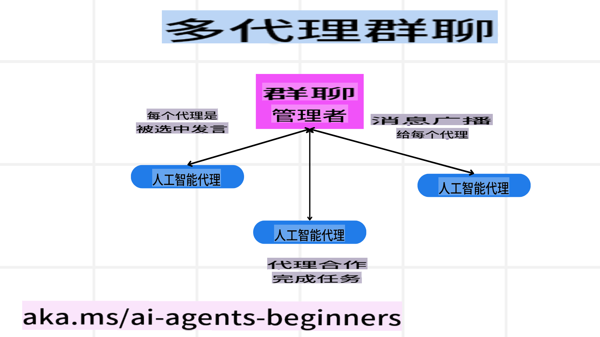
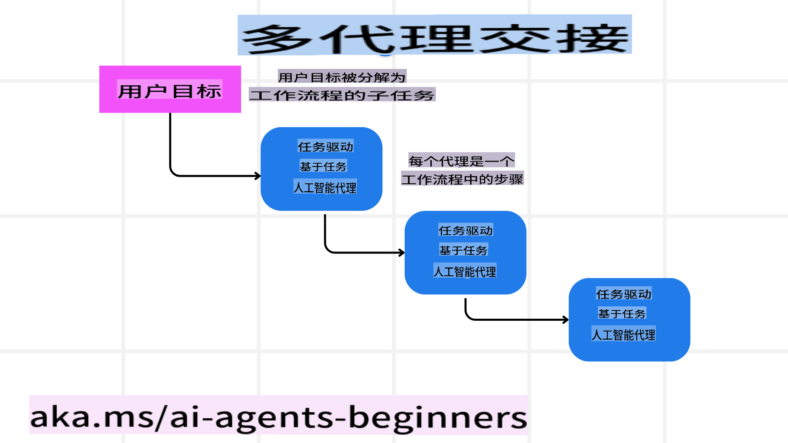
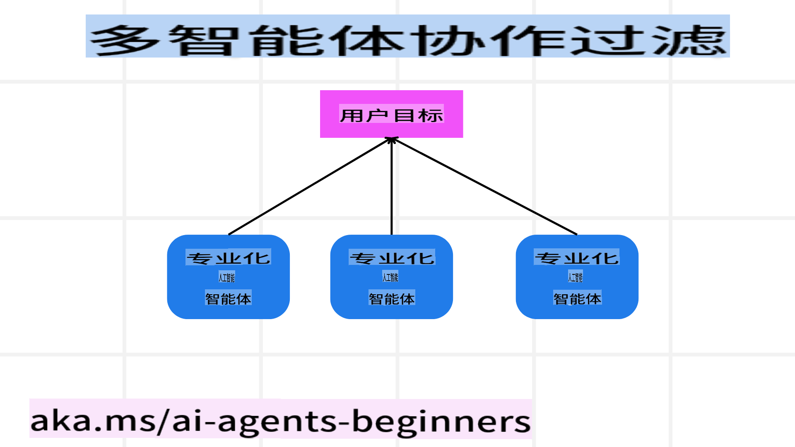

# 多代理设计模式

当你开始一个涉及多个代理的项目时，就需要考虑多代理设计模式。然而，何时切换到多代理模式以及它的优势可能并不一目了然。

## 引言

在本课中，我们将尝试解答以下问题：

- 哪些场景适合应用多代理模式？
- 多代理相较于单一代理处理多个任务有什么优势？
- 实现多代理设计模式的核心构建模块是什么？
- 我们如何掌握多个代理之间的交互情况？

## 学习目标

完成本课后，你应该能够：

- 识别适合应用多代理模式的场景。
- 理解多代理相较于单一代理的优势。
- 掌握实现多代理设计模式的核心构建模块。

更大的意义是什么？

*多代理是一种设计模式，允许多个代理协同工作以实现共同目标。*

这一模式广泛应用于多个领域，包括机器人技术、自动化系统和分布式计算等。

## 多代理适用的场景

那么，哪些场景适合使用多代理模式呢？答案是有很多场景可以从多个代理的应用中受益，尤其是在以下情况下：

- **大规模工作负载**：大规模的工作负载可以被分解为较小的任务，并分配给不同的代理，从而实现并行处理并加快完成速度。例如，大型数据处理任务就属于这一类。
- **复杂任务**：复杂任务可以像大规模工作负载一样被分解为多个子任务，并分配给专注于特定方面的不同代理。例如，在自动驾驶汽车中，不同的代理分别负责导航、障碍物检测以及与其他车辆的通信。
- **多样化的专业技能**：不同的代理可以具备不同的专业技能，从而比单一代理更有效地处理任务的不同方面。例如，在医疗领域，代理可以分别负责诊断、制定治疗方案以及患者监测。

## 多代理相较于单一代理的优势

单一代理系统在处理简单任务时可能表现良好，但对于更复杂的任务，使用多个代理可以带来以下几个优势：

- **专业化**：每个代理可以专注于特定任务。而单一代理缺乏专业化，可能会在面对复杂任务时感到困惑。例如，它可能执行一个并不擅长的任务。
- **可扩展性**：通过增加更多代理来扩展系统比让单一代理超负荷工作更容易。
- **容错性**：如果一个代理失败，其他代理可以继续运行，从而确保系统的可靠性。

举个例子，假设我们为用户预订一次旅行。单一代理系统需要处理旅行预订过程的所有方面，从搜索航班到预订酒店和租车。如果由单一代理完成，这个代理需要具备处理所有这些任务的工具。这可能导致系统复杂且难以维护和扩展。而多代理系统可以分别让不同的代理专注于搜索航班、预订酒店和租车。这使得系统更加模块化、易于维护且具有可扩展性。

这可以类比为一个家庭式旅行社与连锁旅行社的对比。家庭式旅行社由一个代理处理旅行预订的所有方面，而连锁旅行社则由不同的代理分别处理不同方面的预订。

## 实现多代理设计模式的核心构建模块

在实现多代理设计模式之前，你需要了解构成这一模式的核心构建模块。

让我们通过再次审视用户旅行预订的例子来使这一点更加具体。在这种情况下，核心构建模块包括：

- **代理通信**：负责搜索航班、预订酒店和租车的代理需要相互通信并共享用户的偏好和限制条件。你需要决定这些通信的协议和方法。具体而言，负责搜索航班的代理需要与负责预订酒店的代理沟通，以确保酒店的预订日期与航班日期一致。这意味着代理需要共享用户的旅行日期，因此你需要决定*哪些代理共享信息以及如何共享信息*。
- **协调机制**：代理需要协调它们的行为以确保满足用户的偏好和限制。例如，用户可能偏好靠近机场的酒店，而限制条件可能是租车只能在机场提取。这意味着负责预订酒店的代理需要与负责租车的代理协调，以确保用户的偏好和限制得到满足。因此你需要决定*代理如何协调它们的行为*。
- **代理架构**：代理需要具备内部结构来做出决策并从与用户的交互中学习。例如，负责搜索航班的代理需要具备内部结构来决定向用户推荐哪些航班。这意味着你需要决定*代理如何做出决策并从与用户的交互中学习*。例如，负责搜索航班的代理可以使用机器学习模型，根据用户过去的偏好向其推荐航班。
- **多代理交互的可视性**：你需要能够掌握多个代理之间的交互情况。这意味着你需要工具和技术来跟踪代理的活动和交互。这可以通过日志记录和监控工具、可视化工具以及性能指标来实现。
- **多代理模式**：实现多代理系统可以采用不同的模式，例如集中式、分散式和混合式架构。你需要选择最适合你的用例的模式。
- **人类参与**：在大多数情况下，你需要在系统中保留人类参与，并指示代理在需要时请求人类介入。例如，用户可能会要求预订一个代理未推荐的特定酒店或航班，或者在预订前要求确认。

## 多代理交互的可视性

了解多个代理之间的交互情况非常重要。这种可视性对于调试、优化以及确保整体系统的有效性至关重要。为此，你需要工具和技术来跟踪代理的活动和交互。这可以通过日志记录和监控工具、可视化工具以及性能指标来实现。

例如，在用户旅行预订的场景中，你可以使用一个仪表板来显示每个代理的状态、用户的偏好和限制条件，以及代理之间的交互情况。这个仪表板可以显示用户的旅行日期、航班代理推荐的航班、酒店代理推荐的酒店以及租车代理推荐的租车选项。这将为你提供一个清晰的视图，了解代理之间的交互情况以及是否满足了用户的偏好和限制条件。

让我们更详细地看看这些方面：

- **日志记录和监控工具**：你需要为每个代理的每个动作进行日志记录。日志条目可以存储代理执行的动作、动作的时间以及动作的结果等信息。这些信息可以用于调试、优化等。
- **可视化工具**：可视化工具可以帮助你以更直观的方式查看代理之间的交互。例如，你可以使用图表展示代理之间的信息流。这可以帮助你识别系统中的瓶颈、低效以及其他问题。
- **性能指标**：性能指标可以帮助你跟踪多代理系统的有效性。例如，你可以跟踪完成任务所需的时间、每单位时间完成的任务数量以及代理推荐的准确性。这些信息可以帮助你识别改进空间并优化系统。

## 多代理模式

让我们探讨一些可以用于创建多代理应用的具体模式。以下是一些值得考虑的有趣模式：

### 群聊

这种模式适用于创建一个群聊应用，其中多个代理可以相互通信。典型的使用场景包括团队协作、客户支持和社交网络。

在这种模式中，每个代理代表群聊中的一个用户，消息通过某种消息协议在代理之间交换。代理可以向群聊发送消息、从群聊接收消息以及响应其他代理的消息。

这种模式可以通过集中式架构（所有消息通过中央服务器路由）或分散式架构（消息直接交换）实现。

### 任务交接

这种模式适用于创建一个应用，其中多个代理可以相互交接任务。

典型的使用场景包括客户支持、任务管理和工作流自动化。

在这种模式中，每个代理代表一个任务或工作流中的一个步骤，代理可以根据预定义规则将任务交接给其他代理。

### 协作过滤

这种模式适用于创建一个应用，其中多个代理可以协作为用户提供推荐。

为什么需要多个代理协作？因为每个代理可以拥有不同的专业技能，并以不同的方式为推荐过程做出贡献。

例如，用户想要获得关于股市中最佳股票的推荐：

- **行业专家**：一个代理可以是某个特定行业的专家。
- **技术分析**：另一个代理可以是技术分析的专家。
- **基本面分析**：还有一个代理可以是基本面分析的专家。通过协作，这些代理可以为用户提供更全面的推荐。

## 场景：退款流程

考虑一个客户尝试为某产品申请退款的场景，这一流程可能涉及多个代理。我们可以将这些代理分为专门针对退款流程的代理和可以用于其他流程的通用代理。

**专门针对退款流程的代理**：

以下是一些可能参与退款流程的代理：

- **客户代理**：代表客户，负责启动退款流程。
- **卖家代理**：代表卖家，负责处理退款。
- **支付代理**：代表支付流程，负责退还客户的付款。
- **解决方案代理**：代表问题解决流程，负责解决退款流程中出现的任何问题。
- **合规代理**：代表合规流程，负责确保退款流程符合相关法规和政策。

**通用代理**：

这些代理可以用于业务的其他部分。

- **物流代理**：代表物流流程，负责将产品退回给卖家。该代理既可以用于退款流程，也可以用于例如购买时的物流。
- **反馈代理**：代表反馈流程，负责收集客户的反馈。反馈可以在任何时候进行，而不仅限于退款流程。
- **升级代理**：代表升级流程，负责将问题升级到更高级别的支持。该代理可用于任何需要升级问题的流程。
- **通知代理**：代表通知流程，负责在退款流程的各个阶段向客户发送通知。
- **分析代理**：代表分析流程，负责分析与退款流程相关的数据。
- **审计代理**：代表审计流程，负责审计退款流程以确保其正确执行。
- **报告代理**：代表报告流程，负责生成退款流程的报告。
- **知识代理**：代表知识流程，负责维护与退款流程相关的信息知识库。此代理不仅可以掌握退款相关知识，还可以掌握业务的其他部分。
- **安全代理**：代表安全流程，负责确保退款流程的安全性。
- **质量代理**：代表质量流程，负责确保退款流程的质量。

以上列出了许多代理，包括专门针对退款流程的代理以及可以用于业务其他部分的通用代理。希望这些例子能帮助你了解如何为你的多代理系统决定使用哪些代理。

## 练习

这一课的练习是什么？

设计一个用于客户支持流程的多代理系统。确定流程中涉及的代理、它们的角色和职责，以及它们如何相互交互。既要考虑专门针对客户支持流程的代理，也要考虑可以用于业务其他部分的通用代理。

> 在查看下面的解决方案之前，先自己思考一下，你可能需要比预想中更多的代理。

> TIP：思考客户支持流程的不同阶段，同时考虑任何系统可能需要的代理。

## 解决方案

[解决方案](./solution/solution.md)

## 知识检查

问题：何时应该考虑使用多代理？

- [] A1: 当你有小型工作负载和简单任务时。
- [] A2: 当你有大型工作负载时。
- [] A3: 当你有简单任务时。

[测试解决方案](./solution/solution-quiz.md)

## 总结

在本课中，我们探讨了多代理设计模式，包括多代理适用的场景、多代理相较于单一代理的优势、实现多代理设计模式的核心构建模块，以及如何掌握多个代理之间的交互情况。

## 其他资源

- [Autogen设计模式](https://microsoft.github.io/autogen/stable/user-guide/core-user-guide/design-patterns/intro.html)
- [Agentic设计模式](https://www.analyticsvidhya.com/blog/2024/10/agentic-design-patterns/)

**免责声明**：  
本文件使用基于机器的人工智能翻译服务进行翻译。尽管我们尽力确保准确性，但请注意，自动翻译可能包含错误或不准确之处。应以原始语言的文件作为权威来源。对于关键信息，建议使用专业人工翻译。对于因使用本翻译而引起的任何误解或误读，我们概不负责。