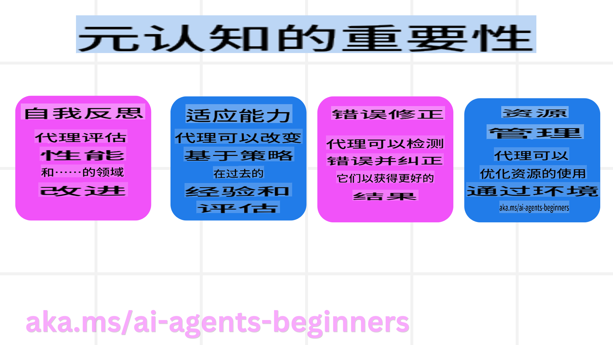

# 元认知在人工智能代理中的应用

## 介绍

欢迎学习关于人工智能代理中元认知的课程！本章专为对人工智能代理如何思考其自身思维过程感兴趣的初学者设计。在本课结束时，您将理解关键概念，并掌握将元认知应用于人工智能代理设计的实际示例。

## 学习目标

完成本课程后，您将能够：
1. 理解代理定义中推理循环的影响。
2. 使用计划和评估技术帮助自我纠正的代理。
3. 创建能够操控代码完成任务的代理。

## 元认知简介

元认知是指涉及思考自己思维的高级认知过程。对于人工智能代理来说，这意味着能够基于自我意识和过去的经验来评估和调整其行为。

### 什么是元认知？

元认知，或称“思考思维”，是一种高级认知过程，涉及对自身认知过程的自我意识和自我调节。在人工智能领域，元认知使代理能够评估和调整其策略和行为，从而提升问题解决和决策能力。通过理解元认知，您可以设计出不仅更智能，而且更具适应性和效率的人工智能代理。

### 元认知在人工智能代理中的重要性

元认知在人工智能代理设计中具有重要作用，主要体现在以下几个方面：



- **自我反思**：代理可以评估自身表现并找出改进的地方。
- **适应性**：代理可以根据过去的经验和不断变化的环境调整其策略。
- **错误修正**：代理可以自主检测和纠正错误，从而提高结果的准确性。
- **资源管理**：代理可以通过规划和评估行为来优化资源的使用，例如时间和计算能力。

## 人工智能代理的组成部分

在深入探讨元认知过程之前，首先需要了解人工智能代理的基本组成部分。一个人工智能代理通常包括：
- **角色**：代理的个性和特征，定义其与用户的交互方式。
- **工具**：代理可以执行的能力和功能。
- **技能**：代理所具备的知识和专业能力。

这些组件协同工作，创建一个能够执行特定任务的“专业单元”。

**示例**：考虑一个旅行代理服务，该代理不仅计划您的假期，还能根据实时数据和过去的客户旅程经验调整路径。

### 示例：旅行代理服务中的元认知

假设您正在设计一个由人工智能驱动的旅行代理服务。该代理“旅行代理”协助用户规划假期。为了融入元认知，“旅行代理”需要基于自我意识和过去的经验来评估和调整其行为。

#### 当前任务

当前任务是帮助用户规划去巴黎的旅行。

#### 完成任务的步骤

1. **收集用户偏好**：询问用户的旅行日期、预算、兴趣（例如博物馆、美食、购物）以及任何具体需求。
2. **检索信息**：搜索符合用户偏好的航班、住宿、景点和餐馆。
3. **生成推荐**：提供包含航班详情、酒店预订和建议活动的个性化行程。
4. **根据反馈调整**：询问用户对推荐的反馈，并进行必要的调整。

#### 所需资源

- 访问航班和酒店预订数据库。
- 巴黎景点和餐馆的信息。
- 之前交互中的用户反馈数据。

#### 经验和自我反思

“旅行代理”通过元认知评估其表现并从过去的经验中学习。例如：

1. **分析用户反馈**：旅行代理会审查用户反馈，以确定哪些推荐受到欢迎，哪些不受欢迎，并据此调整未来的建议。
2. **适应性**：如果用户之前提到不喜欢拥挤的地方，旅行代理会在未来避免在高峰时段推荐热门景点。
3. **错误修正**：如果旅行代理在过去的预订中出现错误，例如推荐了已满的酒店，它会学习在推荐之前更严格地检查可用性。

#### 实际开发示例

以下是旅行代理在融入元认知时的代码简化示例：

```python
class Travel_Agent:
    def __init__(self):
        self.user_preferences = {}
        self.experience_data = []

    def gather_preferences(self, preferences):
        self.user_preferences = preferences

    def retrieve_information(self):
        # Search for flights, hotels, and attractions based on preferences
        flights = search_flights(self.user_preferences)
        hotels = search_hotels(self.user_preferences)
        attractions = search_attractions(self.user_preferences)
        return flights, hotels, attractions

    def generate_recommendations(self):
        flights, hotels, attractions = self.retrieve_information()
        itinerary = create_itinerary(flights, hotels, attractions)
        return itinerary

    def adjust_based_on_feedback(self, feedback):
        self.experience_data.append(feedback)
        # Analyze feedback and adjust future recommendations
        self.user_preferences = adjust_preferences(self.user_preferences, feedback)

# Example usage
travel_agent = Travel_Agent()
preferences = {
    "destination": "Paris",
    "dates": "2025-04-01 to 2025-04-10",
    "budget": "moderate",
    "interests": ["museums", "cuisine"]
}
travel_agent.gather_preferences(preferences)
itinerary = travel_agent.generate_recommendations()
print("Suggested Itinerary:", itinerary)
feedback = {"liked": ["Louvre Museum"], "disliked": ["Eiffel Tower (too crowded)"]}
travel_agent.adjust_based_on_feedback(feedback)
```

#### 元认知为何重要

- **自我反思**：代理可以分析其表现并找出改进的地方。
- **适应性**：代理可以根据反馈和变化的条件调整策略。
- **错误修正**：代理可以自主检测和纠正错误。
- **资源管理**：代理可以优化资源使用，例如时间和计算能力。

通过融入元认知，“旅行代理”可以提供更个性化和准确的旅行推荐，从而提升整体用户体验。

---

## 2. 代理中的规划

规划是人工智能代理行为的关键组成部分。它涉及根据当前状态、资源和可能的障碍来制定实现目标的步骤。

### 规划的要素

- **当前任务**：明确定义任务。
- **完成任务的步骤**：将任务分解为可管理的步骤。
- **所需资源**：确定必要的资源。
- **经验**：利用过去的经验来指导规划。

**示例**：以下是“旅行代理”在有效协助用户规划旅行时需要采取的步骤：

### 旅行代理的步骤

1. **收集用户偏好**
   - 询问用户关于旅行日期、预算、兴趣和任何具体需求的详细信息。
   - 示例：“您计划什么时候旅行？”“您的预算范围是多少？”“您在假期中喜欢哪些活动？”

2. **检索信息**
   - 根据用户偏好搜索相关的旅行选项。
   - **航班**：寻找符合用户预算和偏好的航班。
   - **住宿**：找到符合用户对位置、价格和设施要求的酒店或租赁房产。
   - **景点和餐馆**：识别与用户兴趣一致的热门景点、活动和餐饮选择。

3. **生成推荐**
   - 将检索到的信息编制成个性化行程。
   - 提供航班选项、酒店预订和建议活动的详细信息，确保推荐符合用户偏好。

4. **向用户展示行程**
   - 与用户分享拟议的行程以供审查。
   - 示例：“这是为您巴黎之行建议的行程，包括航班详情、酒店预订以及推荐的活动和餐馆。请告诉我您的想法！”

5. **收集反馈**
   - 询问用户对拟议行程的反馈。
   - 示例：“您喜欢这些航班选项吗？”“酒店是否符合您的需求？”“是否有您想添加或删除的活动？”

6. **根据反馈调整**
   - 根据用户反馈修改行程。
   - 对航班、住宿和活动推荐进行必要的更改，以更好地符合用户偏好。

7. **最终确认**
   - 向用户展示更新后的行程以供最终确认。
   - 示例：“我已根据您的反馈进行了调整。这是更新后的行程。您觉得如何？”

8. **预订并确认**
   - 在用户批准行程后，进行航班、住宿和任何预定活动的预订。
   - 将确认详情发送给用户。

9. **提供持续支持**
   - 在用户旅行前和旅行期间，随时协助处理任何更改或额外请求。
   - 示例：“如果您在旅行期间需要任何进一步的帮助，请随时与我联系！”

### 示例交互

```python
class Travel_Agent:
    def __init__(self):
        self.user_preferences = {}
        self.experience_data = []

    def gather_preferences(self, preferences):
        self.user_preferences = preferences

    def retrieve_information(self):
        flights = search_flights(self.user_preferences)
        hotels = search_hotels(self.user_preferences)
        attractions = search_attractions(self.user_preferences)
        return flights, hotels, attractions

    def generate_recommendations(self):
        flights, hotels, attractions = self.retrieve_information()
        itinerary = create_itinerary(flights, hotels, attractions)
        return itinerary

    def adjust_based_on_feedback(self, feedback):
        self.experience_data.append(feedback)
        self.user_preferences = adjust_preferences(self.user_preferences, feedback)

# Example usage within a booing request
travel_agent = Travel_Agent()
preferences = {
    "destination": "Paris",
    "dates": "2025-04-01 to 2025-04-10",
    "budget": "moderate",
    "interests": ["museums", "cuisine"]
}
travel_agent.gather_preferences(preferences)
itinerary = travel_agent.generate_recommendations()
print("Suggested Itinerary:", itinerary)
feedback = {"liked": ["Louvre Museum"], "disliked": ["Eiffel Tower (too crowded)"]}
travel_agent.adjust_based_on_feedback(feedback)
```

## 3. 校正型 RAG 系统

首先，让我们了解 RAG 工具与预加载上下文的区别：


### 检索增强生成（RAG）

RAG 将检索系统与生成模型结合。当提出查询时，检索系统从外部来源获取相关文档或数据，并使用这些检索到的信息增强生成模型的输入。这有助于模型生成更准确和上下文相关的响应。

在 RAG 系统中，代理从知识库中检索相关信息，并利用这些信息生成适当的响应或行动。

### 校正型 RAG 方法

校正型 RAG 方法专注于使用 RAG 技术来纠正错误并提高人工智能代理的准确性。这包括：

1. **提示技术**：使用特定提示指导代理检索相关信息。
2. **工具**：实施使代理能够评估检索信息相关性并生成准确响应的算法和机制。
3. **评估**：持续评估代理的表现，并进行调整以提高其准确性和效率。

#### 示例：搜索代理中的校正型 RAG

考虑一个从网络检索信息以回答用户查询的搜索代理。校正型 RAG 方法可能涉及：

1. **提示技术**：根据用户输入制定搜索查询。
2. **工具**：使用自然语言处理和机器学习算法对搜索结果进行排序和过滤。
3. **评估**：分析用户反馈以识别和纠正检索信息中的不准确之处。

### 校正型 RAG 在旅行代理中的应用

校正型 RAG（检索增强生成）增强了人工智能在检索和生成信息时纠正任何不准确之处的能力。以下是“旅行代理”如何使用校正型 RAG 方法提供更准确和相关的旅行推荐：

这包括：
- **提示技术**：使用特定提示指导代理检索相关信息。
- **工具**：实施使代理能够评估检索信息相关性并生成准确响应的算法和机制。
- **评估**：持续评估代理的表现，并进行调整以提高其准确性和效率。

#### 在旅行代理中实施校正型 RAG 的步骤

1. **初始用户交互**
   - “旅行代理”收集用户的初始偏好，例如目的地、旅行日期、预算和兴趣。
   - 示例：```python
     preferences = {
         "destination": "Paris",
         "dates": "2025-04-01 to 2025-04-10",
         "budget": "moderate",
         "interests": ["museums", "cuisine"]
     }
     ```

2. **信息检索**
   - “旅行代理”根据用户偏好检索有关航班、住宿、景点和餐馆的信息。
   - 示例：```python
     flights = search_flights(preferences)
     hotels = search_hotels(preferences)
     attractions = search_attractions(preferences)
     ```

3. **生成初始推荐**
   - “旅行代理”利用检索到的信息生成个性化行程。
   - 示例：```python
     itinerary = create_itinerary(flights, hotels, attractions)
     print("Suggested Itinerary:", itinerary)
     ```

4. **收集用户反馈**
   - “旅行代理”询问用户对初始推荐的反馈。
   - 示例：```python
     feedback = {
         "liked": ["Louvre Museum"],
         "disliked": ["Eiffel Tower (too crowded)"]
     }
     ```

5. **校正型 RAG 过程**
   - **提示技术**：
```
```markdown
旅行代理根据用户反馈制定新的搜索查询。  
- 示例：```python
       if "disliked" in feedback:
           preferences["avoid"] = feedback["disliked"]
       ```  
- **工具**：旅行代理使用算法对新的搜索结果进行排名和筛选，强调基于用户反馈的相关性。  
- 示例：```python
       new_attractions = search_attractions(preferences)
       new_itinerary = create_itinerary(flights, hotels, new_attractions)
       print("Updated Itinerary:", new_itinerary)
       ```  
- **评估**：旅行代理通过分析用户反馈并进行必要的调整，持续评估其推荐的相关性和准确性。  
- 示例：```python
       def adjust_preferences(preferences, feedback):
           if "liked" in feedback:
               preferences["favorites"] = feedback["liked"]
           if "disliked" in feedback:
               preferences["avoid"] = feedback["disliked"]
           return preferences

       preferences = adjust_preferences(preferences, feedback)
       ```  

#### 实用示例  
以下是一个结合纠正型RAG方法的简化Python代码示例，用于旅行代理：  
```python
class Travel_Agent:
    def __init__(self):
        self.user_preferences = {}
        self.experience_data = []

    def gather_preferences(self, preferences):
        self.user_preferences = preferences

    def retrieve_information(self):
        flights = search_flights(self.user_preferences)
        hotels = search_hotels(self.user_preferences)
        attractions = search_attractions(self.user_preferences)
        return flights, hotels, attractions

    def generate_recommendations(self):
        flights, hotels, attractions = self.retrieve_information()
        itinerary = create_itinerary(flights, hotels, attractions)
        return itinerary

    def adjust_based_on_feedback(self, feedback):
        self.experience_data.append(feedback)
        self.user_preferences = adjust_preferences(self.user_preferences, feedback)
        new_itinerary = self.generate_recommendations()
        return new_itinerary

# Example usage
travel_agent = Travel_Agent()
preferences = {
    "destination": "Paris",
    "dates": "2025-04-01 to 2025-04-10",
    "budget": "moderate",
    "interests": ["museums", "cuisine"]
}
travel_agent.gather_preferences(preferences)
itinerary = travel_agent.generate_recommendations()
print("Suggested Itinerary:", itinerary)
feedback = {"liked": ["Louvre Museum"], "disliked": ["Eiffel Tower (too crowded)"]}
new_itinerary = travel_agent.adjust_based_on_feedback(feedback)
print("Updated Itinerary:", new_itinerary)
```  

### 预加载上下文  
预加载上下文是指在处理查询之前，将相关的上下文或背景信息加载到模型中。这意味着模型从一开始就可以访问这些信息，从而帮助其生成更有见地的响应，而无需在过程中检索额外的数据。以下是一个预加载上下文在旅行代理应用中的简化Python示例：  
```python
class TravelAgent:
    def __init__(self):
        # Pre-load popular destinations and their information
        self.context = {
            "Paris": {"country": "France", "currency": "Euro", "language": "French", "attractions": ["Eiffel Tower", "Louvre Museum"]},
            "Tokyo": {"country": "Japan", "currency": "Yen", "language": "Japanese", "attractions": ["Tokyo Tower", "Shibuya Crossing"]},
            "New York": {"country": "USA", "currency": "Dollar", "language": "English", "attractions": ["Statue of Liberty", "Times Square"]},
            "Sydney": {"country": "Australia", "currency": "Dollar", "language": "English", "attractions": ["Sydney Opera House", "Bondi Beach"]}
        }

    def get_destination_info(self, destination):
        # Fetch destination information from pre-loaded context
        info = self.context.get(destination)
        if info:
            return f"{destination}:\nCountry: {info['country']}\nCurrency: {info['currency']}\nLanguage: {info['language']}\nAttractions: {', '.join(info['attractions'])}"
        else:
            return f"Sorry, we don't have information on {destination}."

# Example usage
travel_agent = TravelAgent()
print(travel_agent.get_destination_info("Paris"))
print(travel_agent.get_destination_info("Tokyo"))
```  

#### 解释  
1. **初始化 (`__init__` method)**: The `TravelAgent` class pre-loads a dictionary containing information about popular destinations such as Paris, Tokyo, New York, and Sydney. This dictionary includes details like the country, currency, language, and major attractions for each destination.

2. **Retrieving Information (`get_destination_info` method)**: When a user queries about a specific destination, the `get_destination_info` 方法)**：该方法从预加载的上下文字典中获取相关信息。通过预加载上下文，旅行代理应用可以快速响应用户查询，而无需实时从外部来源检索信息。这使得应用更加高效和响应迅速。  

### 以目标为导向启动计划并迭代  
以目标为导向启动计划是指从一开始就明确目标或预期结果。通过事先定义目标，模型可以在整个迭代过程中以此为指导原则。这有助于确保每次迭代都朝着实现预期结果的方向推进，使过程更加高效和专注。以下是如何为旅行代理启动计划并迭代的示例：  

### 场景  
旅行代理希望为客户制定一个定制化的假期计划。目标是根据客户的偏好和预算创建一个能最大化客户满意度的旅行行程。  

### 步骤  
1. 定义客户的偏好和预算。  
2. 基于这些偏好启动初始计划。  
3. 通过迭代优化计划，最大化客户满意度。  

#### Python代码  
```python
class TravelAgent:
    def __init__(self, destinations):
        self.destinations = destinations

    def bootstrap_plan(self, preferences, budget):
        plan = []
        total_cost = 0

        for destination in self.destinations:
            if total_cost + destination['cost'] <= budget and self.match_preferences(destination, preferences):
                plan.append(destination)
                total_cost += destination['cost']

        return plan

    def match_preferences(self, destination, preferences):
        for key, value in preferences.items():
            if destination.get(key) != value:
                return False
        return True

    def iterate_plan(self, plan, preferences, budget):
        for i in range(len(plan)):
            for destination in self.destinations:
                if destination not in plan and self.match_preferences(destination, preferences) and self.calculate_cost(plan, destination) <= budget:
                    plan[i] = destination
                    break
        return plan

    def calculate_cost(self, plan, new_destination):
        return sum(destination['cost'] for destination in plan) + new_destination['cost']

# Example usage
destinations = [
    {"name": "Paris", "cost": 1000, "activity": "sightseeing"},
    {"name": "Tokyo", "cost": 1200, "activity": "shopping"},
    {"name": "New York", "cost": 900, "activity": "sightseeing"},
    {"name": "Sydney", "cost": 1100, "activity": "beach"},
]

preferences = {"activity": "sightseeing"}
budget = 2000

travel_agent = TravelAgent(destinations)
initial_plan = travel_agent.bootstrap_plan(preferences, budget)
print("Initial Plan:", initial_plan)

refined_plan = travel_agent.iterate_plan(initial_plan, preferences, budget)
print("Refined Plan:", refined_plan)
```  

#### 代码解释  
1. **初始化 (`__init__` method)**: The `TravelAgent` class is initialized with a list of potential destinations, each having attributes like name, cost, and activity type.

2. **Bootstrapping the Plan (`bootstrap_plan` method)**: This method creates an initial travel plan based on the client's preferences and budget. It iterates through the list of destinations and adds them to the plan if they match the client's preferences and fit within the budget.

3. **Matching Preferences (`match_preferences` method)**: This method checks if a destination matches the client's preferences.

4. **Iterating the Plan (`iterate_plan` method)**: This method refines the initial plan by trying to replace each destination in the plan with a better match, considering the client's preferences and budget constraints.

5. **Calculating Cost (`calculate_cost` 方法)**：该方法计算当前计划的总成本，包括潜在的新目的地。  

#### 示例用法  
- **初始计划**：旅行代理基于客户的观光偏好和$2000的预算创建初始计划。  
- **优化计划**：旅行代理迭代优化计划，以满足客户的偏好和预算。  

通过以明确的目标（例如最大化客户满意度）启动计划并迭代优化，旅行代理可以为客户创建一个定制化且优化的旅行行程。这种方法确保旅行计划从一开始就符合客户的偏好和预算，并在每次迭代中不断改进。  

### 利用LLM进行重新排序和评分  
大型语言模型（LLM）可以通过评估检索到的文档或生成的响应的相关性和质量，用于重新排序和评分。以下是其工作原理：  
**检索**：初始检索步骤根据查询获取一组候选文档或响应。  
**重新排序**：LLM评估这些候选项，并根据其相关性和质量重新排序。此步骤确保最相关和高质量的信息优先呈现。  
**评分**：LLM为每个候选项分配分数，反映其相关性和质量。这有助于选择最适合用户的响应或文档。  

通过利用LLM进行重新排序和评分，系统可以提供更准确和上下文相关的信息，从而改善整体用户体验。以下是旅行代理如何使用大型语言模型（LLM）根据用户偏好重新排序和评分旅行目的地的示例：  

#### 场景 - 基于偏好的旅行  
旅行代理希望根据客户的偏好推荐最佳旅行目的地。LLM将帮助重新排序和评分目的地，以确保呈现最相关的选项。  

#### 步骤：  
1. 收集用户偏好。  
2. 检索潜在的旅行目的地列表。  
3. 使用LLM根据用户偏好重新排序和评分目的地。  

以下是如何更新之前的示例以使用Azure OpenAI服务：  

#### 要求  
1. 您需要拥有一个Azure订阅。  
2. 创建一个Azure OpenAI资源并获取您的API密钥。  

#### 示例Python代码  
```python
import requests
import json

class TravelAgent:
    def __init__(self, destinations):
        self.destinations = destinations

    def get_recommendations(self, preferences, api_key, endpoint):
        # Generate a prompt for the Azure OpenAI
        prompt = self.generate_prompt(preferences)
        
        # Define headers and payload for the request
        headers = {
            'Content-Type': 'application/json',
            'Authorization': f'Bearer {api_key}'
        }
        payload = {
            "prompt": prompt,
            "max_tokens": 150,
            "temperature": 0.7
        }
        
        # Call the Azure OpenAI API to get the re-ranked and scored destinations
        response = requests.post(endpoint, headers=headers, json=payload)
        response_data = response.json()
        
        # Extract and return the recommendations
        recommendations = response_data['choices'][0]['text'].strip().split('\n')
        return recommendations

    def generate_prompt(self, preferences):
        prompt = "Here are the travel destinations ranked and scored based on the following user preferences:\n"
        for key, value in preferences.items():
            prompt += f"{key}: {value}\n"
        prompt += "\nDestinations:\n"
        for destination in self.destinations:
            prompt += f"- {destination['name']}: {destination['description']}\n"
        return prompt

# Example usage
destinations = [
    {"name": "Paris", "description": "City of lights, known for its art, fashion, and culture."},
    {"name": "Tokyo", "description": "Vibrant city, famous for its modernity and traditional temples."},
    {"name": "New York", "description": "The city that never sleeps, with iconic landmarks and diverse culture."},
    {"name": "Sydney", "description": "Beautiful harbour city, known for its opera house and stunning beaches."},
]

preferences = {"activity": "sightseeing", "culture": "diverse"}
api_key = 'your_azure_openai_api_key'
endpoint = 'https://your-endpoint.com/openai/deployments/your-deployment-name/completions?api-version=2022-12-01'

travel_agent = TravelAgent(destinations)
recommendations = travel_agent.get_recommendations(preferences, api_key, endpoint)
print("Recommended Destinations:")
for rec in recommendations:
    print(rec)
```  

#### 代码解释 - 偏好推荐器  
1. **初始化**：将 `TravelAgent` class is initialized with a list of potential travel destinations, each having attributes like name and description.

2. **Getting Recommendations (`get_recommendations` method)**: This method generates a prompt for the Azure OpenAI service based on the user's preferences and makes an HTTP POST request to the Azure OpenAI API to get re-ranked and scored destinations.

3. **Generating Prompt (`generate_prompt` method)**: This method constructs a prompt for the Azure OpenAI, including the user's preferences and the list of destinations. The prompt guides the model to re-rank and score the destinations based on the provided preferences.

4. **API Call**: The `requests` library is used to make an HTTP POST request to the Azure OpenAI API endpoint. The response contains the re-ranked and scored destinations.

5. **Example Usage**: The travel agent collects user preferences (e.g., interest in sightseeing and diverse culture) and uses the Azure OpenAI service to get re-ranked and scored recommendations for travel destinations.

Make sure to replace `your_azure_openai_api_key` with your actual Azure OpenAI API key and `https://your-endpoint.com/...` 替换为Azure OpenAI部署的实际端点URL。  

通过利用LLM进行重新排序和评分，旅行代理可以为客户提供更个性化和相关的旅行推荐，从而增强客户的整体体验。  

### RAG: 提示技术与工具  
检索增强生成（RAG）既可以作为一种提示技术，也可以作为开发AI代理的工具。理解两者之间的区别可以帮助您更有效地在项目中利用RAG。  

#### RAG作为提示技术  
**是什么？**  
- 作为提示技术，RAG涉及制定特定查询或提示，以指导从大型语料库或数据库中检索相关信息。然后将这些信息用于生成响应或采取行动。  

**如何工作：**  
1. **制定提示**：根据任务或用户输入创建结构良好的提示或查询。  
2. **检索信息**：使用提示从预先存在的知识库或数据集中搜索相关数据。  
3. **生成响应**：将检索到的信息与生成式AI模型结合，以生成全面且连贯的响应。  

**旅行代理示例**：  
- 用户输入："我想参观巴黎的博物馆。"  
- 提示："查找巴黎的顶级博物馆。"  
- 检索到的信息：关于卢浮宫、奥赛博物馆等的详细信息。  
- 生成的响应："以下是巴黎的一些顶级博物馆：卢浮宫、奥赛博物馆和蓬皮杜中心。"  

#### RAG作为工具  
**是什么？**  
- 作为工具，RAG是一个集成系统，可以自动化检索和生成过程，使开发人员无需为每个查询手动编写提示即可实现复杂的AI功能。  

**如何工作：**  
1. **集成**：将RAG嵌入AI代理的架构中，使其能够自动处理检索和生成任务。  
2. **自动化**：工具管理整个过程，从接收用户输入到生成最终响应，无需为每一步明确提示。  
3. **高效性**：通过简化检索和生成过程，提高代理的性能，使其能够更快、更准确地响应。  

**旅行代理示例**：  
- 用户输入："我想参观巴黎的博物馆。"  
- RAG工具：自动检索关于博物馆的信息并生成响应。  
- 生成的响应："以下是巴黎的一些顶级博物馆：卢浮宫、奥赛博物馆和蓬皮杜中心。"  

### 比较  
| 方面 | 提示技术 | 工具 |  
|------------------------|-------------------------------------------------------------|-------------------------------------------------------|  
| **手动与自动**| 每个查询手动制定提示。 | 检索和生成的自动化过程。 |  
| **控制** | 对检索过程提供更多控制。 | 简化并自动化检索和生成。|  
| **灵活性** | 允许根据具体需求定制提示。 | 更适合大规模实现。 |  
| **复杂性** | 需要设计和调整提示。 | 更容易集成到AI代理的架构中。 |  

### 实用示例  
**提示技术示例：**  
```python
def search_museums_in_paris():
    prompt = "Find top museums in Paris"
    search_results = search_web(prompt)
    return search_results

museums = search_museums_in_paris()
print("Top Museums in Paris:", museums)
```  

**工具示例：**  
```python
class Travel_Agent:
    def __init__(self):
        self.rag_tool = RAGTool()

    def get_museums_in_paris(self):
        user_input = "I want to visit museums in Paris."
        response = self.rag_tool.retrieve_and_generate(user_input)
        return response

travel_agent = Travel_Agent()
museums = travel_agent.get_museums_in_paris()
print("Top Museums in Paris:", museums)
```  
```

```markdown
巴黎最好的博物馆？"). - **导航意图**：用户希望导航到特定的网站或页面（例如，“卢浮宫官网”）。 - **交易意图**：用户希望执行交易，例如预订航班或购买商品（例如，“预订飞往巴黎的航班”）。 2. **上下文意识**： - 分析用户查询的上下文有助于准确识别其意图。这包括考虑先前的互动、用户偏好以及当前查询的具体细节。 3. **自然语言处理（NLP）**： - 使用NLP技术来理解和解释用户提供的自然语言查询。这包括实体识别、情感分析和查询解析等任务。 4. **个性化**： - 根据用户的历史记录、偏好和反馈个性化搜索结果，提高检索信息的相关性。 #### 实际示例：旅行代理中的意图搜索 让我们以旅行代理为例，看看如何实现意图搜索。 1. **收集用户偏好** ```python
   class Travel_Agent:
       def __init__(self):
           self.user_preferences = {}

       def gather_preferences(self, preferences):
           self.user_preferences = preferences
   ``` 2. **理解用户意图** ```python
   def identify_intent(query):
       if "book" in query or "purchase" in query:
           return "transactional"
       elif "website" in query or "official" in query:
           return "navigational"
       else:
           return "informational"
   ``` 3. **上下文意识** ```python
   def analyze_context(query, user_history):
       # Combine current query with user history to understand context
       context = {
           "current_query": query,
           "user_history": user_history
       }
       return context
   ``` 4. **搜索并个性化结果** ```python
   def search_with_intent(query, preferences, user_history):
       intent = identify_intent(query)
       context = analyze_context(query, user_history)
       if intent == "informational":
           search_results = search_information(query, preferences)
       elif intent == "navigational":
           search_results = search_navigation(query)
       elif intent == "transactional":
           search_results = search_transaction(query, preferences)
       personalized_results = personalize_results(search_results, user_history)
       return personalized_results

   def search_information(query, preferences):
       # Example search logic for informational intent
       results = search_web(f"best {preferences['interests']} in {preferences['destination']}")
       return results

   def search_navigation(query):
       # Example search logic for navigational intent
       results = search_web(query)
       return results

   def search_transaction(query, preferences):
       # Example search logic for transactional intent
       results = search_web(f"book {query} to {preferences['destination']}")
       return results

   def personalize_results(results, user_history):
       # Example personalization logic
       personalized = [result for result in results if result not in user_history]
       return personalized[:10]  # Return top 10 personalized results
   ``` 5. **示例用法** ```python
   travel_agent = Travel_Agent()
   preferences = {
       "destination": "Paris",
       "interests": ["museums", "cuisine"]
   }
   travel_agent.gather_preferences(preferences)
   user_history = ["Louvre Museum website", "Book flight to Paris"]
   query = "best museums in Paris"
   results = search_with_intent(query, preferences, user_history)
   print("Search Results:", results)
   ``` --- ## 4. 作为工具的代码生成 代码生成代理使用AI模型来编写和执行代码，解决复杂问题并实现任务自动化。 ### 代码生成代理 代码生成代理使用生成式AI模型来编写和执行代码。这些代理可以通过生成和运行各种编程语言的代码来解决复杂问题、实现任务自动化并提供有价值的见解。 #### 实际应用 1. **自动代码生成**：为特定任务生成代码片段，例如数据分析、网络爬取或机器学习。 2. **作为RAG的SQL**：使用SQL查询从数据库中检索和操作数据。 3. **问题解决**：创建并执行代码以解决特定问题，例如优化算法或分析数据。 #### 示例：用于数据分析的代码生成代理 假设您正在设计一个代码生成代理。其工作流程可能如下： 1. **任务**：分析数据集以识别趋势和模式。 2. **步骤**： - 将数据集加载到数据分析工具中。 - 生成SQL查询以过滤和聚合数据。 - 执行查询并检索结果。 - 使用结果生成可视化和见解。 3. **所需资源**：访问数据集、数据分析工具和SQL能力。 4. **经验**：利用过去的分析结果提高未来分析的准确性和相关性。 ### 示例：旅行代理的代码生成代理 在此示例中，我们将设计一个代码生成代理Travel Agent，通过生成和执行代码来协助用户规划旅行。该代理可以处理诸如获取旅行选项、筛选结果以及使用生成式AI编制行程等任务。 #### 代码生成代理概述 1. **收集用户偏好**：收集用户输入的信息，如目的地、旅行日期、预算和兴趣。 2. **生成用于获取数据的代码**：生成代码片段以检索航班、酒店和景点数据。 3. **执行生成的代码**：运行生成的代码以获取实时信息。 4. **生成行程**：将获取的数据编译为个性化的旅行计划。 5. **根据反馈调整**：接收用户反馈并重新生成代码以优化结果。 #### 分步实现 1. **收集用户偏好** ```python
   class Travel_Agent:
       def __init__(self):
           self.user_preferences = {}

       def gather_preferences(self, preferences):
           self.user_preferences = preferences
   ``` 2. **生成用于获取数据的代码** ```python
   def generate_code_to_fetch_data(preferences):
       # Example: Generate code to search for flights based on user preferences
       code = f"""
       def search_flights():
           import requests
           response = requests.get('https://api.example.com/flights', params={preferences})
           return response.json()
       """
       return code

   def generate_code_to_fetch_hotels(preferences):
       # Example: Generate code to search for hotels
       code = f"""
       def search_hotels():
           import requests
           response = requests.get('https://api.example.com/hotels', params={preferences})
           return response.json()
       """
       return code
   ``` 3. **执行生成的代码** ```python
   def execute_code(code):
       # Execute the generated code using exec
       exec(code)
       result = locals()
       return result

   travel_agent = Travel_Agent()
   preferences = {
       "destination": "Paris",
       "dates": "2025-04-01 to 2025-04-10",
       "budget": "moderate",
       "interests": ["museums", "cuisine"]
   }
   travel_agent.gather_preferences(preferences)
   
   flight_code = generate_code_to_fetch_data(preferences)
   hotel_code = generate_code_to_fetch_hotels(preferences)
   
   flights = execute_code(flight_code)
   hotels = execute_code(hotel_code)

   print("Flight Options:", flights)
   print("Hotel Options:", hotels)
   ``` 4. **生成行程** ```python
   def generate_itinerary(flights, hotels, attractions):
       itinerary = {
           "flights": flights,
           "hotels": hotels,
           "attractions": attractions
       }
       return itinerary

   attractions = search_attractions(preferences)
   itinerary = generate_itinerary(flights, hotels, attractions)
   print("Suggested Itinerary:", itinerary)
   ``` 5. **根据反馈调整** ```python
   def adjust_based_on_feedback(feedback, preferences):
       # Adjust preferences based on user feedback
       if "liked" in feedback:
           preferences["favorites"] = feedback["liked"]
       if "disliked" in feedback:
           preferences["avoid"] = feedback["disliked"]
       return preferences

   feedback = {"liked": ["Louvre Museum"], "disliked": ["Eiffel Tower (too crowded)"]}
   updated_preferences = adjust_based_on_feedback(feedback, preferences)
   
   # Regenerate and execute code with updated preferences
   updated_flight_code = generate_code_to_fetch_data(updated_preferences)
   updated_hotel_code = generate_code_to_fetch_hotels(updated_preferences)
   
   updated_flights = execute_code(updated_flight_code)
   updated_hotels = execute_code(updated_hotel_code)
   
   updated_itinerary = generate_itinerary(updated_flights, updated_hotels, attractions)
   print("Updated Itinerary:", updated_itinerary)
   ``` ### 利用环境意识和推理 基于表格的模式确实可以通过利用环境意识和推理来增强查询生成过程。以下是实现方式的示例： 1. **理解模式**：系统将理解表格的模式，并利用此信息来支持查询生成。 2. **根据反馈调整**：系统将根据反馈调整用户偏好，并推断需要更新模式中的哪些字段。 3. **生成和执行查询**：系统将生成并执行查询，以根据新的偏好获取更新的航班和酒店数据。 以下是一个包含这些概念的更新Python代码示例： ```python
def adjust_based_on_feedback(feedback, preferences, schema):
    # Adjust preferences based on user feedback
    if "liked" in feedback:
        preferences["favorites"] = feedback["liked"]
    if "disliked" in feedback:
        preferences["avoid"] = feedback["disliked"]
    # Reasoning based on schema to adjust other related preferences
    for field in schema:
        if field in preferences:
            preferences[field] = adjust_based_on_environment(feedback, field, schema)
    return preferences

def adjust_based_on_environment(feedback, field, schema):
    # Custom logic to adjust preferences based on schema and feedback
    if field in feedback["liked"]:
        return schema[field]["positive_adjustment"]
    elif field in feedback["disliked"]:
        return schema[field]["negative_adjustment"]
    return schema[field]["default"]

def generate_code_to_fetch_data(preferences):
    # Generate code to fetch flight data based on updated preferences
    return f"fetch_flights(preferences={preferences})"

def generate_code_to_fetch_hotels(preferences):
    # Generate code to fetch hotel data based on updated preferences
    return f"fetch_hotels(preferences={preferences})"

def execute_code(code):
    # Simulate execution of code and return mock data
    return {"data": f"Executed: {code}"}

def generate_itinerary(flights, hotels, attractions):
    # Generate itinerary based on flights, hotels, and attractions
    return {"flights": flights, "hotels": hotels, "attractions": attractions}

# Example schema
schema = {
    "favorites": {"positive_adjustment": "increase", "negative_adjustment": "decrease", "default": "neutral"},
    "avoid": {"positive_adjustment": "decrease", "negative_adjustment": "increase", "default": "neutral"}
}

# Example usage
preferences = {"favorites": "sightseeing", "avoid": "crowded places"}
feedback = {"liked": ["Louvre Museum"], "disliked": ["Eiffel Tower (too crowded)"]}
updated_preferences = adjust_based_on_feedback(feedback, preferences, schema)

# Regenerate and execute code with updated preferences
updated_flight_code = generate_code_to_fetch_data(updated_preferences)
updated_hotel_code = generate_code_to_fetch_hotels(updated_preferences)

updated_flights = execute_code(updated_flight_code)
updated_hotels = execute_code(updated_hotel_code)

updated_itinerary = generate_itinerary(updated_flights, updated_hotels, feedback["liked"])
print("Updated Itinerary:", updated_itinerary)
``` #### 解释 - 基于反馈的预订 1. **模式意识**：`schema` dictionary defines how preferences should be adjusted based on feedback. It includes fields like `favorites` and `avoid`, with corresponding adjustments.
2. **Adjusting Preferences (`adjust_based_on_feedback` method)**: This method adjusts preferences based on user feedback and the schema.
3. **Environment-Based Adjustments (`adjust_based_on_environment`方法）**：此方法根据模式和反馈自定义调整。 4. **生成和执行查询**：系统生成代码以根据调整后的偏好获取更新的航班和酒店数据，并模拟执行这些查询。 5. **生成行程**：系统根据新的航班、酒店和景点数据创建更新后的行程。 通过使系统具有环境意识并基于模式进行推理，它可以生成更准确和相关的查询，从而提供更好的旅行推荐和更个性化的用户体验。 ### 使用SQL作为检索增强生成（RAG）技术 SQL（结构化查询语言）是与数据库交互的强大工具。当用作检索增强生成（RAG）方法的一部分时，SQL可以从数据库中检索相关数据，以为AI代理中的响应或操作提供信息并生成它们。让我们探讨如何在旅行代理的上下文中使用SQL作为RAG技术。 #### 关键概念 1. **数据库交互**： - 使用SQL查询数据库，检索相关信息并操作数据。 - 示例：从旅行数据库中获取航班详情、酒店信息和景点。 2. **与RAG集成**： - 根据用户输入和偏好生成SQL查询。 - 然后使用检索到的数据生成个性化推荐或操作。 3. **动态查询生成**： - AI代理根据上下文和用户需求生成动态SQL查询。 - 示例：定制SQL查询以根据预算、日期和兴趣筛选结果。 #### 应用 - **自动代码生成**：为特定任务生成代码片段。 - **作为RAG的SQL**：使用SQL查询操作数据。 - **问题解决**：创建并执行代码以解决问题。 **示例**：一个数据分析代理： 1. **任务**：分析数据集以发现趋势。 2. **步骤**： - 加载数据集。 - 生成SQL查询以过滤数据。 - 执行查询并检索结果。 - 生成可视化和见解。 3. **资源**：数据集访问权限、SQL能力。 4. **经验**：利用过去的结果提高未来分析的准确性。 #### 实际示例：在旅行代理中使用SQL 1. **收集用户偏好** ```python
   class Travel_Agent:
       def __init__(self):
           self.user_preferences = {}

       def gather_preferences(self, preferences):
           self.user_preferences = preferences
   ``` 2. **生成SQL查询** ```python
   def generate_sql_query(table, preferences):
       query = f"SELECT * FROM {table} WHERE "
       conditions = []
       for key, value in preferences.items():
           conditions.append(f"{key}='{value}'")
       query += " AND ".join(conditions)
       return query
   ``` 3. **执行SQL查询** ```python
   import sqlite3

   def execute_sql_query(query, database="travel.db"):
       connection = sqlite3.connect(database)
       cursor = connection.cursor()
       cursor.execute(query)
       results = cursor.fetchall()
       connection.close()
       return results
   ``` 4. **生成推荐** ```python
   def generate_recommendations(preferences):
       flight_query = generate_sql_query("flights", preferences)
       hotel_query = generate_sql_query("hotels", preferences)
       attraction_query = generate_sql_query("attractions", preferences)
       
       flights = execute_sql_query(flight_query)
       hotels = execute_sql_query(hotel_query)
       attractions = execute_sql_query(attraction_query)
       
       itinerary = {
           "flights": flights,
           "hotels": hotels,
           "attractions": attractions
       }
       return itinerary

   travel_agent = Travel_Agent()
   preferences = {
       "destination": "Paris",
       "dates": "2025-04-01 to 2025-04-10",
       "budget": "moderate",
       "interests": ["museums", "cuisine"]
   }
   travel_agent.gather_preferences(preferences)
   itinerary = generate_recommendations(preferences)
   print("Suggested Itinerary:", itinerary)
   ``` #### 示例SQL查询 1. **航班查询** ```sql
   SELECT * FROM flights WHERE destination='Paris' AND dates='2025-04-01 to 2025-04-10' AND budget='moderate';
   ``` 2. **酒店查询** ```sql
   SELECT * FROM hotels WHERE destination='Paris' AND budget='moderate';
   ``` 3. **景点查询** ```sql
   SELECT * FROM attractions WHERE destination='Paris' AND interests='museums, cuisine';
   ``` 通过将SQL作为检索增强生成（RAG）技术的一部分，像Travel Agent这样的AI代理可以动态检索并利用相关数据，提供准确且个性化的推荐。 ### 结论 元认知是一种强大的工具，可以显著增强AI代理的能力。通过引入元认知过程，您可以设计出更智能、更适应性强且更高效的代理。使用附加资源进一步探索AI代理中元认知的迷人世界。
```

**免责声明**：  
本文件使用基于机器的人工智能翻译服务进行翻译。尽管我们尽力确保翻译的准确性，但请注意，自动翻译可能包含错误或不准确之处。应以原始语言的文件作为权威来源。对于关键信息，建议使用专业人工翻译。我们对因使用本翻译而产生的任何误解或误读不承担责任。